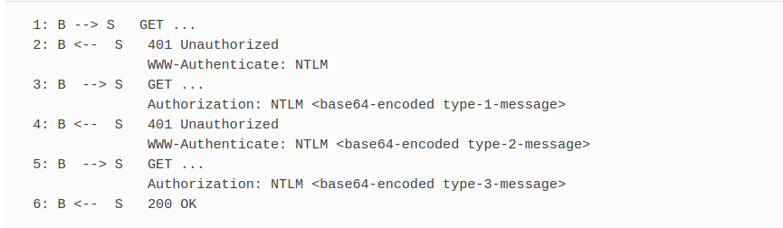
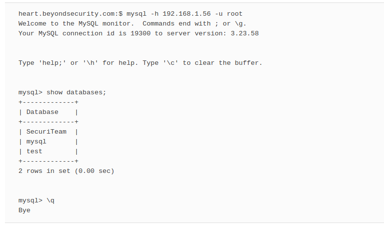
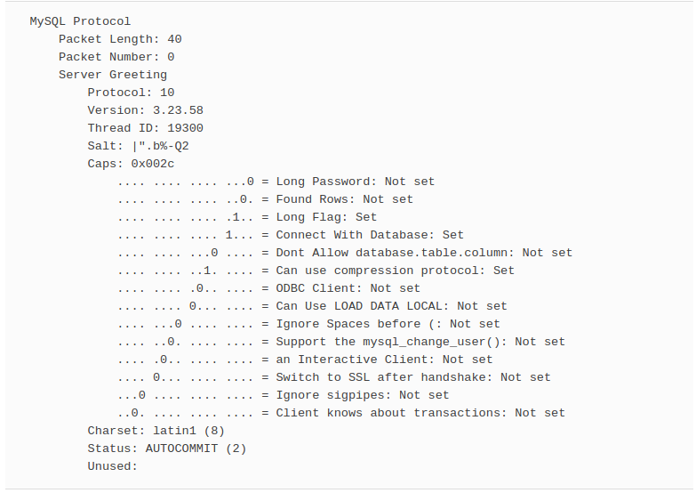
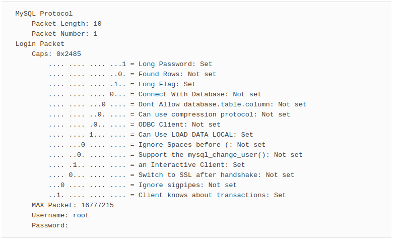
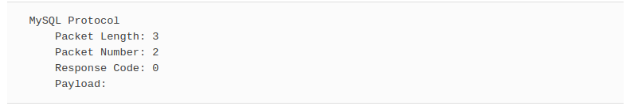
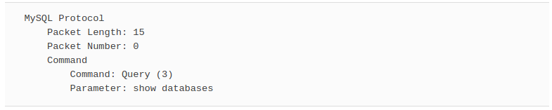
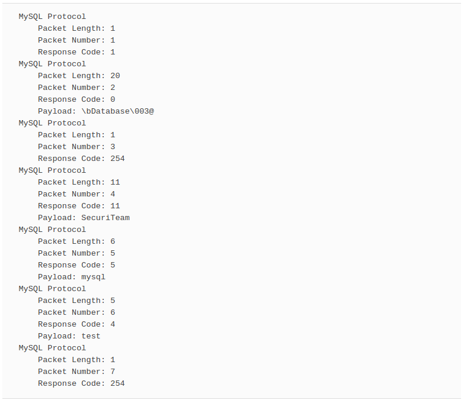
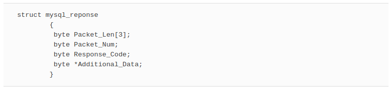
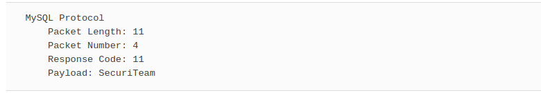

# In This Toolbox

NTLM (NT LAN Manager) authentication is a widely used type of authentication mechanism, and until now, Nessus has lacked the support necessary to test Web sites that use NTLM authentication for their protection. In this chapter we will underline the steps that must be taken so that Nessus can incorporate support for NTLM. We will also look into how the MySQL test can be improved to work better with the different versions of MySQL servers. We will conclude with an in-depth analysis of Windows’s PE header file structure and how the GetFileVersion function can be improved to better utilize this structure to produce less network overhead when trying to determine a remote file’s version.

# Integrating NTLM Authentication into Nessus’ HTTP Authentication Mechanism

We will begin this chapter by explaining how NTLM-based authentication works, describing how to write an NTLM testing NASL, discussing where changes to Nessus are needed to support Nessus-wide NTLM authentication, and finally, illustrating how everything is glued together.

## NTLM

NTLM is an authentication protocol originally constructed by Microsoft to allow its products to talk securely to each other. The authentication protocol was originally conceived for the file-sharing service given by Microsoft (implemented by the Server Message Block \[SMB\] protocol). However, the proliferation of sites on the Web has created a need for a stronger authentication mechanism, and Microsoft decided that it would incorporate its NTLM authentication protocol to its Internet Explorer browser.

The original Hypertext Transfer Protocol (HTTP) did not incorporate any support for NTLM; Microsoft added NTLM support to HTTP later. Unlike the basic authentication mechanism that all browsers support, NTLM is not supported by default. Some browsers such as Mozilla Firefox have chosen to support it, whereas others like Konqueror have chosen to not support it for the time being.

Further, the basic authentication mechanism authenticates requests, whereas the NTLM authentication mechanism authenticates connections. Therefore, we are forced to keep the connection alive as long as possible or else we will be required to reauthenticate the newly created connection.

However, Nessus uses the HTTP keep-alive mechanism to minimize traffic and minimize the requirement to open and close connections. Therefore, all that is necessary is to extend the functionality of the existing keep-alive mechanism to support NTLM. This, however, is no easy feat, in addition to adding to the existing connection an extensive overhead whenever a keep-alive connection is closed and reopened.

Before diving into code writing, you will need to understand a bit more about how NTLM authentication is conducted. This section is by no means a complete guide to NTLM authentication; there are a lot of resources out there that explain in depth how NTLM authentication works.

Because NTLM authentication is a challenge-response protocol, it requires you to transmit three different types of messages between the browser and the Web server:

1.  The browser has to first send a Type 1 message containing a set of flags of features supported or requested to the Web server.
    
2.  The Web server then responds with a Type 2 message containing a similar set of flags supported or required by the Web server and a random challenge (8 bytes).
    
3.  The handshake is completed by the browser client using the challenge obtained from the Type 2 message and the user’s authentication credentials to calculate a response. The calculation methods differ based on the NTLM authentication parameters negotiated before, but in general, MD4/MD5 hashing algorithms and Data Encryption Standard (DES) encryption are applied to compute the response. The response is then sent to the Web server in a Type 3 message.
    

We can illustrate the three-way handshake that takes place between a browser marked as B and a server marked as S as follows:



**Construction of Message Type 1**

| Byte Offset | Description | Content |
| --- | --- | --- |
| 0   | NTLMSSP Signature | Null-terminated ASCII “NTLMSSP” (0x4e544c4d53535000) |
| 8   | NTLM Message Type | Long (0x01000000) |
| 12  | Flags | Long |
| (16) | Supplied Domain (*Optional*) | Security buffer |
| (24) | Supplied Workstation (*Optional*) | Security buffer |
| (32) | *Start of data block (if required)* |     |

the C structure for message Type 1 is as follows:

```C
struct {
    byte    protocol[8];     // 'N', 'T', 'L', 'M', 'S', 'S', 'P', '\0'
    long    type;            // 0x01
    long   flags;          // NTLM Flags
    short   dom_len;         // domain string length
    short   dom_len;         // domain string length
    short   dom_off;         // domain string offset
    byte    zero[2];
    short   host_len;        // host string length
    short   host_len;        // host string length
    short   host_off;        // host string offset (always 0x20)
    byte    zero[2];
    byte    host[*];         // host string (ASCII)
    byte    dom[*];          // domain string (ASCII)
} type-1-message
```

**Construction of Message 2**

| Byte Offset | Description | Content |
| --- | --- | --- |
| 0   | NTLMSSP Signature | Null-terminated ASCII “NTLMSSP” (0x4e544c4d53535000) |
| 8   | NTLM Message Type | Long (0x02000000) |
| 12  | Target Name | Security buffer |
| 20  | Flags | Long |
| 24  | Challenge | 8 bytes |
| (*32*) | Context (*optional*) | 8 bytes (two consecutive longs) |
| (*40*) | Target Information (*optional*) | Security buffer |
| 32 (*48*) | *Start of data block* |     |

The C structure (without the optional sections) for message Type 2 is shown in the following example:

```C
struct {
        byte    protocol[8];     // 'N', 'T', 'L', 'M', 'S', 'S', 'P', '\0'
        long    type;            // 0x02
        long    target_name;
        long    flags;          // NTLM Flags
        byte    challenge[8];        // nonce
    } type-2-message
```

**Construction of Message Type 3**

| Byte Offset | Description | Content |
| --- | --- | --- |
| 0   | NTLMSSP Signature | Null-terminated ASCII “NTLMSSP” (0x4e544c4d53535000) |
| 8   | NTLM Message Type | Long (0x03000000) |
| 12  | LM/LMv2 Response | Security buffer |
| 20  | NTLM/NTLMv2 Response | Security buffer |
| 28  | Domain Name | Security buffer |
| 36  | User Name | Security buffer |
| 44  | Workstation Name | Security buffer |
| (*52*) | Session Key (*optional*) | Security buffer |
| (*60)* | Flags (*optional*) | Long |
| 52 (*64*) | *Start of data block* |     |

The C structure for message Type 3 is as follows.

```C
struct {
    byte    protocol[8];     // 'N', 'T', 'L', 'M', 'S', 'S', 'P', '\0'
    long    type;            // 0x03


    short   lm_resp_len;     // LanManager response length (always 0x18)
    short   lm_resp_len;     // LanManager response length (always 0x18)
    short   lm_resp_off;     // LanManager response offset
    byte    zero[2];


    short   nt_resp_len;     // NT response length (always 0x18)
    short   nt_resp_len;     // NT response length (always 0x18)
    short   nt_resp_off;     // NT response offset
    byte    zero[2];


    short   dom_len;         // domain string length
    short   dom_len;         // domain string length
    short   dom_off;         // domain string offset (always 0x40)
    byte    zero[2];


    short   user_len;        // username string length
    short   user_len;        // username string length
    short   user_off;        // username string offset
    byte    zero[2];


    short   host_len;        // host string length
    short   host_len;        // host string length
    short   host_off;        // host string offset
    byte    zero[6];


    short   msg_len;         // message length
    byte    zero[2];


    short   flags;           // 0x8201
    byte    zero[2];


    byte    dom[*];          // domain string (unicode UTF-16LE)
    byte    user[*];         // username string (unicode UTF-16LE)
    byte    host[*];         // host string (unicode UTF-16LE)
    byte    lm_resp[*];      // LanManager response
    byte    nt_resp[*];      // NT response
} type-3-message

```

As you can see, the data transmitted cannot be trivially handled or generated, as different data types are required. In addition, some parts have to be used by hashing algorithms (for example, MD4), making it harder to incorporate support for HTTP-based NTLM authentication for Nessus.

You should not be discouraged, however, because the same authentication mechanism used by Nessus to connect to Windows machines can be used to enable HTTP-based NTLM authentication. More specifically, by using crypto_func.inc’s internal functions, you can provide the necessary hashed response required for the Type 3 message without much effort.

To give you a better understanding of how we are going to extend the functionality of Nessus, let’s start off by building an NASL script that connects to a remote host, generates the necessary message types, and retrieves an NTLM-protected Web page. Our code will start off by setting a few parameters that will we will user later on, and we don’t want to redefine them each time. The following code and additional scripts discussed in this section are available on the Syngress Web site:

```NASL
username = "administrator";
domain = "beyondsecurity.com";
hostname = "ntlm.securiteam.beyondsecurity.com";
host_off = raw_string(0x20); # host string offset (always 0x20)
domain_off = host_off + strlen(hostname);


type_1_message = raw_string("NTLMSSP", 0x00,
 0x01,0x00, 0x00, 0x00, # type 0x01 - NTLM_NEGOTIATE
 0x02, 0x32, # Flags
 0x00, 0x00, # Two more zeros
 0x00, 0x00, # We don't sent any of the optional fields
 0x00, 0x00, # We don't sent any of the optional fields
 0x00, 0x00, 0x00, 0x00, # We don't sent any of the optional fields
 0x00, 0x00, # We don't sent any of the optional fields
 0x00, 0x00, # We don't sent any of the optional fields
 0x00, 0x00, 0x00, 0x00);
 
```

We can easily dump the raw_string data by using the dump.inc function dump():

```NASL
include("dump.inc");
dump(dtitle: "type_1_message", ddata: type_1_message);
```

Before we can send this Type 1 message, we need to base64 encode it. The required function can be found in the misc_func.inc file and can be used by writing the following lines into your NASL script:

```NASL
include("misc_func.inc");
type_1_message_base64 = base64(str: type_1_message);
```

All we need to do now is generate an HTTP request. Remember that NTLM authentication works only on persistent connections, so for now, we will assume that the remote host supports it. A more intelligent test would first try to determine whether such persistent connections are even supported.

```NASL
request = string("GET / HTTP/1.1\r\n",
 "Host: ntlm.securiteam.beyondsecurity.com\r\n",
 "User-Agent: Mozilla/5.0 (X11; U; Linux i686; en-US; rv:1.7.5)\r\n",
 "Accept: text/html\r\n",
 "Keep-Alive: 300\r\n",
 "Connection: keep-alive\r\n",
 "Authorization: NTLM ", type_1_message_base64, "\r\n",
 "\r\n");
```

The keep-alive headers are shown in two lines. One states that we want to keep the connection alive for the next 300 seconds; the other tells the server that we are requesting a *keep-alive* connection.

All we have to do now is write up all the functions that will open the required port, send the data, and receive the response from the server.

```NASL
port = 80;
if(get_port_state(port))
{
 soc = open_sock_tcp(port);
 if(soc)
 {
  send(socket:soc, data:request);


  res = recv(socket:soc, length:2048);
  display("res: [", res, "]\n");
```

We have requested that Nessus read just the first 2,048 bytes, as we are looking for something that is found in the headers. However, prior to receiving the actual page we requested, as the connection is persistent, we will need to read the whole buffer waiting for us.

We can grab the response sent back by the server by using a regular expression such as this one:

```NASL
v = eregmatch(pattern: "WWW-Authenticate: NTLM (.+)$", string: res);
```

We can then verify whether it is found in the headers sent back by the server by checking whether the parameter v is not NULL:

```NASL
if (!isnull(v))
{
```

Once we have determined that the parameter is not NULL, we need to strip any characters found after our buffer by issuing the following command:

```NASL
v[1] = v[1] - strstr(v[1], string("\r\n"));
```

We can display the Type 2 message response that is base64 encoded:

```NASL
display("NTLM: ", v[1], "\n");
```

We can then follow through and base64 decode the data using the following command:

```NASL
type_2_response = base64_decode(str: v[1]);
```

As the response is in binary form, we can dump its content by reusing the dump() function:

```NASL
dump(dtitle: "type_2_response", ddata: type_2_response);
```

Once we have our binary data, we can start to extract the response type to verify that the response received is in fact what we are expecting. The function hexstr() allows us to quickly compare a stream of bytes with a string by returning a hex string form from binary data.

```NASL
 type = hexstr(raw_string(type_2_response[8], type_2_response[9], type_2_response[10],
type_2_response[11]));
   display("type: ", type, "\n");
```

As we sent an NTLMSSP\_NEGOTIATE message, we are expecting the Web server to return an NTLMSSP\_CHALLENGE whose type is 0x02000000. We verify that the type is as such:

```NASL
if (type == "02000000") # NTLMSSP_CHALLENGE
{
 display("Type is NTLMSSP_CHALLENGE\n");
}
```

Once we have verified that the data is in fact of the right type, we can proceed to process the target type and target length being returned. Because we aren’t creating extensive support for NTLM, we won’t cover the different target types and their corresponding target lengths; rather, we will assume that the type returned is the right one.

```NASL
target_type = hexstr(raw_string(type_2_response[12], type_2_response[13]));
display("target type: ", target_type, "\n");
target_len = ord(type_2_response[14]) + ord(type_2_response[15])*256;
display("target len: ", target_len, "\n");
```

As mentioned before, the response provides a list of different flags; each flag has a different meaning. Note that the flags are bit-wise. If they are there, the flag is on; if they aren’t there, the flag is off.

**Flags Provided by the Server Response**

| Flag | Name | Description |
| --- | --- | --- |
| 0x00000001 | Negotiate Unicode | Indicates that Unicode strings are supported for use in security buffer data. |
| 0x00000002 | Negotiate OEM | Indicates that OEM strings are supported for use in security buffer data. |
| 0x00000004 | Request target | Requests that the server’s authentication realm be included in the Type 2 message. |
| 0x00000008 | Unknown | This flag’s usage has not been identified. |
| 0x00000010 | Negotiate sign | Specifies that authenticated communication between the client and server should carry a digital signature (message integrity). |
| 0x00000020 | Negotiate seal | Specifies that authenticated communication between the client and server should be encrypted (message confidentiality). |
| 0x00000040 | Negotiate datagram style | Indicates that datagram authentication is being used. |
| 0x00000080 | Negotiate LAN manager key | Indicates that the LAN manager session key should be used for signing and sealing authenticated communications. |
| 0x00000100 | Negotiate Netware | This flag’s usage has not been identified. |
| 0x00000200 | Negotiate NTLM | Indicates that NTLM authentication is being used. |
| 0x00000400 | Unknown | This flag’s usage has not been identified. |
| 0x00000800 | Unknown | This flag’s usage has not been identified. |
| 0x00001000 | Negotiate domain supplied | Sent by the client in the Type 1 message to indicate that the name of the domain in which the client workstation has membership is included in the message. This is used by the server to determine whether the client is eligible for local authentication. |
| 0x00002000 | Negotiate workstation supplied | Sent by the client in the Type 1 message to indicate that the client workstation’s name is included in the message. This is used by the server to determine whether the client is eligible for local authentication. |
| 0x00004000 | Negotiate local call | Sent by the server to indicate that the server and client are on the same machine. Implies that the client may use the established local credentials for authentication instead of calculating a response to the challenge. |
| 0x00008000 | Negotiate always sign | Indicates that authenticated communication between the client and server should be signed with a “dummy” signature. |
| 0x00010000 | Target type domain | Sent by the server in the Type 2 message to indicate that the target authentication realm is a domain. |
| 0x00020000 | Target type server | Sent by the server in the Type 2 message to indicate that the target authentication realm is a server. |
| 0x00040000 | Target type share | Sent by the server in the Type 2 message to indicate that the target authentication realm is a share. Presumably, this is for share-level authentication. Usage is unclear. |
| 0x00080000 | Negotiate NTLM2 key | Indicates that the NTLM2 signing and sealing scheme should be used for protecting authenticated communications. Note that this refers to a particular session security scheme, and is not related to the use of NTLMv2 authentication. This flag can, however, have an effect on the response calculations (as detailed in the “NTLM2 Session Response” section). |
| 0x00100000 | Request init response | This flag’s usage has not been identified. |
| 0x00200000 | Request accept response | This flag’s usage has not been identified. |
| 0x00400000 | Request Non-NT session key | This flag’s usage has not been identified. |
| 0x00800000 | Negotiate target info | Sent by the server in the Type 2 message to indicate that it is including a Target Information Block in the message. The Target Information Block is used in the calculation of the NTLMv2 response. |
| 0x01000000 | Unknown | This flag’s usage has not been identified. |
| 0x02000000 | Unknown | This flag’s usage has not been identified. |
| 0x04000000 | Unknown | This flag’s usage has not been identified. |
| 0x08000000 | Unknown | This flag’s usage has not been identified. |
| 0x10000000 | Unknown | This flag’s usage has not been identified. |
| 0x20000000 | Negotiate 128 | Indicates that 128-bit encryption is supported. |
| 0x40000000 | Negotiate key exchange | Indicates that the client will provide an encrypted master session key in the “Session Key” field of the Type 3 message. This is used in signing and sealing, and is RC4-encrypted using the previous session key as the encryption key. |
| 0x80000000 | Negotiate 56 | Indicates that 56-bit encryption is supported. |

We don’t plan to provide support for all the different flags, nor is it required if we are only trying to build the most basic support for HTTP-based NTLM authentication. However, we will provide a short example just to illustrate how the flags are used. Consider the following message that is specified:

```NASL
Negotiate Unicode (0x00000001)
Request Target (0x00000004)
Negotiate NTLM (0x00000200)
Negotiate Always Sign (0x00008000)
```

The combined numerical code in the preceding example equals 0x00008205. This would be physically laid out as 0x05820000 (it is represented in little-endian byte order).

The following code will extract the flags returned in the response and provide it as a hex string:

```NASL
   flags = hexstr(raw_string(type_2_response[16+4+target_len],
type_2_response[17+4+target_len], type_2_response[18+4+target_len],
type_2_response[19+4+target_len]));
   display("flags: ", flags, "\n");
```

We are expecting the following as the response for our NTLM authentication:

```NASL
if (flags == "b2020000")
{
 display("flags as expected\n");
}
```

The next bytes are the challenge provided by the remote Web server that will be combined with the password to create the MD4 response required to complete the authentication process:

```NASL
   challenge = raw_string(type_2_response[20+4+target_len],
type_2_response[21+4+target_len], type_2_response[22+4+target_len],
type_2_response[23+4+target_len], type_2_response[24+4+target_len],
type_2_response[25+4+target_len], type_2_response[26+4+target_len],
type_2_response[27+4+target_len]);
   dump(dtitle: "Challenge", ddata: Challenge);
```

Once we have extracted them, we can include the required authentication functions already created for us in the crypto_func.inc file:

```NASL
include("crypto_func.inc");
```

We also can start building our response to the Web server by first converting the password to Unicode form. Note that this is a quick hack to generating a Unicode string from a plain ASCII string; this is by no means a real method of converting an ASCII string to Unicode. Mainly this form doesn’t enable support for non-ASCII characters in the password; that is, there is no support for any language other than English.

```NASL
password = "beyondsecurity";
pass = NULL;
for (i=0;i < strlen(password);i++)
          pass += password[i] + raw_string(0x00);
          
```

Once we have converted our password to Unicode, we can feed it into the NTLM_Response function, which in turn will compute the required NTLM response to the challenge:

```NASL
ntlm_response = NTLM_Response(password:pass, challenge:challenge);
if (!isnull(ntlm_response))
 ipass = ntlm_response[0];
dump(dtitle: "ipass", ddata: ipass);
```

The challenge response will then be stored in the variable ipass. You probably noticed that the ntlm\_response returned from the NTLM\_Response function contains an array of values; however, we are interested in only the data found at location zero. The rest of the data is of no use to us.

We are almost ready to create our response. We first need to compute a few values:

```NASL
domain_off = 66;
username_off = domain_off + strlen( domain );
hostname_off = username_off + strlen ( username );
lm_off = hostname_off + strlen(hostname);
```

Now we put everything together: domain name, hostname, username, and challenge response.

```NASL
  type_3_message = raw_string("NTLMSSP", 0x00,
0x03, 0x00, 0x00, 0x00, # Type 3 message
0x18, 0x00, # LanManager response length (always 0x18)
0x18, 0x00, # LanManager response length (always 0x18)
lm_off, 0x00, #  LanManager response offset (4 bytes)
0x00, 0x00, # Zeros
0x18, 0x00, # NT response length (always 0x18)
0x18, 0x00, # NT response length (always 0x18)
lm_off, 0x00, # NT response offset (4 bytes)
0x00, 0x00, # Zeros
strlen(domain), 0x00, # domain string length
strlen(domain), 0x00, # domain string length
domain_off, 0x00, # domain string offset (4 bytes)
0x00, 0x00, # Zeros
strlen(username), 0x00, # username string length
strlen(username), 0x00, # username string length
username_off, 0x00, # username string offset (4 bytes)
0x00, 0x00, # Zeros
strlen(hostname), 0x00, # host string length
strlen(hostname), 0x00, # host string length
hostname_off, 0x00, # host string offset (4 bytes)
0x00, 0x00, # Zeros
0x00,
0x00, 0x00, 0x00, 0x00, 0x00, 0x00, 0x00, 0x00, # Session key
0x82, 0x01, # Flags
0x00, 0x00, # Zeros
0x00,
domain,
username,
hostname,
ipass,
0x00);
dump(dtitle: "type_3_message", ddata: type_3_message);
```

Once we have constructed our Type 3 message, we just need to encode it, put it inside an HTTP request, and send it off to the server. All these steps, of course, are done without disconnecting our existing socket, as the challenge response is valid for only this connection:

```NASL
 type_3_message_base64 = base64(str:type_3_message);
   request = string("GET / HTTP/1.1\r\n",
"Host: 192.168.1.243\r\n",
"User-Agent: Mozilla/5.0 (X11; U; Linux i686; en-US; rv:1.7.5) Beyond Security\r\n",
"Accept: text/html\r\n",
"Keep-Alive: 300\r\n",
"Connection: keep-alive\r\n",
"Authorization: NTLM ", type_3_message_base64, "\r\n",
"\r\n");
    soc = open_sock_tcp(port);
    send(socket:soc, data:request);

The data returned from the next lines should be the requested page, if a HTTP error code
401 is returned our authentication process wasn't completed properly:
    while (response = recv(socket:soc, length: 2048))
    {
     display("response: ", response, "\n");
    }
    close(soc);
  }
 }
}
```

* * *

**Swiss Army Knife...: Bringing It All Together**

Now that we have a working NTLM implementation, we can place it into the http\_keepalive.inc mechanism which in turn will allow any Web-based sessions being conducted against an NTLM-requiring server to be properly authenticated. The changes required in http\_keepalive.inc include resending the type\_1\_message whenever a connection is dropped, retrieving the response, and generating the type\_3\_message to complete the NTLM session.

* * *

# Improving the MySQL Test by Utilizing Packet Dumps

Many of the product tests incorporated into Nessus try to determine the existence of a vulnerability with the least effort possible. This is due to two main reasons: the sheer number of tests being created makes it impossible to spend too much time on each test, and most vulnerabilities can be determined without implementing the full range of the protocol required.

However, this approach poses a problem once the products have become more advanced and different versions of the product come out. Not talking to the product with its protocol is most likely to cause false positives or, even worse, false negatives.

One such example is the MySQL *Unpassworded* test. Version 1.22 of the test used a very simple algorithm to extract the database names returned by the *show* *databases* command. The algorithm simply went through the response, looked into predefined positions for mark points, and read anything afterward. This kind of algorithm is prone to problems because it lacks the proper implementation of the protocol, and as such, can cause false positives or in some cases, false negatives. One such false negative is the protocol difference that exists between MySQL version 3.xx and MySQL version 4.xx, which caused the tests to return garbage or empty values in some cases.

These kinds of false positives and false negatives can be easily remedied by implementing the MySQL protocol, or at least part of it. In our case all we are interested in is connecting to the MySQL server, authenticating with a NULL password, and extracting a list of all the databases available to us. This can be done with very little understanding of the whole MySQL protocol, using a very commonly used network sniffer called Ethereal.

For our development environment, we will be using MySQL version 3.23.58 and will foolproof our updates by running it against MySQL version 4.xx.xx. We will begin with capturing the traffic generated by the command-line utility mysql and then comparing it to our existing test, currently at version 1.22.

The command line mysql executed with the following commands will return the packets shown in the following example (this example displays an abbreviated form of the packets):

* * *

**Master Craftsman...: Further Improving the MySQL Implementation**

The code illustrated in the following example doesn’t completely implement the MySQL protocol. For example, it lacks support for its cryptographic layer because supporting the cryptographic layer is currently outside the scope of this test.

Future versions of this script that will support the cryptographic layer will improve the ability of this script to detect whether a remote host is vulnerable or not.

* * *


Upon connecting to the MySQL server, we send the following packet to it:


We don’t need any of the aforementioned information to conclude an authentication process with the MySQL server; therefore, we can move ahead to the next packet:

As you can see, we are logging in with the username root with an empty password. We now need to start processing the response as it contains whether we were successful or not:


Response code 0 means that we were able to complete the previous transaction (that is, log on to the remote MySQL server). We can now continue and send our show databases request:

What follows next is the response to our show databases request:

As you can see, the packet is fairly simple to parse because its structure is the same for all blocks found in the response. The following example is a pseudo-structure because we are not quoting it from the official protocol specification:


The Additional\_Data section’s structure and length depend on two factors: the Packet\_Len value and the Response\_Code value. We will concentrate on one Response\_Code, response code number 254.

The first instance of response code number 254 means that from this point any additional structures that follow are part of the response to the command show databases, whereas the second instance of response code number 254 means that no additional responses to the command show databases will follow.

Once the response code number 254 has been specified, the value returned within the response code field is the length in bytes of the name of the database present on the remote MySQL server. For example:

Thus, we need to build a fairly simple response interpreter that supports two states—grab database name after the first appearance of response code 254 and stop grabbing database names after the second appearance of the response code 254.

Let’s begin with writing the improved NASL:

```NASL
#
# MySQL Unpassworded improved by Noam Rathaus of Beyond Security Ltd.
#
#
# The following is a complete rewrite of the mysql_unpassworded.nasl file
# making it more compatible throughout the versions of MySQL Noam Rathaus
#
```

We will use the dump() function found in the dump.inc file to allow us to better debug our progress:

```NASL
include("dump.inc");
debug = 0;
```

We will start off with determining which port MySQL is listening on. By default, it will listen on port 3306; however, this doesn’t have to be so.

```NASL
port = get_kb_item("Services/mysql");
if(!port)port = 3306;
if(!get_port_state(port))exit(0);
```

Once we know the port MySQL listens on, we can open a connection to it and start recreating what we have just seen using Ethereal and the mysql command-line client:

```NASL
soc = open_sock_tcp(port);
if(!soc)exit(0);
r1 = recv(socket:soc, length:1024);
```

As the minimum length of the response received from a MySQL is 7 bytes, we first need to determine that we aren’t processing a response that isn’t from a MySQL server:

```NASL
if(strlen(r1) < 7)exit(0);
```

Because some MySQL servers will automatically respond with an Access Denied response or something similar, we can quickly determine this by checking for predetermined strings. We can also alter the user if MySQL is blindly refusing connections because of high load, which means that it would be worthwhile to re-scan the MySQL service when it is less loaded with connections:

```NASL
if (" is not allowed to connect to this MySQL" >< r1) exit(0);
if ("Access denied" >< r1)exit(0);
if ("is blocked because of many connection errors" >< r1) {
  security_note(port:port, data:'This MySQL server is temporarily refusing
connections.\n');
  exit(0);
}
```

Once we have established a connection, we can proceed to tell MySQL that we are interested in logging on to it:

```NASL
str = raw_string(0x0A, 0x00, 0x00, # Packet Length
 0x01, # Packet Number
 0x85, 0x04, # Capabilities (Long Password, Long Flag, Can Use LOAD DATA LOCAL,
Interactive Client, Client Knows Transactions
 0x00, 0x00, 0x80, # Max Packet (arbitrary value is also OK)
 0x72, 0x6F, 0x6F, 0x74, 0x00 # NULL terminated root username
 );
```

Once we have constructed our packet, we can send it to the MySQL server and monitor its response:

```NASL
send(socket:soc, data:str);
r1 = recv(socket:soc, length:4096);
```

If needed we can also dump the content of the response:

```NASL
if (debug)
{
 dump(dtitle: "r1", ddata: r1);
}
```

If the response returned is of length zero, we shamefully exit the test, as something must have gone wrong:

```NASL
if(!strlen(r1))exit(0);
```

We can now proceed to disassemble the packet received. We start with determining the packet length, packet number, and response code:

```NASL
packetlen = ord(r1[0]) + ord(r1[1])*256 + ord(r1[2])*256*256 - 1; # Packet Length of 1 is
actually 0
packetnumber = ord(r1[3]);
responsecode = ord(r1[4]);
```

As we already have proceeded to disassemble some parts of the packet, we can capture just the payload part by using the handy substr function, which reads a stream from an initial position up to number of bytes we want (i.e. length):

```NASL
payload = substr(r1, 5, 5+packetlen-1);
```

Because we find debugging a handy tool in determining that we have done everything correctly up to a certain point, we used the following line to display all of the processed variables:

```NASL
if (debug)
{
 display("packetlen: ", packetlen, " packetnumber: ", packetnumber, "\n");
 display("responsecode: ", responsecode, "\n");
 dump(dtitle: "payload", ddata: payload);
}
```

As you recall, the response code of zero indicates that we in fact were able to log on to the remote MySQL server. The following code will determine if this is true by verifying the response code’s value.

If the response code is as we expected, we can move forward and again create a much smaller payload for processing. If it’s not, for example in this case, response code number 255 or Access Denied, we need to exit gracefully.

```NASL
if (responsecode == 255)
{
 errorcode = ord(r1[5]) + ord(r1[6])*256;
 payload = substr(r1, 7, 7+packetlen-1);
```

By steadily decreasing the size of the payload, we can verify that we have in fact successfully analyzed all previous parts of the packet. Again, we can dump the newly acquired error code and payload with the following code:

```NASL
if (debug)
{
  display("errorcode: ", errorcode, "\n");
  dump(dtitle: "payload", ddata: payload);
}
```

Again, as error code 255 means Access Denied, we need to close the socket and exit:

```NASL
 # ErrorCode 255 is access denied
 close(soc);
 exit(0);
}
```

Once we have completed the logon process, we can proceed to querying the remote MySQL server for a list of its databases. This step is done by generating such a packet as this one:

```NASL
str = raw_string(
 0x0F, 0x00, 0x00, # Packet length
 0x00, # Packet number
 0x03 # Command: Query
 ) + "show databases"; # The command we want to execute
```

* * *

**Swiss Army Knife...: MySQL Query Support**

Once this implementation of the MySQL protocol is utilized, the show databases command can be replaced with other more informative commands, for example the show tables or a list of the users on the remote host via the s*elect * from mysql.user* command.

* * *

As before, once we have constructed the packet to send, we send it, await the MySQL’s server response, and disconnect the connection, as we require no additional information from the remote MySQL server:

```NASL
send(socket:soc, data:str);
r = recv(socket:soc, length:2048);
close(soc);


if (debug)
{
 dump(dtitle: "r", ddata: r);
 display("strlen(r): ", strlen(r), "\n");
}
```

We will use a few markers to help us analyze the response. The first one is pos, which will store the position inside the packet we are at. The dbs marker will be a comma separated by a list of databases we have discovered, whereas ok will store the state of the packet analysis (that is, whether additional data has to be processed or not).

```NASL
pos = 0;
dbs = "";
ok = 1;
```

We will store the state of the database name-capturing process using two parameters:

```NASL
Database_response = 0;
Database_capture = 0;
```

We will also verify whether we have handled this section of the packet using the following parameter:

```NASL
skip = 0;
```

The following algorithm can be used to analyze the data returned by the remote MySQL server:

- Subtract a subsection packet from the original one depending on the pos parameter and pass it on
    
- Check the value of the response code. If it’s the first appearance of error code 254, it will initiate the database name-capturing process. If it’s the second appearance of the error code 254, it will terminate the database name-capturing process.
    
- The pos parameter will be moved to next subsection of the packet.
    
- Return to 1 unless no additional data is available for processing.
    

The following is the NASL interpretation of the preceding algorithm.

```NASL
while(ok)
{
 skip = 0;


 if (debug)
 {
  display("pos: ", pos, "\n");
 }


 packetlen = ord(r[pos]) + ord(r[pos+1])*256 + ord(r[pos+2])*256*256 - 1; # Packet Length
is 1 is actually 0 bytes
 packetnumber = ord(r[pos+3]);
 responsecode = ord(r[pos+4]);
 payload = substr(r, pos+5, pos+5+packetlen-1);


 if (debug)
 {
  display("packetlen: ", packetlen, " packetnumber: ", packetnumber, " responsecode: ",
responsecode, "\n");
  dump(dtitle: "payload", ddata: payload);
 }


 if ((!skip) && (responsecode == 254) && (Database_capture == 1))
 {
  skip = 1;
  Database_capture = 0;
  if (debug)
  {
   display("Stopped capturing DBS\n");
  }
 }


 if ((!skip) && (responsecode == 254) && (Database_capture == 0))
 {
  skip = 1;
  Database_capture = 1;
  if (debug)
  {
   display("Capuring DBS\n");
  }
 }


 if ((!skip) && (payload >< "Database") && (responsecode == 0))
 {
  skip = 1;
  if (debug)
  {
   display("Found Database list\n");
  }
  Database_response = 1;
 }


 if ((!skip) && Database_capture)
 {
  if (debug)
  {
   display("payload (dbs): ", payload, "\n");
  }
  if (dbs)
  {
   dbs = string(dbs, ", ", payload);
  }
  else
  {
   dbs = payload;
  }
 }


 pos = pos + packetlen + 5;
 if (pos >= strlen(r))
 {
  ok = 0;
 }
}
```

Once the algorithm has completed its job, all that is left is to print the results and dynamically add our comma-separated database list to the response displayed by the Nessus client:

```NASL
report = string("Your MySQL database is not password protected.\n\n",
"Anyone can connect to it and do whatever he wants to your data\n",
"(deleting a database, adding bogus entries, ...)\n",
"We could collect the list of databases installed on the remote host :\n\n",
dbs,
"\n",
"Solution : Log into this host, and set a password for the root user\n",
"through the command 'mysqladmin -u root password <newpassword>'\n",
"Read the MySQL manual (available on www.mysql.com) for details.\n",
"In addition to this, it is not recommended that you let your MySQL\n",
"daemon listen to request from anywhere in the world. You should filter\n",
"incoming connections to this port.\n\n",
"Risk factor : High");


security_hole(port:port, data:report);
```

If you compare the NASL code in the preceding example with the original version of NASL that didn’t include the preceding interpretation of the MySQL protocol, you will probably notice that the version in the preceding example is more complex and that it requires a deeper understanding of the MySQL protocol.

It doesn’t mean that the original version was not able to detect the presence of the vulnerability; rather, it wasn’t able to handle any changes to what it expected to receive, whereas this version “understands” how the MySQL protocol works and would work as long as the MySQL protocol remains the same.

# Improving Nessus’ GetFileVersion Function by Creating a PE Header Parser

Some of Nessus’ Windows-based security tests, mainly those related to MSXX-XXX advisories, require the ability to open executables or DLLs (Dynamic Link Libraries) and retrieve from them the product version. This product version is then used to determine whether the version being used on the remote host is vulnerable to attack. This kind of testing is very accurate and in most cases imitates the way Microsoft’s Windows Update determines whether you are running a vulnerable version.

Nessus includes a special function called GetFileVersion() provided by the smb_nt.inc include file that handles this version retrieval. The function receives four parameters, a socket through which all communication will be conducted, a uid and tid pair that are assigned to each SMB communication channel, and an fid, the file descriptor that will be used to read information in the remote file.

The current version of the GetFileVersion() function reads 16,384 bytes from the file descriptor using the *ReadAndX* function:

```NASL
tmp = ReadAndX(socket: soc, uid: uid, tid: tid, fid: fid, count:16384, off:off);
```

It removes all the NULL characters:

```NASL
tmp = str_replace(find:raw_string(0), replace:"", string:tmp);
```

It also goes off to look for the string ProductVersion:

```NASL
version = strstr(data, "ProductVersion");
```

Once it has found the product version, it will start off by reading the content of the bytes that follow it, and it will accumulate into its v buffer only those characters that are either the number zero through nine or are the character that represents the character dot:

```NASL
for(i=strlen("ProductVersion");i<len;i++)
 {
  if((ord(version[i]) < ord("0") || ord(version[i]) > ord("9")) && version[i] != ".")
return (v);
  else
    v += version[i];
 }
```

If the string is not found, the function will move to the next 16,384 bytes. If none are found there as well and there are no more bytes available for reading, the function will terminate and return NULL as the version.

As you probably understand, this is not a very good method of finding what we seek, mainly because reading 16,384 bytes and then looking for the string ProductVersion can be made redundant if we would beforehand read the file’s headers and jump to the right offsets where the ProductVersion data is stored.

Before we begin writing the actual code, we need to first understand how the executable and DLL files are structured in Windows. Both executable and DLL files of Windows are defined by the PE (Portable Executable) file format.

PE files can be outlined in the following manner:

- MS-DOS header
    
- MS-DOS stub
    
- PE header
    
- Section header
    
- Section 1
    
- Section 2
    
- Section ...
    
- Section n
    

PE files must start with a simple DOS MZ header that allows the DOS operating system to recognize this file as its own and proceed to running the DOS stub that is located just after the DOS MZ header. The DOS stub holds inside it a very simple executable that in very plain words just writes to the user that: “This program requires Windows.” Programmers may replace this section with any other executable they desire; however, in most cases they leave it to the assemblers or compilers to add. In any case both these sections are of no interest to us.

After the DOS stub you can find the PE *header*. This is the first section that we are interested in reading. This section contains essential things that the PE requires for its proper execution. The section is constructed in accordance with the IMAGE\_NT\_HEADERS data structure.

To save time and network traffic, we would want to skip the DOS stub section altogether; therefore, we could do what the operating system does: read the DOS MZ header, retrieve the offset where the PE header can be found, and read from that offset skipping the entire DOS stub section.

The PE header contains a *Signature* variable that actually consists of the following constant four bytes: PE\\0\\0, the letters P and E followed by two NULL characters, and two variables that contain information on the file. As before this section can be skipped, as it doesn’t hold the value of *ProductVersion*.

Next, we stumble upon Section Header, or as it’s called by Microsoft, *COFF File Header*.

**The GetFileVersion() Section Header**

| Size | Field | Description |
| --- | --- | --- |
| 2   | Machine | Number identifying type of target machine. |
| 2   | NumberOfSections | Number of sections; indicates size of the Section Table, which immediately follows the headers. |
| 4   | TimeDateStamp | Time and date the file was created. |
| 4   | PointerToSymbolTable | File offset of the COFF symbol table or 0 if none is present. |
| 4   | NumberOfSymbols | Number of entries in the symbol table. This data can be used in locating the string table, which immediately follows the symbol table. |
| 2   | SizeOfOptionalHeader | Size of the optional header, which is required for executable files but not for object files. An object file should have a value of 0 here. The format is described in the section “Optional Header.” |
| 2   | Characteristics | Flags indicating attributes of the file. |

The only information found here that is of interest to us is the *NumberOfSections* field, as it holds the size of the Section table that follows the Section header. Inside one of the Sections that follow is our *ProductVersion* value. Once we know the *NumberOfSections* value, we can proceed to reading through them. The structure of each section is shown in Table.

Inside each section we are interested just in the *PointerToRawData* that we read from and the *SizeOfRawData*, which tells us how many bytes we need to read from *PointerToRawData*. Once we have found the Unicode representation of the string *ProductVersion*, any bytes that follow it will be our product version.

* * *

**Master Craftsman...: Shortening the PE Header Analysis Algorithm**

The algorithms in the following example represent an almost complete description of Windows’ PE header file parsing algorithms, but it lacks a few sections such as those made to support internationalization. The algorithm, however, is not optimized to the task at hand, (returning the remote host’s file version), so it can be further trimmed down by making assumptions regarding the different sizes the algorithm tries to determine from the file, such as in the case of section sizes, resource locations, etcetera.

* * *

| Size | Field | Description |
| --- | --- | --- |
| 8   | Name | An 8-byte, null-padded ASCII string. There is no terminating null if the string is exactly eight characters long. For longer names, this field contains a slash (/) followed by an ASCII representation of a decimal number. This number is an offset into the string table. Executable images do not use a string table and do not support section names longer than eight characters. Long names in object files will be truncated if emitted to an executable file. |
| 4   | VirtualSize | Total size of the section when loaded into memory. If this value is greater than SizeofRawData, the section is zero-padded. This field is valid only for executable images and should be set to 0 for object files. |
| 4   | VirtualAddress | For executable images this is the address of the first byte of the section, when loaded into memory, relative to the image base. For object files, this field is the address of the first byte before relocation is applied; for simplicity, compilers should set this to zero. Otherwise, it is an arbitrary value that is subtracted from offsets during relocation. |
| 4   | SizeOfRawData | Size of the section (object file) or size of the initialized data on disk (image files). For executable image, this must be a multiple of FileAlignment from the optional header. If this is less than VirtualSize, the remainder of the section is zero filled. Because this field is rounded while the VirtualSize field is not, it is possible for this to be greater than VirtualSize as well. When a section contains only uninitialized data, this field should be 0. |
| 4   | PointerToRawData | File pointer to section’s first page within the COFF file. For executable images, this must be a multiple of FileAlignment from the optional header. For object files, the value should be aligned on a four-byte boundary for best performance. When a section contains only uninitialized data, this field should be 0. |
| 4   | PointerToRelocations | File pointer to beginning of relocation entries for the section. Set to 0 for executable images or if there are no relocations. |
| 4   | PointerToLinenumbers | File pointer to beginning of line-number entries for the section. Set to 0 if there are no COFF line numbers. |
| 2   | NumberOfRelocations | Number of relocation entries for the section. Set to 0 for executable images. |
| 2   | NumberOfLine-numbers | Number of line-number entries for the section. |
| 4   | Characteristics | Flags describing section’s characteristics. |

We can summarize the algorithms as follows:

1.  Read the first 64 bytes off the file (DOS\_HEADER\_SIZE).
2.  Verify that it contains the string MZ.
3.  Return the PE\_HEADER\_OFFSET value from DOS_HEADER.
4.  Read the first 4 bytes off the file while taking into account the offset (PE\_SIGNATURE\_SIZE).
5.  Verify that it contains the string PE\\0\\0 (the letters P and E followed by two NULL characters).
6.  Read 64 bytes off the file while taking into account the offset of PE_HEADER. This would return the Optional Header section.
7.  Extract the NumberOfSections field found inside the Optional Header section
8.  Extract the size of the OPTIONAL\_HEADER\_SIZE if it’s larger than zero; align any future file reading accordingly.
9.  Read the OPTIONAL\_HEADER\_SIZE data section and verify that it is in fact an Optional Header by verifying that the first two bytes are 0x0B and 0x01.
10.  Extract the SectionAligment field from the Optional Header—this is optional, as most PE files are properly aligned.
11. Extract the FileAligment field from the Optional Header—this is optional, as most PE files are properly aligned.
12. Skip to the Section Table by moving out offset past the Optional Header section.
13. Read the first 40 bytes off the file while taking into account the offset we just calculated.
14. Extract the SectionName field by analyzing the first 8 bytes of the buffer we just read.
15. Compare the value given inside with the constant string .rsrc, if it isn’t equal, return to step 13.
16. Extract the ResourceSectionVA, the resource section virtual address, by reading the 4 bytes that follow the SectionName.
17. Extract the ResourceSectionOffset by reading the 4 bytes that follow the ResourceSectionVA field.
18. Return to step 13 until the number of sections defined by NumberOfSections haves been processed.
19. Move our offset position to the last ResourceSectionOffset and read the first 16 bytes.
20. Extract the value of NumberOfTypes and NumberOfNames found at the beginning of the buffer.
21. Move forward our offset position by 16 bytes
22. Move forward our offset position by NumberOfNames multiplied by 2 (for the Unicode calculation) and by 2 again (for the unsigned short calculation).
23. Now we can go through all the resources found and find the entry that lists the ProductVersion value.
24. Read the first 8 bytes off the file while taking into account the offset we just calculated (IMAGE_RESOURCE_DIRECTORY_ENTRY_SIZE).
25. Extract the ResourceName by reading the first 4 bytes from the buffer.
26. Compare it with 0x10000000 if no match, move the offset by 8 more bytes (IMAGE_RESOURCE_DIRECTORY_ENTRY_SIZE) and return to step 24.
27. If it matches, extract the ResourceOffset by reading the next 4 bytes.
28. Move the offset by the value found in ResourceOffset and ResourceSectionOffset.
29. Read the first 4 bytes off the file while taking into account the offset we just calculated.
30. Extract the value of NumberOfVersionResources and NumberOf VersionNames.
31. In the case where there is more than one NumberOf VersionResources or NumberofVersionNames, move the offset accordingly.
32. Read the first 8 bytes off the file while taking into account the offset we just calculated.
33. The first 8 bytes are the ResourceVirtualAddress, whereas the next 8 bytes are the ResourceVirtualAddressSize.
34. Once we have both of these values, we can read the content of the Virtual Address, and compare whether it contains the Unicode representation of the string ProductVersion; if it does pull out the ProductVersion value.
35. We are done.

The algorithms look complicated; however, it is much more efficient than reading 16 kilobytes. In fact much less bandwidth is required by the aforementioned algorithms. They are also faster than reading 16 kilobytes, as they require fewer large files reading via ReadAndX().

The following is a representation of how the new GetFileVersion() function would look:

```NASL
#####
# Improved version of GetFileVersion by Beyond Security Ltd.
# Authors:
#               Noam Rathaus
#               Ami Chayun
#               Eli Kara


function GetFileVersionEx(socket, uid, tid, fid)
{
 debug_fileversion = 0;


 if (debug_fileversion)
 {
  include("dump.inc");
 }


 DOS_HEADER_OFFSET = 0;
 DOS_HEADER_SIZE = 64;
 USHORT_SIZE = 2;
 ULONG_SIZE = 4;
 local_var PE_HEADER_OFFSET;
 PE_HEADER_SIZE = 20;
 PE_SIGNATURE_SIZE = 4;
 OPTIONAL_HEADER_OFFSET = 0;
 OPTIONAL_HEADER_SIZE = 0;
 SECTION_HEADER_SIZE = 40;
 SECTION_NAME_LENGTH = 8;
 SECTION_NAME_RESOURCE = ".rsrc";


 IMAGE_RESOURCE_DIRECTORY_SIZE = 2*ULONG_SIZE + 4*USHORT_SIZE;
 IMAGE_RESOURCE_DIRECTORY_ENTRY_SIZE = 2*ULONG_SIZE;
 IMAGE_RESOURCE_DATA_ENTRY_SIZE = 4*ULONG_SIZE;
 UNICODE_PRODUCT_VERSION = raw_string("P", 0x00, "r", 0x00, "o", 0x00, "d", 0x00, "u",
0x00, "c", 0x00, "t", 0x00, "V", 0x00, "e", 0x00, "r", 0x00, "s", 0x00, "i", 0x00, "o",
0x00, "n", 0x00);
 UNICODE_FILE_VERSION = raw_string("F", 0x00, "i", 0x00, "l", 0x00, "e", 0x00, "V", 0x00,
"e", 0x00, "r", 0x00, "s", 0x00, "i", 0x00, "o", 0x00, "n", 0x00);


 # open the PE file and read the DOS header (first 64 bytes)
 # validate DOS signature and get pointer to PE signature
 section = ReadAndX(socket: soc, uid: uid, tid: tid, fid: fid, count:DOS_HEADER_SIZE,
off:DOS_HEADER_OFFSET);
 if (debug_fileversion)
 {
 dump(dtitle: "section", ddata: section);
  display("strlen(section): ", strlen(section), "\n");
 }


 if (strlen(section) == 0)
 {
  if (debug_fileversion)
  {
   display("File empty?! maybe I was unable to open it..\n");
  }
  return NULL;
 }


 DOSSig = substr(section, 0, USHORT_SIZE);


 if (debug_fileversion)
 {
  dump(dtitle: "DOSSig", ddata: DOSSig);
 }


 if (!((strlen(DOSSig) == 2) && (hexstr(DOSSig) == "4d5a")))
 { # not a MZ file
  display("invalid DOS signature or missing DOS header in PE file\n");
  return NULL;
 }


 # get pointer to PE signature (e_lfanew)
 data = substr(section, DOS_HEADER_SIZE-ULONG_SIZE, DOS_HEADER_SIZE);
 if (debug_fileversion)
 {
  dump(dtitle: "data PE_HEADER_OFFSET", ddata: data);
 }
 PE_HEADER_OFFSET = ord(data[0])+ord(data[1])*256;


 if (debug_fileversion)
 {
  display("PE_HEADER_OFFSET: ", PE_HEADER_OFFSET, "\n");
 }


 # get PE signature (validate it) and header
 section = ReadAndX(socket: soc, uid: uid, tid: tid, fid: fid, count:PE_SIGNATURE_SIZE,
off:PE_HEADER_OFFSET);
 if (debug_fileversion)
 {
  dump(dtitle: "PE", ddata: section);
 }


 PESig = substr(section, 0, PE_SIGNATURE_SIZE);


 if (debug_fileversion)
 {
  dump(dtitle: "PESig", ddata: PESig);
 }


 if (!((strlen(PESig) == 4) && (hexstr(PESig) == "50450000")))
 {
  display("invalid PE signature before PE header\n");
  return NULL;
 }


 # real offset to header
 PE_HEADER_OFFSET += PE_SIGNATURE_SIZE;
 if (debug_fileversion)
 {
  display ("* PE header found at offset ", PE_HEADER_OFFSET, "\n");
 }
 

 OPTIONAL_HEADER_OFFSET = PE_HEADER_OFFSET + PE_HEADER_SIZE;


 section = ReadAndX(socket: soc, uid: uid, tid: tid, fid: fid, off: PE_HEADER_OFFSET, count:
PE_HEADER_SIZE);
 data = substr(section, 2, 2+USHORT_SIZE);
 nSections = ord(data[0]) + ord(data[1])*256;


 if (debug_fileversion)
 {
  display("* Number of sections: ", nSections, "\n");
 }


 data = substr(section, PE_HEADER_SIZE-(2*USHORT_SIZE), PE_HEADER_SIZE-USHORT_SIZE);
 OPTIONAL_HEADER_SIZE = ord(data[0]) + ord(data[1])*256;


 if (debug_fileversion)
 {
  display("* Optional header size: ", OPTIONAL_HEADER_SIZE, "\n");
 }


 # read optional header if present and extract file and section alignments
 if (OPTIONAL_HEADER_SIZE > 0)
 {
  section = ReadAndX(socket: soc, uid: uid, tid: tid, fid: fid, off: OPTIONAL_HEADER_OFFSET,
count: OPTIONAL_HEADER_SIZE);
  OptSig = substr(section, 0, USHORT_SIZE);
  if (!((strlen(OptSig) == 2) && (hexstr(OptSig) == "0b01")))
  {
   display ("invalid PE optional header signature or no optional header found where one
SHOULD be!\n");
   return NULL;
  }


  # get file and section alignment
  data = substr(section, 8*ULONG_SIZE, 9*ULONG_SIZE);
  SectionAlignment = ord(data[0]) + ord(data[1])*256 + ord(data[2])*256*256 +
ord(data[3])* 256 * 256 * 256;


  if (debug_fileversion)
  {
   display("* Section alignment: ", SectionAlignment, "\n");
  }


  data = substr(section, 9*ULONG_SIZE, 10*ULONG_SIZE);


  FileAlignment = ord(data[0]) + ord(data[1]) * 256 + ord(data[2]) * 256 * 256 +
ord(data[3])* 256 * 256 * 256;
  if (debug_fileversion)
  {
   display ("* File alignment: ", FileAlignment, "\n");
  }
 }


 # iterate the section headers by reading each until we find the resource section (if
present)
 # we're starting right after the optional header


 pos = OPTIONAL_HEADER_OFFSET + OPTIONAL_HEADER_SIZE;
 local_var i;
 found = 0;
 local_var ResourceSectionVA;
 local_var ResourceSectionOffset;


 for(i = 0 ; (i < nSections) && (!found) ; i++)
 {
  # read section and get the name string
  section = ReadAndX(socket: soc, uid: uid, tid: tid, fid: fid, off: pos, count:
SECTION_HEADER_SIZE);
  SectionName = substr(section, 0, strlen(SECTION_NAME_RESOURCE));


  if (debug_fileversion)
  {
   dump(dtitle: "SectionName", ddata: SectionName);
  }


  if (SectionName >< raw_string(SECTION_NAME_RESOURCE))
  {
   # found resource section, extract virtual address of section (VA for later use) and
offset to raw data
   found = 1;


   data = substr(section, SECTION_NAME_LENGTH + ULONG_SIZE, SECTION_NAME_LENGTH + 2 *
ULONG_SIZE - 1);
   ResourceSectionVA = ord(data[0]) + ord(data[1]) * 256 + ord(data[2]) * 256 * 256 +
ord(data[3]) * 256 * 256 * 256;
   if (debug_fileversion)
   {
    display("* Resource section VA: ", ResourceSectionVA, "\n");
   }


   data = substr(section, SECTION_NAME_LENGTH + (3*ULONG_SIZE), SECTION_NAME_LENGTH +
(4*ULONG_SIZE));
   ResourceSectionOffset = ord(data[0]) + ord(data[1]) * 256 + ord(data[2]) * 256 * 256 +
ord(data[3]) * 256 * 256 * 256;
   if (debug_fileversion)
   {
    display("* Resource section found at raw offset: ", ResourceSectionOffset, "\n");
   }
  }
  # we haven't found the resource section, move on to next section
  pos += SECTION_HEADER_SIZE;
 }


 if (!found)
 {
  display ("\n* Couldn't locate resource section, aborting..\n");
  return NULL;
 }
 

 # moving to the rsrc section, reading the first RESOURCE_DIRECTORY which is the root of
the resource tree
 # read the number of resource types
 pos = ResourceSectionOffset;
 section = ReadAndX(socket:soc, uid: uid, tid: tid, fid: fid, off: pos, count:
IMAGE_RESOURCE_DIRECTORY_SIZE);


 if (debug_fileversion)
 {
  dump(dtitle: "section of rsc", ddata: section);
 }


 data = substr(section, IMAGE_RESOURCE_DIRECTORY_SIZE-USHORT_SIZE,
IMAGE_RESOURCE_DIRECTORY_SIZE);
 nTypes = ord(data[0]) + ord(data[1])*256;


 data = substr(section, IMAGE_RESOURCE_DIRECTORY_SIZE - (2 * USHORT_SIZE),
IMAGE_RESOURCE_DIRECTORY_SIZE - USHORT_SIZE - 1);
 nNames = ord(data[0]) + ord(data[1]) * 256;


 if (debug_fileversion)
 {
  display("* Number of resource names at root node: ", nNames, "\n");
 }


 # optional step if there are resource names would be to SKIP them :)
 # This is because resource names at the root node CANNOT be a Version resource type, at
the root they
 # are always user-defined types


 pos += IMAGE_RESOURCE_DIRECTORY_SIZE;   # offset to entries array
 if (nNames > 0)
 {
  pos += 2*nNames*ULONG_SIZE;
 }


 if (debug_fileversion)
 {
  display("* Number of resource types (RESOURCE_DIRECTORY_ENTRYs in root node): ", nTypes,
"\n");
 }


 # iterate the resource types and locate Version information resource
 # node offsets are from the BEGINNING of the raw section data
 # our 'pos' was already incremented to skip over to the entries


 local_var ResourceName;
 local_var ResourceOffset;


 found = 0;
 for(i = 0 ; (i < nTypes) && (!found) ; i++)
 {
  # get one RESOURCE_DIRECTORY_ENTRY struct and check name
  # in the root level, resource names are type IDs. Any ID not listed in the spec is user-
defined
  # any name (not ID) is always user-defined here
  section = ReadAndX(socket: soc, uid: uid, tid: tid, fid: fid, off: pos, count:
IMAGE_RESOURCE_DIRECTORY_ENTRY_SIZE);
  ResourceName = substr(section, 0, ULONG_SIZE);
  if (((strlen(ResourceName) == 4) && (hexstr(ResourceName) == "10000000")))
  {
   # found it, get the offset and clear the MSB (but consider that the byte ordering is
reversed)
   found = 1;
   data = substr(section, ULONG_SIZE, 2 * ULONG_SIZE - 1);


   if (debug_fileversion)
   {
    dump(dtitle: "ResourceOffset", ddata: data);
   }
   

   ResourceOffset = ord(data[0]) + ord(data[1]) * 256 + ord(data[2]) * 256 * 256 +
(ord(data[3]) & 127) * 256 * 256 * 256;


   if (debug_fileversion)
   {
    display("* Version resources found at offset ", ResourceSectionOffset+ResourceOffset,
"\n");
   }
  }
  pos += IMAGE_RESOURCE_DIRECTORY_ENTRY_SIZE;   # next entry
 }


 if (!found)
 {
  display ("\n* Couldn't find any Version information resource in resource section,
aborting..\n");
  return NULL;
 }


 # found Version resource in tree, now we parse ID or name, there should only be one
Version resource here
 # offset from beginning of raw section data
 pos = ResourceSectionOffset + ResourceOffset;
 section = ReadAndX(socket: soc, uid: uid, tid: tid, fid: fid, off: pos, count:
IMAGE_RESOURCE_DIRECTORY_SIZE);
 data = substr(section, IMAGE_RESOURCE_DIRECTORY_SIZE-USHORT_SIZE,
IMAGE_RESOURCE_DIRECTORY_SIZE);
 nVersionResources = ord(data[0]) + ord(data[1])*256;


 data = substr(section, IMAGE_RESOURCE_DIRECTORY_SIZE-(2*USHORT_SIZE),
IMAGE_RESOURCE_DIRECTORY_SIZE-USHORT_SIZE);
 nVersionNames = ord(data[0]) + ord(data[1])*256;


 if (debug_fileversion)
 {
  display("* Number of Version resource IDs: ", nVersionResources," \n");
  display("* Number of Version resource Names: ", nVersionNames, "\n");
 }


 # TODO: iterate the resource names and IDs in case there is more than 1 (highly unlikely)
 # for now just use the first ID
 pos += IMAGE_RESOURCE_DIRECTORY_SIZE;  # offset to entries array
 section = ReadAndX(socket: soc, uid: uid, tid: tid, fid: fid, off:pos,
count:IMAGE_RESOURCE_DIRECTORY_ENTRY_SIZE);
 data = substr(section, ULONG_SIZE, 2*ULONG_SIZE);
 ResourceOffset = ord(data[0]) + ord(data[1])*256 + ord(data[2])*256*256 + (ord(data[3]) &
127)* 256 * 256 * 256;

 if (debug_fileversion)
 {
  display ("* Language ID node found at offset ", ResourceSectionOffset+ResourceOffset,
"\n");
 }


 # we're in the language ID node, just going one more level to get to the DATA_DIRECTORY
struct
 # TODO: check that there are no more than 1 language IDs and if so take the default
0x0409 (us-en)
 pos = ResourceSectionOffset + ResourceOffset;
 section = ReadAndX(socket: soc, uid: uid, tid: tid, fid: fid, off:pos,
count:IMAGE_RESOURCE_DIRECTORY_SIZE);
 nLanguageIDs = substr(section, IMAGE_RESOURCE_DIRECTORY_SIZE-USHORT_SIZE,
IMAGE_RESOURCE_DIRECTORY_SIZE);
 pos += IMAGE_RESOURCE_DIRECTORY_SIZE; # go to the entries array


 section = ReadAndX(socket: soc, uid: uid, tid: tid, fid: fid, off:pos,
count:IMAGE_RESOURCE_DIRECTORY_ENTRY_SIZE);
 data = substr(section, 0, ULONG_SIZE);
 ResourceName = ord(data[0]) + ord(data[1])*256 + ord(data[2])*256*256 + ord(data[3])* 256
* 256 * 256;


 data = substr(section, ULONG_SIZE, 2*ULONG_SIZE);
 ResourceOffset = ord(data[0]) + ord(data[1])*256 + ord(data[2])*256*256 + ord(data[3])*
256 * 256 * 256;


 if (debug_fileversion)
 {
  display("* Found ", nLanguageIDs, " language IDs in node: ");
  display("Language ID ", ResourceName, ", Offset ", ResourceSectionOffset+ResourceOffset,
"\n");
 }


 # we're in the RESOURCE_DATA_ENTRY which is the last leaf. It's the one pointing to the
 # raw resource binary block. However, only the VA is given so a bit calculation is needed
 pos = ResourceSectionOffset + ResourceOffset;


 if (debug_fileversion)
 {
  display("ResourceSectionOffset + ResourceOffset: ", pos, "\n");
 }


 section = ReadAndX(socket: soc, uid: uid, tid: tid, fid: fid, off:pos,
count:IMAGE_RESOURCE_DATA_ENTRY_SIZE);
 data = substr(section, 0, ULONG_SIZE);
 ResourceVA = ord(data[0]) + ord(data[1])*256 + ord(data[2])*256*256 + ord(data[3])* 256 *
256 * 256;


 if (debug_fileversion)
 {
  display("ResourceVA calculated: ", ResourceVA, "\n");
 }


 data = substr(section, ULONG_SIZE, 2*ULONG_SIZE);
 ResourceSize = ord(data[0]) + ord(data[1])*256 + ord(data[2])*256*256 + ord(data[3])* 256
* 256 * 256;


 if (debug_fileversion)
 {
  display("ResourceSize calculated: ", ResourceSize, "\n");
 }


 ResourceOffset = ResourceVA - ResourceSectionVA;


 if (debug_fileversion)
 {
  display("* Raw version resource VA: ", ResourceVA, " (raw offset: ",
ResourceSectionOffset+ResourceOffset, "), Size: ", ResourceSize, "\n");
 }


 # read the raw block and look for the UNICODE string 'Product Version'
 pos = ResourceSectionOffset + ResourceOffset;


 section = ReadAndX(socket: soc, uid: uid, tid: tid, fid: fid, off:pos, count:ResourceSize);
if (debug_fileversion)
{
 dump(dtitle: "Product Version chunk", ddata: section);
}


# look for ProductVersion string
stroff = -1;
stroff = stridx(section, UNICODE_PRODUCT_VERSION);
if (stroff >= 0)
{
 data = substr(section, stroff-4, stroff-4+USHORT_SIZE);
 if (debug_fileversion)
 {
  dump(dtitle: "UNICODE_PRODUCT_VERSION", ddata: data);
 }


 len = ord(data[0]) + ord(data[1])*256;
 if (debug_fileversion)
 {
  display("len: ", len, "\n");
 }


 start = stroff+strlen(UNICODE_PRODUCT_VERSION)+2;
 end = stroff+strlen(UNICODE_PRODUCT_VERSION)+2+2*(len)-2;


 if (debug_fileversion)
 {
  display("start: ", start, " end: ", end, "\n");
 }


 ProductVersion = substr(section, start, end);


 if (debug_fileversion)
 {
  dump(dtitle: "RAW ProductVersion", ddata: ProductVersion);
 }


 ProductVersion = str_replace(find:raw_string(0), replace:"", string:ProductVersion);
 if (debug_fileversion)
 {
  display("\n* ProductVersion: ", ProductVersion, "\n");
 }


 return ProductVersion;
}


stroff = -1;
stroff = stridx(section, UNICODE_FILE_VERSION);
if (stroff >= 0)
{
 data = substr(section, stroff-4, stroff-4+USHORT_SIZE);
 if (debug_fileversion)
 {
  dump(dtitle: "UNICODE_FILE_VERSION", ddata: data);
 }
  len = ord(data[0]) + ord(data[1])*256;
  if (debug_fileversion)
  {
   display("len: ", len, "\n");
  }
  

  start = stroff+strlen(UNICODE_FILE_VERSION)+2;
  end = stroff+strlen(UNICODE_FILE_VERSION)+2+2+2*(len);
  if (debug_fileversion)
  {
   display("start: ", start, " end: ", end, "\n");
  }


  FileVersion = substr(section, start, end);


  if (debug_fileversion)
  {
   dump(dtitle: "RAW FileVersion", ddata: FileVersion);
  }


  FileVersion = str_replace(find:raw_string(0), replace:"", string:FileVersion);
  if (debug_fileversion)
  {
   display("* FileVersion: ", FileVersion, "\n");
  }


  return FileVersion;
 }


 return NULL;
}
```

# Final Touches
You have learned how to improve the three mechanisms provided by the Nessus environment. Once these mechanisms are improved they will each contribute to making the test being launched by the Nessus environment become more accurate and faster. Each of these mechanisms can be improved without harming or modifying large sections of the Nessus code base. Moreover, each of these mechanisms can be improved by better implementing the protocol that the Nessus functionality tried to implement.