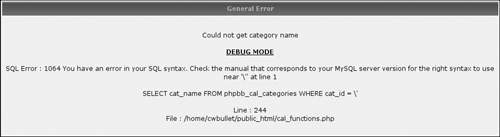
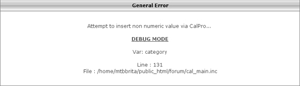
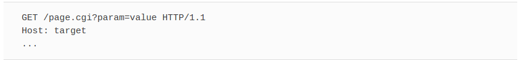
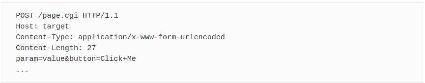
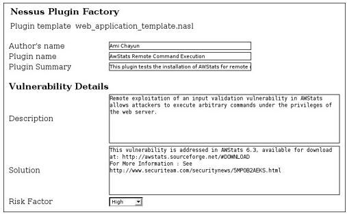
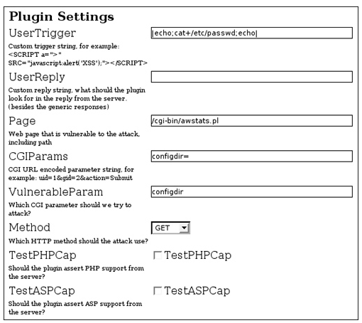
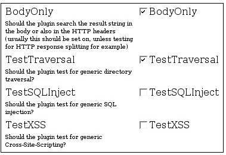
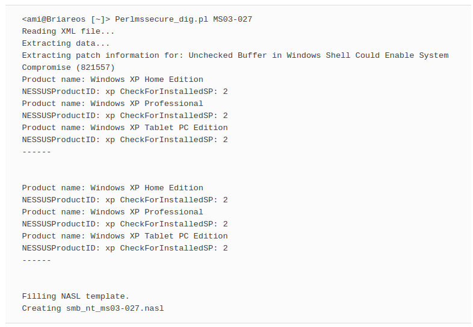

# In This Toolbox
Nessus’ most powerful feature is that it enables users to write custom plugins. At first glance, writing your own plugin seems to be an intimidating job, requiring deep knowledge in security and networking. This chapter’s goal is to present several tools to automate and simplify plugin creation. First, we will examine the similarities among plugins from the same family with the goal of creating templates that can be used for more than one plugin. Second, we will discuss the more general approach to plugin creation using XML (Extensible Markup Language) data structures.

# Plugin Templates: Making Many from Few
To get the most out of Nessus, you need powerful plugins. An effective plugin should have maximum detection abilities and minimum false positives. Instead of reinventing the wheel for every plugin, templates provide a solid and tested base for entire plugin families. In this section, we will discuss templates that you can create for Web applications.

Web applications have gained increasing popularity in the last couple of years. Additionally, Web standards allow Web applications (if written properly) to be almost platform-independent.

Web applications typically include several security issues, some of them quite different from the ones classic applications suffer. Because the user has much more control over the input the application receives, the application must enforce strict content filtering. Insufficient content filtering is the main cause of all Web application security problems.

## Common Web Application Security Issues
The security issues that we will discuss here are divided into two distinct families; server-side execution and client-side execution. In the first type of vulnerability, the attacker has control over code being run on the application server itself, whether the application is running the script (PHP, or Hypertext Preprocessor, engine, for example) or a database that the application communicates with. The latter type allows an attacker to inject code that runs on clients of the application.

### SERVER-SIDE EXECUTION (SQL INJECTION, CODE INCLUSION)
Common server-side execution techniques include SQL injection and code inclusion. In this section we will cover the subject only superficially because there are many resources about this subject available on the Internet. The following paragraphs, will, however, describe the subject briefly. This background information was taken from frequently asked questions that appeared on a Web page titled “SQL Injection Walkthrough” on Beyond Security’s Securiteam Web site, http://www.securiteam.com/securityreviews/5DP0N1P76E.html.

SQL (Structured Query Language) injection is a trick to inject SQL queries and commands as input via Web pages. Many Web pages take parameters from users, and make SQL queries to the database. For instance, when a user logs in, the login Web page queries the database to determine if that username and password are valid. Using SQL injection, someone can send a crafted username and/or password field that will change the SQL query and grant that person gained privileges (i.e., arbitrary access to the database).

When trying to determine SQL injection vulnerabilities, you should look for pages that allow you to submit data such as login page, search pages, and so on. Sometimes HTML pages use the POST command to send parameters to another active server page (ASP). Therefore, you may not see the parameters in the URL. However, you can check the source code of the HTML and look for the FORM tag in the HTML code. You may find something like this in some HTML codes:
```javascript
<FORM action=Search/search.asp method=post>
<input type=hidden name=A value=C>
</FORM>
```

Everything between `<FORM>` and `</FORM>` has parameters that could potentially be exploited.

You should also look for vulnerabilities on ASP, Java Server Page (JSP), Common Gateway Interface (CGI), or PHP Web pages with URLs like http://duck/index.asp?id=10.

Any page containing URL encoded parameters, like id in the preceding example, is interesting and should be tested for SQL injection.

Once you have located a potentially vulnerable Web page, you can test it for vulnerabilities. Start with a single quote trick. Enter something like **hi’ or 1=1--** in the login, password, or URL (Uniform Resource Locator) field.

If you must do this with a hidden field, just download the source HTML from the site, save it in your hard disk, and modify the URL and hidden field accordingly. For example:

```javascipt
<FORM action=http://duck/Search/search.asp method=post>
<input type=hidden name=A value="hi' or 1=1--">
</FORM>
```

If there is a vulnerability, you will be able to log in without a valid username or password.

Let us look at why **’ or 1=1--** is important. Other than bypassing login pages, it is also possible to view extra information that is not normally available. Take an ASP that will link you to another page using the URL

http://duck/index.asp?category=food.

In the URL, *category* is the variable name, and *food* is the value assigned to the variable. In this case, an ASP might contain the following code:

```SQL
v_cat = request("category")
sqlstr="SELECT * FROM product WHERE PCategory='" & v_cat & "'"
set rs=conn.execute(sqlstr)
```
As you can see, the variable will be wrapped into v_cat and thus the SQL statement should become:

`SELECT * FROM product WHERE PCategory='food'`

The query should return a result set containing one or more rows that match the WHERE condition, in this case, *food*.

Now, assume that we change the URL into something like this: http://duck/index.asp?category=food’ or 1=1--

Now, our variable v_cat equals food or 1=1-- “. If we substitute this in the SQL query, we will have:

`SELECT * FROM product WHERE PCategory='food' or 1=1--'`

The query should now select everything from the product table regardless if PCategory is equal to food or not. A double dash (--) tells the SQL server to ignore the rest of the query, which will get rid of the last hanging single quote (‘). Sometimes, it may be possible to replace double dash with single hash (#).

However, if it is not an SQL server, or you simply cannot ignore the rest of the query, you also may try:

`' or 'a'='a`

The SQL query will now become:

`SELECT * FROM product WHERE PCategory='food' or 'a'='a'`

And it should return the same result.

### CLIENT-SIDE EXECUTION (CODE INJECTION, CROSS-SITE SCRIPTING, HTTP RESPONSE SPLITTING)
On the other side of the Web application vulnerability rainbow are the client-side vulnerabilities. This type of vulnerability is caused by the same issue as SQL injections: unfiltered user parameters. When user parameters are passed to the Web application, they can contain HTML (Hypertext Markup Language) or HTTP (Hypertext Transfer Protocol) special characters. Even if the input is never used in SQL or exec commands, an attacker can use this weakness if the user input is printed back by the script as a result. For example, if the user is required to fill his or her name in an HTML field, the HTML source can look something like:

`<INPUT NAME="username" VALUE="please provide a valid username">`

The attacker can enter something like:

`"><SCRIPT SRC="http://hostilepage/evilscript.asp"></SCRIPT>`

If the content is printed back unfiltered, the resultant HTML will include:

`<INPUT NAME="username" VALUE=" "><SCRIPT SRC="http://hostilepage/evilscript.asp"></SCRIPT>
">`

As you can see, the attacker injected arbitrary HTML code into the original HTML page, and the resultant HTML will run the attacker’s script.

This is, of course, being run on the client browser, not on the server. This does present a threat, though. For example, let us assume that a company holds a Web portal for its employees.

If the company’s site is vulnerable to cross-site scripting, an attacker can exploit the vulnerability combined with some social engineering. The attacker can send an e-mail to all the employees of the company, falsely stating that all the employees must renew their passwords owing to a problem in the database. The e-mail would also contain a link that points to the company’s site. To the untrained eye it will look valid, but actually it will point the person to the attacker’s page to harvest passwords.

## Creating Web Application Plugin Templates
Let’s begin with an example, a plugin that tests a simple SQL Injection vulnerability in phpBB’s (http://phpbb.com) Calendar Pro Mod (www.securiteam.com/exploits/5XP021FFGU.html).

The first part is divided into two sections: The first part of the plugin is the description used if the vulnerability was detected. Usually the description supplies details on the vulnerable product, the vulnerability, and a proposed solution. The second part runs the test and detects the vulnerability.

```NASL
#
# Copyright 2005 Ami Chayun
#
if (description) {
  script_version("$Revision: 1.0 $");


  name["english"] = "SQL Injection in phpBB 2.0.13 Calendar Pro Mod";
  script_name(english:name["english"]);


  desc["english"] = "
The remote host is running a version of phpBB that suffers from an SQL injection flaw in
the cal_view_month.php script.
An attacker can execute arbitrary SQL commands by injecting SQL code in the category
parameter.


Solution : Upgrade to a version after phpBB 2.0.13 when it becomes available and disable
the Calendar Pro mod until then.


Risk factor : Medium";
  script_description(english:desc["english"]);


  summary["english"] = "Checks for SQL injection in phpBB Calendar Pro Mod";
  script_summary(english:summary["english"]);


  script_category(ACT_GATHER_INFO);
  script_copyright(english:"This script is Copyright (C) 2005 Ami Chayun");


  family["english"] = "CGI abuses";
  script_family(english:family["english"]);


  script_require_ports("Services/www", 80);
  exit(0);
}


include("http_func.inc");
include("http_keepalive.inc");
# Test starts here
port = get_http_port(default:80);
if (!get_port_state(port)) exit(0);


req = http_get(item: "/cal_view_month.php?&month=04&year=2005&category='&action=print",
port:port);
buf = http_keepalive_send_recv(port:port, data:req, bodyonly:1);
if(buf == NULL)exit(0);

if("SQL Error : 1064" >< buf)
        security_warning(port);
```

Detecting Vulnerabilities
So how does the plugin detect the vulnerability? The vulnerability occurs in the category parameter of the script. We are able to inject arbitrary SQL content into the script by requesting a page like:

http://target/cal_view_month.php?month=04&year=2005&category=’&action=print

As shown in Figure, a vulnerable server would usually contain the following text in the reply:



“SQL Error: 1064 You have an error in your SQL syntax near ‘\’’ at line 1.”

`SELECT cat_name FROM phpbb_cal_categories WHERE cat_id = \'`

The vendor released a patch for the issue, and trying to exploit the vulnerability on an immune site should give a reply like the one shown in Figure.



The script requests the vulnerable page with an injected quote (‘). This will trigger the SQL injection and will output the desired error. If the error is found in the reply, we can conclude that the target host is vulnerable.


## Making the Plugin More General
Let’s start generalizing the plugin. From here on we will change only the test itself; the description will be written again only if it is changed.

### PARAMETERIZE THE DETECTION AND TRIGGER STRINGS
We are interested in a plugin suitable for general purposes, so we need to parameterize the URI that triggers the error and the error string:

```NASL
...
vulnerable_string = "SQL Error : 1064";
page = "cal_view_month.php";
params = "month=04&year=2005&category='&action=print";
uri = "/"+page+params;
req = http_get(item:uri, port:port);
buf = http_keepalive_send_recv(port:port, data:req, bodyonly:1);
if(buf == NULL)exit(0);
if(vulnerable_string >< buf)
        security_warning(port);
```

After getting the strings out of the code, we can replace them with appropriate tags:

```NASL
port = get_http_port(default:80);
if (!get_port_state(port)) exit(0);
vulnerable_string = "<VulnerableString/>";
page = "<Page/>";
params = "<CGIParams/>";
uri = string("/", page, params);
req = http_get(item:uri, port:port);
buf = http_keepalive_send_recv(port:port, data:req, bodyonly:1);
if(buf == NULL)exit(0);
if(vulnerable_string >< buf)
        security_warning(port);
```

### ALLOW DIFFERENT INSTALLATION DIRS
Another thing to consider is the installation path. What if the script is installed under */cgi-bin* and not in the Web server root? Nessus supplies us with a function just for this:

The *cgi_dirs()* function in the http_func include file will return the default installation path *cgi-bin* (in apache) and */scripts* (in IIS). If the user configured custom Web dirs in the knowledge base, they will also be included.

An extended functionality is included in the DDI_Directory_Scanner.nasl plugin, which scans for more than 700 known paths. This capability, combined with *webmirror.nasl*, which will be discussed next, provides accurate mapping of the target’s CGI paths. Both DDI_Directory_Scanner.nasl and webmirror.nasl update the *cgi_dirs* list, so the only requirement is to include either *DDI_Directory_Scanner.nasl* or *webmirror.nasl* (as it includes *DDI_Directory_Scanner.nasl*) in the script dependencies.

*Webmirror.nasl* is a directory crawler, which allows a method of mapping a Web server by the contents of its pages. For example, if the main index page contains a link to: */my-cgis/login.php*, webmirror will add the my-cgis directory to the *cgi_dir()* list. This, of course, simplifies the work of our plugin because we can use the knowledge gathered from this plugin in our test.

So the general approach to test under several directories will be:

```NASL
foreach d (cgi_dirs())
{
 req = http_get(item:string(d, uri), port:port);
 buf = http_keepalive_send_recv(port:port, data:req, bodyonly:1);
 if(buf == NULL) exit(0);
 if(vulnerable_string >< buf)
 {
   security_warning(port);
   exit(0);
 }
}
```

***
**NOTE**
The downside of depending on webmirror.nasl or its counterpart, DDI_Directory_ Scanner.nasl, is the fact that these tests take a substantial amount of time to run, especially on a Web server containing a lot of content or that responds slowly. When testing the plugin before releasing it, you can remove webmirror.nasl from the dependency list.

Also, if you plan to run your plugin as a stand-alone, or if you are sure that the target application is installed in one of the default paths, it is not absolutely necessary to depend on the webmirror.nasl or DDI_Directory_Scanner.nasl plugins. For general usage, however, we highly recommend using these plugins.
***

Another important task is to check whether the page actually exists. This can be done with *is_cgi_installed_ka* in *http_func*.

```NASL
 if(is_cgi_installed_ka(item: string(d, page), port:port))
 {
  req = http_get(item:string(d, uri), port:port);
  buf = http_keepalive_send_recv(port:port, data:req,
...
}
```

### ALLOW DIFFERENT HTTP METHODS
HTTP supports two major protocols to send form information: one is URI-encoded GET, and the other is POST. Parameters passed in the GET method are written after a question mark (?), for example, http://target/page.cgi?param=value.

The actual HTTP request will look like the following:



Passing parameters via GET is simple because it can be written as a URI (link to a browser) where a POST command requires a FORM part in the HTML. The main reason POST is sometimes preferred over GET is that some Web servers enforce maximum size on URI length, limiting the amount of data that can be sent.

The same command in POST will look like the following:


```HTML
<form action="/page" method="POST">
<input type="hidden" name="param" value="value">
<input type=submit value="Click Me" name="button">
</form>
```

According to the preceding command, the user will see a **Click Me** button. When this button is clicked, the browser will perform a POST request like the following:



The same parameters that were passed in the URI of the GET request are now encoded in the body of the POST request. Because there is no limit to the size of the body, we must pass the server the length of the content, in this case 27.

We want to be able to test SQL injection in POST as well as GET; therefore, we can change the template to allow the user to select the preferred method:

```NASL
if(method == "GET")
  {
   uri = string(d, page, "?", cgi_params);
   req = http_get(item: uri, port:port);
  }
  else if (method == "POST")
  {
   req = http_post(item: string(d, page), port:port);
   idx = stridx(req, '\r\n\r\n');
   req = insstr(req, '\r\nContent-Length: ' + strlen(data) + '\r\n' +
     'Content-Type: application/x-www-form-urlencoded\r\n\r\n' + cgi_params, idx);
  }
  buf = http_keepalive_send_recv(port:port, data:req, bodyonly:1);
  if(buf == NULL)exit(0);
...
```

### MULTIPLE ATTACK VECTORS
The power of a good plugin is in its attack vector. A string that would set off a vulnerability in one product can be useless in another. Server reply strings are even more complicated and can be completely different from one product version to the next.

The plugin template presented in this section aims to help the user build an effective plugin with minimum effort. To provide this, we need to generalize the mechanism that searches for the vulnerability.

Until now, the user supplied a URI and an expected response. How about letting the plugin do the hard work for us?

We add this code to the beginning of the test, letting the users be as flexible as they need:
```NASL
user_vulnerable_string = "";
user_trigger_string = "";
vulnerable_param = "category";


page = string("/","cal_view_month.php");
cgi_params = "month=04&year=2005&category=&action=print";


test_dir_traversal = 1;
test_sql_injection = 1;
test_xss = 1;
```

First, we provide a valid page and parameter set, so our requests are legal to the target application. Next, we provide a vulnerable CGI parameter name. We suspect that the category parameter is vulnerable to SQL injection, so we mark that we want to test for SQL injection. We know that the vendor fixed the SQL injection in this parameter, but was the cross-site scripting fixed, too? We would like to know, so we mark all three test options.

The next part of this addition is the attack vectors themselves. Here are some common attack vectors and reply strings to match them:

```NASL
###
# Attack vectors
dir_traversal[0] = "/etc/passwd";
dir_traversal[1] = "../../../../../../../../etc/passwd";
dir_traversal[2] = "../../../../../../../../etc/passwd%00";


passwd_file[0]  = "root:";


sql_injection[0] = "'";
sql_injection[1] = "%27";
sql_injection[2] = " group by";


sql_error[0]     = "SQL Error : 1064";
sql_error[1]     = "ODBC Microsoft Access Driver";
sql_error[2]     = "SQLServer JDBC Driver";
sql_error[3]     = "Microsoft JET Database Engine error '80040e14'";


XSS[0]           = "<script>alert(document.cookie)</script>";
XSS[1]           = "%22%3E%3Cscript%3Ealert%28document.cookie%29%3C%2Fscript%3E";
XSS[2]           = "%22+onmouseover%3D%22javascript:alert%28%27foo%27%29%22+%22";


XSS_reply[0]     = "<script>alert(document.cookie)</script>";
XSS_reply[1]     = "javascript:alert('foo')";
```

From these attack vectors we can build the pool of options we will have for the attack. We build a list of trigger strings and vulnerable reply strings:


```NASL
trigger_strings = make_list(user_trigger_string);
vulnerable_strings = make_list(user_vulnerable_string);
if(test_dir_traversal)
{
    trigger_strings = make_list(trigger_strings, dir_traversal);
    vulnerable_strings = make_list(vulnerable_strings, passwd_file);
}
if(test_sql_injection)
{
    trigger_strings = make_list(trigger_strings, sql_injection);
    vulnerable_strings = make_list(vulnerable_strings, sql_error);
}
if(test_xss)
{
    trigger_strings = make_list(trigger_strings, XSS);
    vulnerable_strings = make_list(vulnerable_strings, XSS_reply);
}
```

The *user_trigger_string* and *user_vulnerable_string* are custom strings the user can add for the test without modifying the generic strings.

Now for the test loop itself (this loop shows only the GET method. See the complete template later for the entire loop):
```NASL
foreach d ( cgi_dirs() )


{
  if(is_cgi_installed_ka(item: string(d, page), port:port))
  {
  foreach trigger_string (trigger_strings)
  {
   attack_vector = ereg_replace(string:cgi_params,
                       pattern:vulnerable_param + "=[^&]*",
                       replace:vulnerable_param + "="+ trigger_string);


    uri = string(d, page, "?", attack_vector);
    req = http_get(item: uri, port:port);
   #Send the request, and put in buf the response (body only or entire result)
   buf = http_keepalive_send_recv(port:port, data:req, bodyonly:test_only_body);
   if(buf == NULL) exit(0);
   foreach vulnerable_string (vulnerable_strings)
   {
    if(strlen(vulnerable_string) > 0 && vulnerable_string >< buf)
    {
     display(req,"\n");
     security_warning(port);
     exit(0);
    }
   }
  } #foreach attack vector
 } #Is CGI installed
} #foreach web dir

```

The test is performed in two parts. First, we make sure the page we want exists in the current directory. Then we take the original parameter list and change it to contain the trigger string. The regular expression grabs the *vulnerable_param=value* part of the parameter list. We then replace it with *vulnerable_param=trigger_string* to try to trigger the vulnerability.

The second part of the test id is the detection string in the server response. For each of the strings in hand, we try to see if the information we want exists in the response.

This algorithm actually performs a comprehensive test for all the known attack vectors. This allows the user to perform vulnerability research on a specific Web application; all you need to pass to the NASL is the parameter you suspect to be vulnerable, and the test will work its magic.

We now have several vulnerabilities at our disposal, so it would be wise to alert the user about the exact situation that triggered the vulnerability. If we detect a vulnerability, we return the exact details in the security warning:

```NASL
if(strlen(vulnerable_string) > 0 && vulnerable_string >< buf)
   {
    report = "By injecting: '" + trigger_string +
             "' to the '" + vulnerable_param +
             "' parameter of " + page + " via " + method +
             ", we were able to trigger the following response '" +
             vulnerable_string;


    security_warning(port:port, data:report);
    exit(0);
   }
 ```
 
 ***
 **Swiss Army Knife...: Creepy Crawlers: Learn More about Web Application Vulnerability Scanning**

Writing a test for a specific Web application security flaw is one thing, but finding new flaws in custom in-house applications is a completely different art. The Whisker project provides a framework in Perl that supplies functionality for HTTP-based vulnerability testing. For more information visit the tool’s Web page at www.wiretrip.net/rfp/lw.asp.

The most popular application based on this library is Nikto (www.cirt.net/code/nikto.shtml). It performs a thorough scan of a Web server for many known Web-based security flaws.

Nessus also has its own Web application scanner, a test known as torturecgis.nasl. This test runs a set of attack vectors on each of the CGIs discovered by webmirror.nasl.

Think you can do even better? The templates described here can easily be turned into your own personal Web application scanners. Once you are thoroughly acquainted with Nessus’ built-in functionality, you can write a plugin that scans your in-house application for an abundance of security holes and flaws.
***

### Increasing Plugin Accuracy
The weak spot of every security analysis is its credibility. If you fail to detect a real vulnerability, you’re in trouble. If you falsely detect a vulnerability, you’re in trouble again. What causes these troubles, and how can we overcome them?

#### THE “WHY BOTHER” CHECKS
If the target host doesn’t run an HTTP server, there is no point in testing it for SQL injection, right?

A plugin can run a series of tests to avoid being run uselessly:

- **Test if the service is running on the target host**. This is done with the following commands:
```NASL
script_require_ports("Services/www", 80);
and in the plugin body:
port = get_http_port(default:80);
if (!get_port_state(port)) exit(0);
```
These lines determine if a Web server is running on the target host and will abort if it is not.
- **Test for server capabilities**. Let’s assume we are testing for a vulnerability in an ASP-based Web application. Testing a target running Apache HTTP server is quite futile, as Apache cannot serve ASP pages. Nessus provides the functionality to test for server capabilities with the can_host_php and can_host_asp functions in http_func. Before we decide if we want to use these functions, first let’s see how this check is being done.
Every Web server should return a Server header when it replies to any HTTP request. For Apache HTTP server, this header usually looks like the following:

The server declares it is an Apache server and lists its capabilities (mod_perl, mod_ssl, OpenSSL version and PHP). It makes sense to look in this reply to see whether we should run the test or not.
An IIS server will usually answer with the simple header, “Server: Microsoft-IIS/6.0,” stating only that it is in fact a Microsoft IIS server, and its version.
Looks quite simple, right? Actually too simple. In the effort to enforce security on Web servers, a popular trend requires diligent system administrators to obscure the Server header as much as possible. Load balancers and other content-aware firewalls also sometimes decide that the Server header is too informative and cut it to a bare minimum. Even though the can_host_* functions try to evade such tricks, it is still easily fooled, and the user should consider whether to test for capabilities beforehand.
One trick up our sleeves comes again from the friendly webmirror.nasl plugin. When webmirror crawls the target’s Web site, it will look for PHP and ASP pages; if it stumbles upon any, it will make sure to set the can_host_php and can_host_asp reliably, even if the Web server banner does not include any useful information.

#### AVOIDING THE PITFALLS
Here are some ways to avoid pitfalls:

- **Test for generic XSS**. Assume the following scenario. You have discovered a new vulnerability in a popular Web platform. The reckless designers forgot to test the id parameter for metacharacters, allowing any hacker to show his l33t skillz (http://en.wikipedia.org/wiki/Leet), take over the board and write his too-cool name everywhere. You are eager to write a test for Nessus and gain eternal glory. Your test looks something like the following:
```NASL
if (description)
{
 script_name(english:"Popular Web Forum (R) XSS");
 desc["english"] = "A serious security flaw in Popular Web Forum 2.0.13 allows an
attacker to run arbitrary commands on your host.
Solution : Reinstall from scratch. No one is safe!
Risk factor : High";
script_description(english:desc["english"]);
}
include("http_func.inc");
include("http_keepalive.inc");
port = get_http_port(default:80);
if(!get_port_state(port))exit(0);
req = http_get(item:
"/index.asp?id=%3cscript%3ealert('I%20was%20here')%3c/script%3e", port:port);
buf = http_keepalive_send_recv(port:port, data:req, bodyonly:1);
if(buf == NULL)exit(0);
if("<script>alert('I was here')</script>" >< buf)
  security_warning(port);
```

Besides the writer’s overenthusiasm, this plugin suffers from a serious flaw; it does not check to see if we already detected generic SQL injection on the target.

Let’s say the target is an in-house Web application that is also written in ASP, and by blind luck, it does not filter user input. Requesting http://target/index.asp?id=%3Cscript would also affect the target host, even though the host doesn’t run Popular Web Forum. If we had run a scan on this host and not tested for generic XSS, the user would be alerted with more than he or she bargained for. Upon receiving the results, you can be sure to expect a mail or phone call in the spirit of, “All this automated vulnerability assessment may be good for kids, but how do you expect us to trust your results when you alert us that we have a problem in a product we don’t even have installed?” Now go try and explain to the customer that the flaw does actually exist, but under different name.

For this type of scenario, it is the better-safe-than-sorry policy that will save your hide. So we should add the generic XSS test:
```NASL
if (get_kb_item(string("www/", port, "/generic_xss"))) exit(0);
```

- **Test for product installation**. A popular approach in Web application testing states that to make sure a target host is vulnerable to a specific vulnerability, first check that the vulnerable product is even installed. Nessus provides various NASLs that test for many Web applications. For example, the *plugin phpbb_detect.nasl* tests for an installation of phpbb. The plugin looks in the source of several pages (*index.php* and */docs/CHANGELOG.html*) for the regular expression Powered by.*phpBB.
To use the installation check, you should use script_dependencies(“phpbb_detect.nasl”) and perform the following test in the test phase:
```NASL
install = get_kb_item(string("www/", port, "/phpBB"));
if (isnull(install)) exit(0);
```

If the target host has an installation of phpBB, the string will exist, and the test will run. The license of phpBB requires you to leave the docs directory intact, but if someone decides to remove all the “Powered by ...” strings, the test will fail to detect the installation. Again, the user has a choice of whether to use detection plugins.


- **Test for no404**. A known issue when testing for Web application insecurities is the infamous no 404 page. According to the HTTP 1.0 protocol (www.w3.org/Protocols/rfc1945/rfc1945), when a server fails to find a requested URI, it should return a reply with the code 404. When we build a request, we create something like the following:
```NASL
http_get(item: uri, port:port);
buf = http_keepalive_send_recv(port:port, data:req);
```
If the page in the uri does not exist, buf should return with the server reply for nonexistent pages. Preferably the reply will contain the “404 Not Found” header.

Some Web developers prefer to redirect the user to a known page when an unknown page is requested. Although this usually does not affect the end user of the product, when testing for a security vulnerability, this can be disastrous. For example, if we request index.php?id=’, the page does not exist, but instead of getting a 404 response, we get the main index page. In most cases this should present no problem, but in the unlikely situation where the index page contains the string “SQL Error : 1064,” we will get a false positive.

Fortunately, there are a few countermeasures at our disposal:

- **Look for distinctive replies from the server**. Looking for the string “*Error*” in the reply is obviously more prone to false positives than looking for “You have an error in your SQL syntax near ‘\“.” The key is to find the right balance between testing for too specific a string, and too generic a string.

- **Require script_dependencies(“no404.nasl”)**. The no404 plugin connects to the Web server on the target host and requests several pages. Some of these should be existing pages (like /, for example, which should be the page index) and some that should never exist (random page names, for example). From the replies of the server, the script tries to dig a string that appears only when a nonexistent page is requested. If it finds such a string, it is saved in the knowledge base under the following line:
`no404 = get_kb_item(strcat(“www/no404/”, port));`
This string can be used later to detect whether the page we requested actually exists on the server, or the page we received is a canned response. This will make your life a lot easier when trying to debug false positive issues.

- **Use is_cgi_installed_ka**. The *is_cgi_installed_ka* function is aware of the no404 issue. If the script has included no404.nasl in the dependencies, it will check if the no404 string was set. If the no404 string is set, the function will return FALSE, preventing false positives.
Following these guidelines when writing a Web-based test will improve your accuracy and help you evade the 404 situation.
- **Use body only when needed**. Nessus was designed to be a network-oriented auditing tool. This means that most of the built-in capabilities provide low-level access to network protocol. When we use buf = *http_keepalive_send_recv*(, the reply will contain the page we requested, but it will contain also all of the HTTP headers! When we search for a string in the reply of the server, we may stumble upon a header containing the string we sought, resulting in a false positive.
On the other hand, sometimes the body of the response will not contain any useful information. For example, if the vulnerability triggers an internal server error (code 500 family), the body of the response will probably be empty, but if we look in the headers, we can see that the server replied with an error status.
Once again, it is up to the user to decide where to look for the result string.

***
**Master Craftsman...: Getting Accurate: Add Attack Vectors to Increase Your Detection Abilities**

Web applications are odd creatures. User input is being parsed several times before it reaches the target application. A firewall, an IDS (intrusion detection system), and finally the Web server can all carry out different functions on your input.

Some Web application developers trust content filtering in the hands of dedicated software such as Urlscan for the IIS (Internet Information Services) Web server (www.microsoft.com/windows2000/downloads/recommended/urlscan/default.asp) and mod_security for Apache (www.modsecurity.org/).

We all know that the < character is dangerous if not filtered properly and that it can lead to cross-site scripting, but how many ways can one encode the < character? Here are just a few possibilities: %3C &lt; &LT &#60 &#060 \x3C

To gain the real benefits of your Web application plugin, you need to increase the amount of attack vectors in hand. Testing only for < can be insufficient, as it can be filtered along the way, and the scan will come up empty. The more possibilities of encoding you supply the plugin, the more accurate the scan will be. One handy tool is Rsnake’s XSS Cheatsheet (www.shocking.com/~rsnake/xss.html), which supplies some nifty tricks to enhance your ability to detect XSS and other Web application insecurities.
***

## The Final Plugin Template
Here is the final plugin, following the guidelines to be as general as possible. The plugin now has tags instead of specific contents.
```NASL
#
# Web application test template
# Copyright 2005 Ami Chayun
#


if (description) {
  script_version("$Revision: 1.0 $");


  name["english"] = "<Name/>";
  script_name(english:name["english"]);


  desc["english"] = "
<Description/>
Solution : <Solution/>
Risk factor : <RiskFactor/>";
  script_description(english:desc["english"]);


  summary["english"] = "<Summary/>";
  script_summary(english:summary["english"]);


  script_category(ACT_GATHER_INFO);
  script_copyright(english:"This script is Copyright (C) 2005 <Author/>");


  family["english"] = "CGI abuses";
  script_family(english:family["english"]);
  script_dependency("no404.nasl", "cross_site_scripting.nasl",
                      "webmirror.nasl");
  script_require_ports("Services/www", 80);
  exit(0);
}


include("http_func.inc");
include("http_keepalive.inc");


###
#User defined variables
user_trigger_string = '<UserTrigger/>';    #User custom trigger string
user_vulnerable_string = '<UserReply/>'; #User custom reply string
vulnerable_param = "<VulnerableParam/>";


page = string("/","<Page/>"); #web page containing the vulnerability
cgi_params = "<CGIParams/>"; #URL encoded parameter list
method = "<Method/>"; #GET | POST


#Test for web server capabilities
#1 test for server capability, 0 skip capability test
do_test_php = <TestPHPCap/>;
do_test_asp = <TestASPCap/>;
#Test the response body or also headers?
test_only_body = <BodyOnly/>;


#1 include the family of attack vectors in test
#0 exclude the family
test_dir_traversal = <TestTraversal/>;
test_sql_injection = <TestSQLInject/>;
test_xss = <TestXSS/>;


### End variable part ###


###
# Attack vectors
dir_traversal[0] = "/etc/passwd";
dir_traversal[1] = "../../../../../../../../etc/passwd";
dir_traversal[2] = "../../../../../../../../etc/passwd%00";


passwd_file[0]  = "root:";


sql_injection[0] = "'";
sql_injection[1] = "%27";
sql_injection[2] = " group by";


sql_error[0]     = "SQL Error : 1064";
sql_error[1]     = "ODBC Microsoft Access Driver";
sql_error[2]     = "SQLServer JDBC Driver";
sql_error[3]     = "Microsoft JET Database Engine error '80040e14'";


XSS[0]           = "<script>alert(document.cookie)</script>";
XSS[1]           = "%22%3E%3Cscript%3Ealert%28document.cookie%29%3C%2Fscript%3E";
XSS[2]           = "%22+onmouseover%3D%22javascript:alert%28%27foo%27%29%22+%22";


XSS_reply[0]     = "<script>alert(document.cookie)</script>";
XSS_reply[1]     = "javascript:alert('foo')";


#Build the attack vector list to the user's wishes
trigger_strings = make_list(user_trigger_string);
vulnerable_strings = make_list(user_vulnerable_string);
if(test_dir_traversal)
{
        trigger_strings = make_list(trigger_strings, dir_traversal);
    vulnerable_strings = make_list(vulnerable_strings, passwd_file);
}
if(test_sql_injection)
{
    trigger_strings = make_list(trigger_strings, sql_injection);
    vulnerable_strings = make_list(vulnerable_strings, sql_error);
}
if(test_xss)
{
    trigger_strings = make_list(trigger_strings, XSS);
    vulnerable_strings = make_list(vulnerable_strings, XSS_reply);
}


###
# Test mechanism starts here
port = get_http_port(default:80);
if (!get_port_state(port)) exit(0);


#If the user requested, check that the server is ASP/PHP capable
if(do_test_php && !can_host_php(port:port)) exit(0);
if(do_test_asp && !can_host_asp(port:port)) exit(0);


#First check for generic XSS and. Don't do other plugin't job
if (get_kb_item(string("www/", port, "/generic_xss"))) exit(0);


foreach d ( cgi_dirs() )
{
  if(is_cgi_installed_ka(item: string(d, page), port:port))
  {
  foreach trigger_string (trigger_strings)
  {
   attack_vector = ereg_replace(string:cgi_params,
                       pattern:vulnerable_param + "=[^&]*",
                       replace:vulnerable_param + "="+ trigger_string);


   if(method == "GET")
   {
    uri = string(d, page, "?", attack_vector);
    req = http_get(item: uri, port:port);
   }
   else if (method == "POST")
   { #Build a valid POST, with content length
    req = http_post(item: string(d, page), port:port);
    idx = stridx(req, '\r\n\r\n');
    req = insstr(req, '\r\nContent-Length: ' + strlen(data) + '\r\n' +
       'Content-Type: application/x-www-form-urlencoded\r\n\r\n' +
    attack_vector, idx);
   }


   #Send the request, and put in buf the response (body only or entire result)
   buf = http_keepalive_send_recv(port:port, data:req, bodyonly:test_only_body);
   if(buf == NULL) exit(0);


   #Try to detect a vulnerable reply
   foreach vulnerable_string (vulnerable_strings)
   {
    if(strlen(vulnerable_string) > 0 && vulnerable_string >< buf)
    {
         #Report to the user of our findings
         report = "By injecting: '" + trigger_string +
                  "' to the '" + vulnerable_param +
                  "' parameter of " + page + " via " + method +
                  ", we were able to trigger the following response '" +
                  vulnerable_string;
     security_warning(port:port, data:report);
     exit(0);
        }
   }
  } #foreach attack vector
 } #Is CGI installed
} #foreach web dir
```

***
**Master Craftsman...: The Work Is Never Over: Expanding Capabilities of the Web Application Template**

The final template serves its goal, but it can be extended far more. The plugin can include cookie information or any other HTTP header information. By using Nessus’ library functions the plugin can also accept authentication information and attempt brute-force attacks. The more ideas you come up with on weaknesses in the Web application, the more powerful the template can be. It is worthwhile to check the Nessus plugin archive to see examples for advanced Web application insecurities.
***

### Rules of Thumb
In this section we have seen a method of creating a plugin and generalizing so that it can serve as a family template. Rules of thumb that you should follow are:

1. Allow different installation paths and different commands.
2. Use Nessus Knowledge Base items to see if the service you want to test is running on the target host.
3. Increase the amount of attack vectors and consider different encodings and different commands. Research for similar vulnerabilities in other products to add their attack vectors to yours.
4. Don’t overtest! For example, if you are testing a Simple Mail Transfer Protocol (SMTP) server for a vulnerability in the AUTH command, consider checking the server capabilities before running the attack. This will save network traffic and increase plugin accuracy.
5. Consider using application banner information. Sometimes it is the simplest way to test for a vulnerability, and sometimes it’s the only way. If you decide to use banner information, consider the consequences! A user can easily change banners. If there is no other way than checking in the banner, alert the user that according to its version the server is vulnerable to certain issues.
6. Alert the user about exactly what you found. This aids debugging false positives and helps the user to find a solution.
7. Avoid other people’s mistakes. Use script_dependencies to include tests that increase accuracy (no404, for example).
8. Use library functions. Don’t reinvent the wheel. Really, Nessus provides a wide interface to almost any known network protocol, so avoid hard-coded requests.
9. Divide and conquer. Separate the user variable part of the test from the mechanism. It will make life easier for other people to look in the final source.
10. Don’t hide your code. Publishing your code as much as possible is the best way for it to become the best all-around code; the more people who see and use your code, the more stable and accurate it will be. Use Nessus’ community to improve your code.

### Using a CGI Module for Plugin Creation
Presented here is a simple and effective interface for filling plugin templates. The interface will be Web based, and we will use Perl’s CGI module to create the page.

Apache’s Web server (http://httpd.apache.org) is the most popular HTTP server in the world, and we will use the out-of-the-box installation of Apache 1.3.33, installed from the Debian Linux APT system (apt-get install apache).

The default configuration of Apache in Debian is enough for our purposes, so we will not go into details on how to configure Apache. If you wish to learn more on Apache’s configuration file, see http://httpd.apache.org/docs/configuring.html.

### CGI
The Common Gateway Interface is an agreement between HTTP server implementers about how to integrate such gateway scripts and programs. It is typically used in conjunction with HTML forms to build database applications. For more information see www.w3.org/CGI/.

HTML forms are sections of a document containing normal content, markup, special elements called controls (checkboxes, radio buttons, and menus), and labels on those controls. Users generally complete a form by modifying its controls (entering text, selecting menu items, and so on), before submitting the form to an agent for processing (for example, to a Web server or to a mail server). For a complete specification of form elements in the HTML standard see www.w3.org/TR/REC-html40/interact/forms.html.

### PERL’S CGI CLASS
Perl’s CPAN repository includes a CGI library that supplies an interface to the CGI functionality. It also supports form elements for simplifying the creation of forms. The package’s documentation can be found at http://search.cpan.org/~lds/CGI.pm-3.10/CGI.pm.

***
**NOTE**
CPAN is the Comprehensive Perl Archive Network, a large collection of Perl software and documentation. For more information see www.cpan.org.
***

Although the package can be installed from CPAN, we will install it via Debian’s Advanced Package Tool (APT). The required package is apache-perl. This package includes Perl::CGI and the supplementary Apache support. Once all packages are installed, it’s time to see what the CGI looks like.

### Template .conf File
We would like to present the user with an HTML form that supplies all the template needs. We will also like to include several attributes to each customizable field, such as type and default value. We might also want to include a help item on each of the fields to explain to the user how to fill the form. To this end, we will create a configuration file for each of the templates in the system. The .conf file is an XML, containing information on each field that can be customized by the user:
```xml
<?xml version="1.0" encoding="utf-8"?>
<TemplateConf name="web_application_template">
 <Variables>
 <Variable name="UserTrigger" type="string" required="yes">
  <help>Custom trigger string, for example:
   &lt;SCRIPT a=">" SRC="javascript:alert('XSS');">&lt;/SCRIPT>
  </help>
 </Variable>
...
</Variables>
</TemplateConf>
```

For more information on XML see the section titled “Advanced Plugin Generation: XML Parsing for Plugin Creation” later in this chapter.

The example Variable element shows the attributes available for the *UserTrigger* field available in the *web_application_template.nasl* discussed in the previous section. The attributes used here are:

- **name**. Parameter name as it appears in the .nasl template

- **type**. Type of input the user submits. The types supported are:

- **string**. Free text INPUT control

- **checkbox**. Tickmark CHEECKBOX control

- **select**. Multiple option SELECT control

- **required**. Specifies whether this is field essential to the result plugin

- **default**. Default value of element

The .conf file XML can be extended by adding elements, for example by adding *label* and *language* attributes, to allow localization.

# Plugin Factory
The Plugin Factory includes two files. One is the HTML template to be filled by the CGI, and the other is the Plugin Factory CGI itself. The HTML template allows maximal flexibility, separating data from style information. The HTML source follows:

```HTML
<HTML>
<BODY>
 <FORM METHOD="GET" ACTION="pluginfactory.cgi">
  <TABLE BORDER="0" CELLPADDING="4">
   <TR>
    <TD CLASS="header" COLSPAN="2">Nessus Plugin Factory</TD>
   </TR>
   <TR>
    <TD>Plugin template</TD><TD><!-- #PluginTemplates# --></TD>
   </TR>
   <!-- #BEGINTemplateSelection# -->
   <TR>
    <TD><INPUT TYPE="Submit" Name="Action" Value="Choose Template"></TD>
   </TR>
   <!-- #ENDTemplateSelection# -->
  </TABLE>
 </FORM>
 <FORM METHOD="POST" ACTION="pluginfactory.cgi">
 <!-- #BEGINPluginDetails# -->
 <INPUT TYPE="Hidden" NAME="template" VALUE="<!-- #PluginTemplates# -->">
 <TABLE BORDER="0">
  <TR>
   <TD>Author's name</TD>
   <TD><INPUT TYPE="Text" NAME="Author" SIZE="50"></TD>
  </TR>
  <TR>
   <TD>Plugin name</TD><TD>
   <INPUT TYPE="Text" NAME="Name" SIZE="50"></TD>
  </TR>
  <TR>
   <TD>Plugin Summary</TD><TD>
   <INPUT TYPE="Text" NAME="Summary" SIZE="50"></TD>
  </TR>
  <TR>
   <TD COLSPAN="2" CLASS="header">Vulnerability Details</TD>
  </TR>
  <TR>
   <TD>Description</TD><TD>
   <TEXTAREA NAME="Description" ROWS="6" COLS="70">
Here is the place to write a description of the vulnerability,
how the vulnerability is triggered,
and what damage an attacker might cause exploiting this vulnerability.
   </TEXTAREA></TD>
  </TR>
  <TR>
   <TD>Solution</TD><TD><TEXTAREA NAME="Solution" ROWS="6" COLS="70">
Write down at least one solution available to the problem.
If the affected product did not release a patch or a newer version,
suggest a practical method to prevent the vulnerability,
for example filtering access to the port.</TEXTAREA></TD>
  </TR>
  <TR>
   <TD>Risk Factor</TD>
   <TD><SELECT NAME="RiskFactor">
    <OPTION VALUE="High">High</OPTION>
    <OPTION VALUE="Medium">Medium</OPTION>
    <OPTION VALUE="Low">Low</OPTION></SELECT></TD>
  </TR>
  <TR>
   <TD COLSPAN="2" CLASS="header">Plugin Settings</TD>
   <!-- #BEGINParams# -->
   <TR>
    <TD><!-- #ParamName# --></TD><TD><!-- #ParamInput# --></TD>
   </TR>
   <TR>
    <TD CLASS="help"><!-- #ParamHelp# --></TD>
   </TR>
   <!-- #ENDParams# -->
   <TR><TD COLSPAN="2" CLASS="header">Actions</TD></TR>
   <TR>
    <TD>Display plugin source</TD>
    <TD>Save generatred plugin to file.<BR>
    Filename:&nbsp;<INPUT TYPE="text" NAME="filename" VALUE=""></TD>
   </TR>
   <TR>
    <TD><INPUT TYPE="submit" NAME="Action" VALUE="Generate"></TD>
    <TD><INPUT TYPE="submit" NAME="Action" VALUE="Save"></TD>
   </TR>
 </TABLE>
 </FORM>
 <!-- #ENDPluginDetails# -->
 <!-- #BEGINResultNasl# -->
 <TABLE BORDER="0">
  <TR>
   <TD CLASS="header">Generated Plugin</TD>
  </TR>
  <TR>
   <TD><PRE><!-- #ResultNasl# --></PRE></TD>
  </TR>
 </TABLE>
 <!-- #ENDResultNasl# -->
</BODY>
</HTML>
```

The HTML file consists of three parts:

- **The template selection**. The first part of the HTML requires users to choose which template they would like to use to generate the plugin.

- **Vulnerability details and template parameters**. Once users have selected a valid template, they fill in the details regarding the vulnerability and complete the appropriate template parameters.

- **Generation actions**. Users choose the format in which the resulting plugin will be generated. The CGI can either print the content of the generated plugin or generate a .nasl file and prompt the user to save it.

The HTML includes special tags that will be replaced with the appropriate text. Tags are simply HTML comments with pound (#) sign in each end.

The second Plugin Factory element, the CGI itself, uses the following helper subroutines:

- **getSection**. Returns the contents of the text between two section tags (<!— #BEGINtagname# —> and <!— #ENDtagname# —>).

- **replaceSection**. Replaces the contents of the block between two section tags and the tags themselves.

- **replaceTag**. Replaces a simple tag in the format of <!— #tagname# —>.

- **replaceNaslTag**. Replaces a single tag in the format of <tagname/> used in the plugin template.

- **sanitize_name**. Returns a string that contains only allowed characters (-_a-zA-Z0-9.).

- **booleanFromString**. Returns 1 from true/yes/on strings, 0 otherwise.

- **error_message**. Prints an error message to the user and dies.

The CGI requires two Perl modules: Perl::CGI and XML::Simple. The CGI module is used to parse the CGI queries and generate appropriate HTML forms. XML::Simple is used to parse the template .conf XML file. An elaborate explanation of the XML::Simple module is given in the section titled “Advanced Plugin Generation: XML Parsing for Plugin Creation” later in this chapter.

Here is the CGI’s code:

```CGI
my $query = new CGI;
my $html_template = "";
 open HTML, "HTML/pluginFiller.html"
     or error_message("Could not open HTML file");
 while(<HTML>)
 {
  $html_template .= $_;
 }
 close HTML;
 ```
 
 The code begins by trying to read the HTML file to be filled by the script. The code then separates two cases; an HTTP GET request is used to build the form and choose a valid plugin template:

```NASL
 my $selected_plugin_template = sanitize_name($query->param('template'));


#The GET method is used to present the user the plugin form
if( $query->request_method() eq "GET")
{
 #If the user has not chosen a template yet,
 #Show the selection box, and hide the plugin details
 if(! $selected_plugin_template )
 {
  opendir TEMPLATES, "templates"
      or error_message("Could not open templates dir");


  my @plugin_templates = grep { /^(.*?).nasl$/ } readdir(TEMPLATES);
  closedir TEMPLATES;
  @plugin_templates or error_message("No valid plugin templates found");


  #Create a list of all the available plugin templates
  $selected_plugin_template = $query->scrolling_list(-name=>'template',
                                -values=>@{ @plugin_templates },
                                -multiple=>'false',
                                -labels => @{ @plugin_templates },
                                -default => [ $plugin_templates[0] ]);
  #Delete the Plugin Details section.
  $html_template = replaceSection($html_template, "PluginDetails");
 }
 else {
  $html_template = fillHTMLTemplateParams($html_template,
```

#Delete the template selection section.

```NASL
 $html_template = replaceSection($html_template, "TemplateSelection");
}


#Show the selected template name or a list of available templates
$html_template = replaceTag($html_template, "PluginTemplates",
                            $selected_plugin_template);
#Show resulting plugin section
$html_template = replaceSection($html_template, "ResultNasl");
 #Print the final HTML file
 print $query->header;
 print $html_template;
} #GET
```


If the user chooses a valid plugin template, the fillHTMLTemplateParams subroutine is called to build the form defined by the template .conf file. If the user has not yet chosen a template (the request did not contain a valid *template* parameter), a selection of the available templates is presented, and the user should choose one.

The other option is the POST method. If the script was called via a POST request, it expects to have all the parameters required to fill the template. It then takes the data provided by the user and generates a plugin.

```NASL
#The POST method is used to actually generate the plugin
elsif( $query->request_method() eq "POST")
{
 my $result_filename = $query->param('filename');


 #Read the desired plugin template
 open PLUGIN, "templates/$selected_plugin_template"
     or error_message("Template file does not exist");
 my $plugin_template = "";
 while(<PLUGIN>)
 {
   $plugin_template .= $_;
 }
 close PLUGIN;


 my %formParams = $query->Vars; #Get the form parameters as hash
 delete $formParams{'template'}; #Previously used
 delete $formParams{'filename'};


 $plugin_template = fillNaslTemplate($selected_plugin_template,
                                      $plugin_template, %formParams);

```

The fillNaslTemplate generates a NASL plugin from the parameters supplied by the user. The template and filename parameters are deleted from the hash, as both were already used and there is no need to pass them to the function. Once we have successfully generated the plugin, we can either print the result or prompt the user to save the file:

```NASL
#Check what output should be done
if( $query->param('Action') eq 'Save' and $result_filename)
{
 #Allow 'Save as'
 print $query->header(-type => 'text/nasl',
                      -attachment => $result_filename);
 print $plugin_template;
}
else
{
 #Delete the template selection section.
  $html_template = replaceSection($html_template, "TemplateSelection");
  #Delete the Plugin Details section.
  $html_template = replaceSection($html_template, "PluginDetails");
  #Show the selected template name or a list of avaliable templates
  $html_template = replaceTag($html_template, "PluginTemplates",
                              $selected_plugin_template);


  #Show resulting plugin
  $html_template = replaceTag($html_template, "ResultNasl",
                             $query->escapeHTML($plugin_template));
  #Print the final HTML
  print $query->header;
  print $html_template;
 }
}#POST


 #Tell Apache we're done.
 #No reason to keep the connection open more than needed
 exit 0;
 ```
 
Here are the two core subroutines used by the CGI. The first subroutine initializes the XML parser, reads the XML elements, and then fills in the HTML template accordingly. It generates controls according to the desired type as defined in the .conf file.

```NASL
sub fillHTMLTemplateParams
{
 my ($html_template, $plugin_template_file) =@_;
 $plugin_template_file =~ s/\.nasl/.conf/; #Load the appropriate .conf file


 my @ForceArray = ("Variable", "option");
 my $xml = new XML::Simple (ForceArray => [@ForceArray],
                            KeyAttr => 0, #Don't fold arrays
                            );
 stat "templates/$plugin_template_file"
     or error_message("Template file does not exist");


 my $data = $xml->XMLin("templates/$plugin_template_file")
    or error_message("Selected template doesn't have a valid .conf file");


 my $param_template = getSection($html_template, "Params");
 my $temp_param = ""; #The filled params sections
 my $Variables = $data->{'Variables'};
 foreach my $Variable ( @{ $Variables->{'Variable'} } )
 {
   $temp_param .= $param_template;


   my $name = $Variable->{'name'};
   $temp_param = replaceTag($temp_param, "ParamName", $name);
   $temp_param = replaceTag($temp_param, "ParamHelp",
                            $query->escapeHTML($Variable->{'help'}));


   my $default = $query->escapeHTML($Variable->{'default'});
   my $input = "";
   if($Variable->{'type'} eq "checkbox")
   {
     $input = $query->checkbox(-name => "$name",
                               -checked => booleanFromString($default),
                               -label => $name);
   }
   elsif($Variable->{'type'} eq "string")
   {
     $input = $query->textfield(-name => "$name",
                                -value => $default,
                                -size => 50);
   }
   elsif($Variable->{'type'} eq "select" and $Variable->{'option'})
   {
     $input = $query->scrolling_list(-name => "$name",
                                     -values => $Variable->{'option'},
                                     -size => 1, -default => $default);
   }
   $temp_param = replaceTag($temp_param, "ParamInput", $input);
 }
 $html_template = replaceSection($html_template, "Params", $temp_param);
 return $html_template;
}
```

The second function fills in the NASL template. The function runs on every parameter defined in the .conf file and then checks to determine if the user filled in that parameter. If a required parameter is missing, the function raises an error message.

```NASL
sub fillNaslTemplate
{
 my ($plugin_template_file, $plugin_template, %formParams) = @_;
 $plugin_template_file =~ s/\.nasl/.conf/;


 my @ForceArray = ("Variable");
 my $xml = new XML::Simple (ForceArray => [@ForceArray],
                            KeyAttr => 0, #Don't fold arrays
                            );
 my $data = $xml->XMLin("templates/$plugin_template_file")
    or error_message("Selected template doesn't have a valid .conf file");


 #Fill default plugin parameters
 $plugin_template = replaceNaslTag($plugin_template, 'Author',
                                   $formParams{'Author'});
 $plugin_template = replaceNaslTag($plugin_template, 'Name',
                                   $formParams{'Name'});
 $plugin_template = replaceNaslTag($plugin_template, 'Summary',
                                   $formParams{'Summary'});
 $plugin_template = replaceNaslTag($plugin_template, 'Description',
                                   $formParams{'Description'});
 $plugin_template = replaceNaslTag($plugin_template, 'Solution',
                                   $formParams{'Solution'});
 $plugin_template = replaceNaslTag($plugin_template, 'RiskFactor',
                                   $formParams{'RiskFactor'});


 my $Variables = $data->{'Variables'}
    or error_message("Error parsing XML .conf file");


 #Fill Optional parameters
 foreach my $Variable ( @{ $Variables->{'Variable'} } )
 {
   my $name = $Variable->{'name'};
   my $value = $formParams{$name};


   if(! $value and $Variable->{'required'} eq "yes")
   {
     error_message("Missing essential parameter: <B>$name</B>");
   }
   #Checkboxes in CGI are not sent if they are not checked,
   #so if there is no $formParams{$name} assume unchecked
   if($Variable->{'type'} eq 'checkbox')
   {
     $value = booleanFromString($value);
   }
   $plugin_template = replaceNaslTag($plugin_template, $name, $value);
 }


 return $plugin_template;
}

```

## Final Setup
Copy the *pluginfactory.cgi* file to your cgi-bin directory (default in the Debian install is /usr/lib/cgi-bin). Make sure it is executable by all (chmod 755 pluginfactory.cgi). The cgi-bin folder should include two subfolders: HTML and templates. In HTML, place the *pluginFiller.html* file and under templates copy the template .nasls and and their appropriate .conf files.

Once all the files are in the target directory, open a Web browser and visit the Plugin Factory page at http://127.0.0.1/cgi-bin/pluginfactory.cgi.

## Example Run
As an example we will look at a vulnerability in Awstats, a popular open source Web statistics and log parsing utility. Awstats suffered from a remote command execution vulnerability in versions 5.7 through 6.2. Figure 6.3 shows the vulnerability information filled in the CGI form.

**Awstats Remote Command Execution Vulnerability Details**

Now for the plugin configuration. We will test the vulnerability by running the exploit on the configdir parameter. The trigger will be the string: |echo;cat+/etc/passwd;echo|.

On vulnerable machines this will print the contents of the /etc/passwd file to the user (see Figure).


**Awstats Remote Command Execution Plugin Configuration**

Detecting if a server is vulnerable is quite simple. Because we already have a test that compares the result against /etc/passwd (when we test for directory traversal), we can check TestTraversal, and we do not have to supply a custom result string (see Figure).


**Using Awstats to Detect If a Server Is Vulnerable**

That’s it. Now a plugin for the Awstats remote command execution vulnerability can be generated.

The CGI presented here supplies an easy way to create plugins from plugin templates. As the example shows, a security advisory can be easily turned into a plugin. This kind of plugin creation automation can help security analysis of a system because the analyst can generate plugins while testing, and after gaining some experience, the resulting plugins will be effective and reliable.

# Advanced Plugin Generation: XML Parsing for Plugin Creation
In the previous section we introduced a method of creating generic plugin families with common templates. We are now going to approach the problem of efficient plugin creation from a different angle; namely, the data.

## XML Basics
XML is a standard for keeping and parsing data. An introduction to XML can be found at www.w3.org/XML.

XML recent development news can be found through various XML interest groups such as http://xml.org/.

We will use the XML as a data holder for our plugin creation. Since XML can easily be parsed, we can use several readily available parsing tools to take the data from the XML and turn it to a usable plugin.

Because we will use a simple implementation of the XML standard, here is a crash course on the XML file structure that we will use.

To make the explanation less alien to people unfamiliar with XML, we will use examples from HTML. HTML can actually be parsed as an XML, and it is a special case of general XML.

In XML, a document is a block of characters that make the XML. In this context we will usually mean a physical file, but the document can be any character stream.

```XML
Header:

<?xml version="1.0" encoding="UTF-8"?>
```

The XML document (file) starts with a header line that indicates the client parser that the file type is XML. The line can also hold information about the file content, like charset information.

An element in XML is a name for a block of data (that can also hold child elements). Elements start with a tag; for example, `<ThisIsAnElement>`.

The tag name can is decided by the user and cannot contain spaces. The name is placed between greater than (<) and less than (>) signs. To mark an ending of an element, the block ends with an ending tag, such as `</ThisIsAnElement>``.

An element that has no child elements can also be written as `<ThisIsAnotherElement />`. Notice that before the closing smaller than sign there is a forward slash (/).

In XML, an attribute is a name-value pair that can describe an element; for example, `<Work station ip=“192.168.0.2” />`.

The name of an attribute must not contain spaces, and the value must be enclosed in double quotation (“”) marks.

Every XML document must have exactly one top-level element. For example, HTML files have the following as a top-level element:

```html
 <html>
...
</html>
```

All the contents of the file (except the header) must be inside this element.

## XML AS A DATA HOLDER
One common implementation of XML is a data holder. XML can be used to create data structures that can be parsed later by code. The official name for this use is Document Object Model (DOM). Here is a simple example:

```xml
<?xml version="1.0" encoding="UTF-8"?>

<PersonFile>
<Name>My first name</Name>
<Address>123 Main St.</Address>
<Occupation>IT manager</Occupation>
</PersonFile>
```

This very simple configuration structure holds the details of one person. The top-level element, PersonFile, contains three child elements: Name, Address, and Occupation. The same data structure can be written with attributes instead if child elements like this:

```xml
<?xml version="1.0" encoding="UTF-8"?>
<PersonFile>
<Person name="My first name" address="123 Main St." occupation="IT manager" />
</PersonFile>
```

The Person element contains the same data, but this time as attributes. Using elements is sometimes preferred over attributes, usually if the data spans over multiple lines.

The preceding configuration files can be parsed into a data structure; for example, in C the structure can be written as:

```nasl
struct Person {
        char *name;
        char *address;
        char *occupation;
};

```

## Using mssecure.xml for Microsoft Security Bulletins
Shavlik Technologies, LLC (http://shavlik.com/) created HFNetChkPro, a patch management tool for the Microsoft Windows platform. This tool uses an XML schema for storing the data of the automatic patching system. The file is called mssecure.xml and an updated version can be downloaded from http://xml.shavlik.com/mssecure.xml.

Because the rights for the tool belong to Microsoft, the mssecure.xml is now a part of the Microsoft Baseline Security Analyzer tool (www.microsoft.com/technet/security/tools/mbsahome.mspx), Microsoft’s patch management solution.

We will use mssecure.xml as an example of automatic plugin creation for Microsoft’s security bulletins.

### THE MSSECURE XML SCHEMA
The mssecure.xml top-level structure is described as follows:

```XML
<BulletinDatastore DataVersion="1.1.2.409" LastDataUpdate="4/15/2005" ...>
+  <Bulletins></Bulletins>
+  <Products></Products>
+  <ProductFamilies></ProductFamilies>
+  <ServicePacks></ServicePacks>
+  <RegKeys></RegKeys>
+  <Files></Files>
+  <Commands></Commands>
+  <Severities></Severities>
+  <MSSeverities></MSSeverities>
+  <SupercededBys></SupercededBys>
+  <WellKnownURLs></WellKnownURLs>
</BulletinDatastore>
```
***
**NOTE**
The plus (+) prefix before an element means its contents were not shown. It is not a part of the XML document, just an accepted abbreviation.
***

Here is a short description of the elements that contain information we use in our plugins:

- **BulletinDatastore**. Top-level element. All data (except for document header) must be inside this element.

- **Bulletins**. Information included in a security bulletin; for example, summary, effected platforms, patch information, and so on.

- **Products**. Listing of all the known products. Products are referred by their ProductIDs.

- **ProductFamilies**. List of general product families as pointed by Product.

- **ServicePacks**. Information regarding software service pack updates.

- **MSSeverities**. Microsoft’s classification of risk levels in their bulletins.

We will use all the aforementioned elements to create a registry-based test for vulnerabilities affecting Microsoft Windows operating System.

## The Plugin Template
The plugin is a simple NASL file that contains tags for replacement. Later we will see the command-line tool that fills these tags automatically. Here is the template we will use to generate our plugins:

```NASL
# smb_nt_ms_template.nasl
#
# Automatically generated by MSSecure to NASL
#
if(description)
{
 script_id(<ScriptID/>);
 script_cve_id(<CVEID/>);
 script_version("$Revision: 1.0 $");


 name["english"] = "<ScriptName/>";
 script_name(english:name["english"]);


 desc["english"] = "
 <ScriptSummary/>
 Solution : <ScriptSolution/>
 Risk factor : <ScriptRiskFactor/>";
 script_description(english:desc["english"]);
 summary["english"] =
         "Determines if hotfix <ScriptHotfix/> has been installed";
 script_summary(english:summary["english"]);
 script_category(ACT_GATHER_INFO);


 script_copyright(english:
        "This script is Copyright (C) <Author/>");
 family["english"] =
        "Windows : Microsoft Bulletins";
 script_family(english:family["english"]);


 script_dependencies("smb_hotfixes.nasl");
 script_require_keys("SMB/Registry/Enumerated");
 script_require_ports(139, 445);
 exit(0);
}


include("smb_hotfixes.inc");
#Check if target has installed the Service Pack that includes the hotfix


nt_sp_version = <NTServicePack/>;
win2k_sp_version = <Win2kServicePack/>;
xp_sp_version = <XPServicePack/>;
win2003_sp_version = <Win2003ServicePack/>;


if ( hotfix_check_sp(  nt:nt_sp_version,
                        win2k:win2k_sp_version,
                        xp:xp_sp_version,
                        win2003:win2003_sp_version) <= 0 ) exit(0);


#Check if target has installed a hotfix that mitigates the vulnerability
if ( hotfix_missing(name: "<ScriptHotfix/>") > 0 )
        security_hole(get_kb_item("SMB/transport"));
		
```

***
**NOTE**
Although it is possible to automatically write plugins for MS security bulletins, these plugins cannot be redistributed because they include the text of advisories that are copyrighted by Microsoft.
***

### INS AND OUTS OF THE TEMPLATE
As we can see, the plugin is divided into two sections. The description section contains the information to be displayed to the user in case we detect the vulnerability. Details that will be filled in are the CVE numbers for this security bulletin, the name, summary, solution, and more.

The description also states two prerequisites. First, the script requires that *smb_hotfixes.nasl* be run before launching the plugin. Second, we also must have access to the target host’s registry; this is done via the *SMB/Registry/Enumerated knowledge-base item*.

The second part of the NASL tests for the vulnerability. A patch for a certain security bulletin can be applied in two ways: either install the hotfix issued in the security bulletin itself or install a Service Pack that already includes the hotfix.

To test if a certain Service Pack or hotfix is missing, we need to include the smb_hotfixes.inc file. This file contains functions we’ll use later; *namely, hotfix_check_sp* and *hotfix_missing*.

Next, we need to test whether the target has installed a Service Pack that resolves the issue. This is done by the following code:

```nasl
nt_sp_version = <NTServicePack/>;
win2k_sp_version = <Win2kServicePack/>;
xp_sp_version = <XPServicePack/>;
win2003_sp_version = <Win2003ServicePack/>;
```
For each affected operating system, we will fill a service pack number that includes the patch for the vulnerability. If no available Service Pack includes the hotfix, we will fill in here the upcoming service pack.

```nasl
if ( hotfix_check_sp(  nt:nt_sp_version,
                        win2k:win2k_sp_version,
                        xp:xp_sp_version,
                        win2003:win2003_sp_version) <= 0 ) exit(0);
```

This line actually performs the test for installed Service Pack. The function can return the following values:

**-1** The test does not affect the target host’s operating system (for example, the vulnerability affects Windows 2003, but the target host is running Microsoft Windows 2000). This obviously means the host is not vulnerable to the security issue, so we end our test.

**0** The service pack we tested for is installed. This means that the host installed a service pack that includes the hotfix. This means that the host is not vulnerable, and again, we end the test.

**1** The service pack is missing on the target host. In this case, the host might be vulnerable to the security issue, and we need to test further if the hotfix itself is installed.

In case no relevant service packs were installed, we need to test for the actual hotfix:

```nasl
if ( hotfix_missing(name: "<ScriptHotfix/>") > 0 )
        security_hole(get_kb_item("SMB/transport"));
		
```

If the *hotfix_missing* function return with a positive value, the target host is marked to be vulnerable.

## Filling in the Template Manually
After we looked at how the plugin performs the test for the vulnerability, let’s see how we get the data from the MSSecure.XML file. As an example, let’s look at Microsoft’s security bulletin MS03-026 (this vulnerability was the one exploited by the MSBLAST worm).

### GENERAL BULLETIN INFORMATION
Here is the beginning of the Bulletin element for the advisory. For the example, we listed here only the first patch in the structure:

```xml
<Bulletin BulletinID="MS03-026" BulletinLocationID="73" FAQLocationID="73"
FAQPageName="FQ03-026" Title="Buffer Overrun In RPC Interface Could Allow Code Execution
(823980)" DatePosted="2003/07/16" DateRevised="2003/07/16" Supported="Yes" Summary="Remote
Procedure Call (RPC) is a protocol used by the Windows operating system..." Issue="">
 <BulletinComments/>
 <QNumbers>
  <QNumber QNumber="Q823980"/>
  </QNumbers>
 <Patches>
  <Patch PatchName="Q823980i.EXE" PatchLocationID="1815" SBID="178" SQNumber="Q823980"
NoReboot="0" MSSeverityID="1" BugtraqID="8205" CVEID="CAN-2003-0352"
ShavlikPatchComment="This patch has been superseded by the patch for MS03-039">
   <PatchComments/>
   <AffectedProduct ProductID="2" FixedInSP="0">
    <AffectedServicePack ServicePackID="7"/>
   </AffectedProduct>
   <AffectedProduct ProductID="3" FixedInSP="0">
    <AffectedServicePack ServicePackID="7"/>
   </AffectedProduct>
   <AffectedProduct ProductID="1" FixedInSP="0">
    <AffectedServicePack ServicePackID="7"/>
   </AffectedProduct>
  </Patch>
 </Patches>
</Bulletin>
```

In the preceding example of code, we put the interesting data in bold text. *BulletinID* is the unique identifier for every bulletin. We will use it as a search key in the command-line tool presented later.

Title is the attribute we replace with our `<Name/>` tag, and Summary (appear in abbreviated form here) will replace the `<Summary/>` tag.

The *QNumber* element contains the name of the hotfix to be used in the plugin registry search. It’s value, in this example, **Q823980** replaces the `<ScriptHotfix/>` tag.

From the patch information we draw the CVEID attribute, to replace the `<CVEID/>`.

That’s it? Not exactly. There is one more piece of information we need to get to complete our plugin; the service pack that includes the hotfix. We will do this by looking in the *AffectedProduct* element.

The patch lists three affected products. All these products can use the patch executable to resolve the vulnerability. The affected product information is described like this:

```xml
<AffectedProduct ProductID="1" FixedInSP="0">
```

*ProductID* is a unique identifier in the XML to point to a specific version of a product (in our case a version of Microsoft Windows). The *FixedInSP* attribute equals 0, which means that there is no service pack that includes the hotfix. This is not entirely accurate, as we’ll see later in this chapter.

How do we link the ProductID attribute to a version of Microsoft Windows? The answer is in the `<Product>` sections of the XML. The `<Products>` element contains a list of subelements named `<Product>`, each describing a specific product version.

Here is the `<Product>` element of *ProductID* 1, 2, and 3 we are looking for:

```xml
<Product ProductID="1" Name="Windows NT Workstation 4.0"
MinimumSupportedServicePackID="4" CurrentServicePackID="7" CurrentVersion="4.00.1381">
 ...
 </Product>
<Product ProductID="2" Name="Windows NT Server 4.0" MinimumSupportedServicePackID="4"
CurrentServicePackID="7" CurrentVersion="4.00.1381">
...
</Product>
<Product ProductID="3" Name="Windows NT Server 4.0, Enterprise Edition"
MinimumSupportedServicePackID="4" CurrentServicePackID="7" CurrentVersion="4.00.1381">
...
</Product>

```

The XML element provides plenty of information. In this example we look for the name of the product; in this case, Windows NT.

***
**NOTE**
Nessus does not separate different subversions of the same product, so both Windows NT Workstation 4.0 and Windows NT Server 4.0 belong to the Windows NT family.

If a more specific version detection is required, the user can use the library function supplied in smb_hotfixes.inc to check for NT /2000 Server -hotfix_check_nt_server.
***

We can also find from this element the service pack number to write in the plugin template. Since no service pack resolves the issue, we need to know what is the last supported service pack for Windows NT. This information can also be found in the XML, in the `<ServicePacks>` section:

```xml
<ServicePack ServicePackID="7" Name="Windows NT4 Service Pack 6a" URL =
"http://support.microsoft.com/support/servicepacks/WinNT/4.0/SP6a.asp"
ReleaseDate="1999/11/30"/>
```

The latest service pack issued to Windows NT 4.0 was Service Pack 6a. This means that a host with Service Pack 7 installed does not require an installation of the hotfix. Because Windows NT 4.0 is no longer supported by Microsoft, there is no plan to issue such a service pack. By looking for a missing Service Pack 7, we will actually catch all the Windows NT 4.0 machines with any service pack installed.

### THE FINISHED TEMPLATE
After digging all the information required to fill the template, here is the final result:

```nasl
# smb_nt_ms03_026_example.nasl
if(description)
{
 script_cve_id("CAN-2003-0352");


 script_version("$Revision: 1.0 $");


 name["english"] = "Buffer Overrun In RPC Interface Could Allow Code Execution (823980)";
 script_name(english:name["english"]);
 desc["english"] = "
 Remote Procedure Call (RPC) is a protocol used by the Windows operating system. RPC
provides an inter-process communication mechanism that allows a program running on one
computer to seamlessly execute code on a remote system. The protocol itself is derived
from the Open Software Foundation (OSF) RPC protocol, but with the addition of some
Microsoft specific extensions. There is a vulnerability in the part of RPC that deals with
message exchange over TCP/IP. The failure results because of incorrect handling of
malformed messages. This particular vulnerability affects a Distributed Component
ObjectModel (DCOM) interface with RPC, which listens on TCP/IP port 135. This interface
handles DCOM object activation requests that are sent by client machines (such as
Universal Naming Convention (UNC) paths) to the server. An attacker who successfully
exploited this vulnerability would be able to run code with Local System privileges on an
affected system. The attacker would be able to take any action on the system, including
installing programs, viewing changing or deleting data, or creating new accounts with full
privileges. To exploit this vulnerability, an attacker would need to send a specially
formed request to the remote computer on port 135.
 Solution : http://microsoft.com/technet/security/bulletin/MS03-026.mspx
 Risk factor : High";
 script_description(english:desc["english"]);


 summary["english"] =
         "Determines if hotfix Q823980 has been installed";
 script_summary(english:summary["english"]);


 script_category(ACT_GATHER_INFO);


 script_copyright(english:
        "This script is Copyright (C) 2005 Ami Chayun");
 family["english"] =
        "Windows : Microsoft Bulletins";
 script_family(english:family["english"]);


 script_dependencies("smb_hotfixes.nasl");
 script_require_keys("SMB/Registry/Enumerated");
  script_require_ports(139, 445);
 exit(0);
}
include("smb_hotfixes.inc");


#Check if target has installed the Service Pack that includes the hotfix
nt_sp_version = 7;
win2k_sp_version = NULL;
xp_sp_version = NULL;
win2003_sp_version = NULL;


if ( hotfix_check_sp(   nt:nt_sp_version,
                                win2k:win2k_sp_version,
                                xp:xp_sp_version,
        win2003:win2003_sp_version)
                        <= 0 ) exit(0);
#Check if target has installed a hotfix that mitigates the vulnerability
if ( hotfix_missing(name: "Q823980") > 0 )
        security_hole(get_kb_item("SMB/transport"));
```

***
**NOTE**
In this example we filled win2k_sp_version (and all sp_version parameters except Windows NT 4.0) to be NULL. This will cause hotfix_check_sp to return -1 for any operating system except Windows NT 4.0. Of course if we wanted to complete the plugin, we would need to look in the Bulletin element of the XML for all the Patches elements and dig the missing service pack numbers from them. We leave this dirty work for the automatic tool.
***

## The Command-Line Tool
The tool we present here is command line based. It will read an XML file in the format of the MSSecure.XML described already in this chapter, and will generate a NASL plugin for a specific bulletin MSB-ID the user specifies as a parameter in the command line. Remember, the tool is meant to be extended, so almost all its parameters are in the source, rather than as command-line parameters.

### XML::SIMPLE
Grant McLean’s XML::Simple (http://homepages.paradise.net.nz/gmclean1/cpan/index.html) is a Perl module that provides, as the name implies, a simple API (application program interface) to XML files. For the complete API see http://search.cpan.org/dist/XML-Simple/lib/XML/Simple.pm. For our purposes it’s the perfect tool. It will convert the raw XML data to structured hashes and arrays. This is exactly what we need to dig out the required information.

To be able to run the script, first you need to make sure that the XML::Simple library is installed. This can be done either by downloading the sources from either of the links in the preceding paragraph, or preferably, installing it via CPAN.

The usage of XML::Simple is very straightforward:


```nasl
use XML::Simple qw(:strict);
my $xml = new XML::Simple (); #<-- optional construction parameters
my $data = $xml->XMLin("file.xml");
```

After successful initialization, *$data* will hold the XML document in form of hashes and arrays.

XML::Simple allows the user to control some aspects of the data structure that will be created by passing instructions to the constructor. We will use a couple of these features:

```xml
my $xml = new XML::Simple (
         ForceArray => ["Bulletin", "QNumber"],
         KeyAttr => {Bulletin => "BulletinID"});
```

The *ForceArray* parameter tells the parser that all elements named *Bulletin* or *QNumber* will be in an array. The default behavior of XML::Simple is to store elements in an array only if they have siblings (for example, if a bulletin has only one *QNumber* item under the *QNumbers* element, it will be stored as a hash, and not an array). This instruction, by forcing elements to be in an array instead of a hash, makes it easier to handle because there will be no need to deal with the special case where there is only one element.

The *KeyAttr* instruction controls array folding. XML::Simple can fold an array into a hash, with any attribute acting as a key. By default the parser will fold arrays with the attributes *name, key* or *id*. In our XML each element has a different attribute for a unique identifier, so we can set it here. This feature is especially useful for the Bulletin element. Instead of iterating over the entire *Bulletins* array, we can access the desired element directly.

For example, without the instruction, data will be stored like this:

```nasl
Bulletins {
 Bulletin => [0..n]
}
```

With array folding with *BulletinID* as key the data will be stored as:

```nasl
Bulletins {
 Bulletin => MS98-001 => { } ...
}
```

***
**NOTE**
Any element used in array folding must also be included in the ForceArray list.
***

### TOOL USAGE
To run the tool, get the latest version of mssecure.xml and make sure you have XML::Simple installed. The tool takes one obligatory parameter, the MSB-ID, which we will create a plugin for. Here is an example run:


And the resulting NASL for this vulnerability is as follows:

```nasl
#
# Automatically generated by MSSecure to NASL
#
if(description)
{
 script_id(90000);


 script_cve_id("CAN-2003-0306");


 script_version("$Revision: 1.0 $");


 name["english"] = "Unchecked Buffer in Windows Shell Could Enable System Compromise
(821557)";


 script_name(english:name["english"]);


 desc["english"] = "
 The Windows shell is responsible for providing the basic framework of the Windows user
interface experience. It is most fa
miliar to users as the Windows desktop. It also provides a variety of other functions to
help define the user's computing s
ession, including organizing files and folders, and providing the means to start programs.
An unchecked buffer exists in on
e of the functions used by the Windows shell to extract custom attribute information from
certain folders. A security vulne
rability results because it is possible for a malicious user to construct an attack that
could exploit this flaw and execut
e code on the user's system. An attacker could seek to exploit this vulnerability by
creating a Desktop.ini file that conta
ins a corrupt custom attribute, and then host it on a network share. If a user were to
browse the shared folder where the f
ile was stored, the vulnerability could then be exploited. A successful attack could have
the effect of either causing the
Windows shell to fail, or causing an attacker's code to run on the user's computer in the
security context of the user.
 Solution : http://www.microsoft.com/technet/security/bulletin/MS03-027.mspx
 Risk factor : Medium";
 script_description(english:desc["english"]);


 summary["english"] =
     "Determines if hotfix Q821557 has been installed";
 script_summary(english:summary["english"]);


 script_category(ACT_GATHER_INFO);
 script_copyright(english:
    "This script is Copyright (C) Ami Chayun");
 family["english"] =
    "Windows : Microsoft Bulletins";
 script_family(english:family["english"]);
 

 script_dependencies("smb_hotfixes.nasl");
 script_require_keys("SMB/Registry/Enumerated");
 script_require_ports(139, 445);
 exit(0);
}


include("smb_hotfixes.inc");


#Check if target has installed the Service Pack that includes the hotfix
nt_sp_version = NULL;
win2k_sp_version = NULL;
xp_sp_version = 2;
win2003_sp_version = NULL;


if ( hotfix_check_sp(  nt:nt_sp_version,
                        win2k:win2k_sp_version,
                        xp:xp_sp_version,
                        win2003:win2003_sp_version) <= 0 ) exit(0);


#Check if target has installed a hotfix that mitigates the vulnerability
if ( hotfix_missing(name: "Q821557") > 0 )
        security_hole(get_kb_item("SMB/transport"));
```

### THE SOURCE
Here is the source code for generating a NASL that tests for a specific MS BID.

```nasl
#!/usr/bin/perl -w
############
# The script will generate a NASL that tests for a specific MS BID
# Copyright 2005 Ami Chayun


use strict;
use XML::Simple qw(:strict);


#http://xml.shavlik.com/mssecure.xml
my $MSSecure = "mssecure.xml";
my $template_file = "smb_nt_ms_template.nasl";
my $Author = "Ami Chayun";
my $ScriptID = "10000";


my %SeveritiesMap = (   1 => 'High',   #Critical
                                2 => 'Medium', #Important
                                3 => 'Medium', #Moderate
                                4 => 'Low',    #Low
                        );
#Product families list
my %ProductsMap = (     1 => "nt",
                        2 => "win2k",
                        3 => "win9x",
                        4 => "xp",
                        5 => "win2003",
                        );
#Servicepack tags in the nasl template
my %ProductTags = (     "nt"            =>      "NTServicePack",
                        "win2k" =>      "Win2kServicePack",
                        "win9x" =>      "Win9xServicePack",
                        "xp"            =>      "XPServicePack",
                        "win2003"       =>      "Win2003ServicePack",
                        );
#Get the MS_BID From the user
my $MS_BID = shift @ARGV or die "Usage: $0 MS??-???\n";


#Before parsing the XML, tell the parser which elements will !Always!
# be an array, even if there are no siblings.
#Rule of thumb: Everything we later use in a 'foreach'
#or in folding must be in the @ForceArrays list
my @ForceArrays = (     "QNumber", "Bulletin", "Patch", "Product",
                        "AffectedProduct", "ServicePack",
                        "ProductFamily", "Location", "RegChg", "RegChange", "RegKey"
                        );
#Items that will be enumerated into a hash, and what string is the key


my @FoldArrays = (      Bulletin => "BulletinID",
                        Product => "ProductID",
                        ServicePack => "ServicePackID",
                        Location => "LocationID",
                                        ProductFamily => "ProductFamilyID",
                                        RegChange => "RegChangeID",
                                        Location => "LocationID");
#Items that are overcomplicated can be simplified.
#We 'flatten' RegKeys in one level
my @GroupTags = (RegKeys => "RegKey");
#Construct a new XML::Simple object
my $xml = new XML::Simple (     ForceArray => [@ForceArrays],
                                        KeyAttr => {@FoldArrays},
                                                        GroupTags => {@GroupTags}
                                        #Notice that we use KeyAttr => { list } NOT
KeyAttr => [ list ]

                               );
###
# 1. Read the template file
open TEMPLATE, $template_file
                  or die "Could not open template file: $!\n";
my $template = "";
while(<TEMPLATE>)
{
 $template .= $_;
}


###
# 2. Read XML file
print "Reading XML file...\n";
my $data = $xml->XMLin($MSSecure)
                  or die "Cannot open XML file:". $!."\n";


###
# 3. Start digging...
print "Extracting data...\n";


# Find and read the desired <Bulletin>...</Bulletin> section
my $BulletinXML = get_Bulletin($data, $MS_BID)
                  or die "Could not find bulletin: $MS_BID\n";


###
# 4. Get the data from the XML in a hash form
my %Bulletin = parse_MS_BID($BulletinXML);
$Bulletin{'AdvisoryURL'} =
     "http://www.microsoft.com/technet/security/bulletin/$MS_BID.mspx";


###
# 5. Replace tags
print "Filling NASL template.\n";
$template = replaceTag($template, "Author", $Author);
$template = replaceTag($template, "ScriptID", $ScriptID);


#Convert the CVE array to a comma separated string
my $CVEList = "CVE-NO-MATCH";
if(defined $Bulletin{'CVE'})
{
 $CVEList = "\"".join("\", \"", @{$Bulletin{'CVE'}})."\"";
}
$template = replaceTag($template, "CVEID", $CVEList);


$template = replaceTag($template, "ScriptHotfix", $Bulletin{'QNumber'});


$template = replaceTag($template, "ScriptName", $Bulletin{'Title'});
$template = replaceTag($template, "ScriptSummary", $Bulletin{'Summary'});
$template = replaceTag($template, "ScriptSolution", $Bulletin{'AdvisoryURL'});
$template = replaceTag($template, "ScriptRiskFactor", $Bulletin{'RiskFactor'});
#Fill in the missing service packs tags
while (my ($productName,$productTags) = each (%ProductTags) )
{
  my $ServicePackVer = $Bulletin{'ServicePacks'}{$productName};
  if(defined $ServicePackVer)
  {
   $template = replaceTag($template, $productTags, $ServicePackVer);
  }
  else
  {
   $template = replaceTag($template, $productTags, "NULL");
  }
}


###
# 6. Write target nasl
my $target_nasl_name = "smb_nt_".lc($MS_BID).".nasl";
print "Creating $target_nasl_name\n";
if(! -f $target_nasl_name)
{
 open NASL, ">$target_nasl_name" or die "Could not create target nasl $!\n";
 print NASL $template;
}
else
{
 print "Target nasl: $target_nasl_name already exist. Aborting\n";
}
#All done.
exit 0;


### SUBS ###
sub parse_MS_BID
{
 my ($Bulletin) = @_;


 my %MS_Bulletin; #Result hash


 #QNumber. Take only the first, as Windows advisories have only one
 my @QNumbers = @{$Bulletin->{'QNumbers'}->{'QNumber'}};
 $MS_Bulletin{'QNumber'} = $QNumbers[0]->{'QNumber'};


 my @AffectedProducts;
 #Patches. Check if the advisory contain at least one patch
 if($Bulletin->{'Patches'} && $Bulletin->{'Patches'}->{'Patch'})
 {
  print "Extracting patch information for: ".$Bulletin->{'Title'}."\n";
  my @CVEs;
  my @BulletinPatches;
  my $HighestSeverity;
  my %CheckForSPs;


  foreach my $Patch (@{$Bulletin->{'Patches'}->{'Patch'}})
  {
 my %PatchInfo;


 #Read the registry changes for this patch. The registry changes
 #can contain HOTFIX path and ServicePack information
 my @HotfixPathInRegistry;
 if($Patch->{'RegChgs'})
 {
      @HotfixPathInRegistry = parse_RegChgs($Patch->{'RegChgs'}, $data);
 }


 #Record the highest severity for the final 'Risk Level' tag
 if($Patch->{'MSSeverityID'} )
 {
  my $SeverityID = $Patch->{'MSSeverityID'};
  if( !$HighestSeverity || $HighestSeverity > $Patch->{'MSSeverityID'})
  {
   $HighestSeverity = $SeverityID;
  }
 }


#Get the CVE, and if it does not already exist, add it
my $CVEID = $Patch->{'CVEID'};
if($CVEID && ! grep(/^\Q$CVEID\E$/, @CVEs)) #See /Note 1/
{
 push @CVEs, $CVEID;
}
if($Patch->{'AffectedProduct'}) #See /Note 2/
{
  #Go over each AffectedProduct, if the product is a version of
      #Microsoft Windows, get Service Pack information
  foreach my $AffectedProduct (@{$Patch->{'AffectedProduct'}})
  {
       #Get the Nessus product name and the latest service pack
   my ($NESSUSProductID, $CurrentSPID) =
            parse_ProductID($AffectedProduct->{'ProductID'}, $data);
   #Check if the patch is alreay included in a service pack
   my $CheckForInstalledSP =
            parse_SPID($AffectedProduct->{'FixedInSP'}, $data);


       #Try to see if the patch is part of a Service Pack
       if(! defined $CheckForInstalledSP)
       {
    foreach my $RegistryPath (@HotfixPathInRegistry)
    {
     if($RegistryPath =~ /\\SP(\d)\\/) #See /Note 3/
     {
      $CheckForInstalledSP = $1;
              last;
         }
    }
    if(! $CheckForInstalledSP && defined $CurrentSPID)
    {
     print "Patch is not included in any existing ServicePack.".
                 "Setting CheckForInstalledSP to be the upcoming one\n";
       $CheckForInstalledSP = $CurrentSPID + 1;
      }
         }
     #If the patch is relevant to a Windows product,
     #set the global required service packs to the one we found
     if(defined $NESSUSProductID && defined $CheckForInstalledSP)
         {
       print "NESSUSProductID: $NESSUSProductID".
                 " CheckForInstalledSP: $CheckForInstalledSP\n";
       if( (! defined $CheckForSPs{$NESSUSProductID}) ||
        ($CheckForInstalledSP > $CheckForSPs{$NESSUSProductID}) )
       {
        $CheckForSPs{$NESSUSProductID} = $CheckForInstalledSP;
       }
      }
     }
    }#AffectedProduct
    push @BulletinPatches, %PatchInfo;
    print "------\n\n";
   } #foreach patch


   #Fill the target hash
   $MS_Bulletin{'Title'} = $Bulletin->{'Title'};
   $MS_Bulletin{'Summary'} = $Bulletin->{'Summary'};
   $MS_Bulletin{'RiskFactor'} = $SeveritiesMap{$HighestSeverity};
   $MS_Bulletin{'Patches'} = [@BulletinPatches];
   $MS_Bulletin{'CVE'} = [@CVEs];
   $MS_Bulletin{'ServicePacks'} = { %CheckForSPs };


  } #If Patches exist
  else
  {
   print "Bulletin ".$MS_BID. " has no Patch information\n";
  }
 return %MS_Bulletin;
}


sub get_Bulletin
{
 my ($xml_data, $MS_BID) = @_;
 my %Bulletins = %{$xml_data->{'Bulletins'}->{'Bulletin'}};
 my $Bulletin = $Bulletins{$MS_BID};
 return $Bulletin;
}
###
#Convert ServicePackID -> Nessus ServicePackID
sub parse_SPID
{
 my ($MSSP_ID, $data) = @_;
 my $SP_ID_String = "";
 my $SP_ID;
 my %ServicePacks = %{ $data->{'ServicePacks'}->{'ServicePack'} };
 my $SP = $ServicePacks{$MSSP_ID};


 if($SP)
 {
  $SP_ID_String = $SP->{'Name'};
  #Gold edition is service pack 0
  if($SP_ID_String =~ /Gold/)
  {
   $SP_ID = 0;
  }
  #Otherwise, get the number of the service pack (6a == 6)
  elsif($SP_ID_String =~ /Service Pack (\d+)/)
  {
   $SP_ID = $1;
  }
 }
 return $SP_ID;
}


###
# Convert Patch{ProductID} -> Nessus Product
sub parse_ProductID
{
my ($MSProductID, $data) = @_;
 my $NESSUSProductID;
 my $CurrentSPID;
 # Map products to a hash
 my %MSProductsMap = %{ $data->{'Products'}->{'Product'} };
 my $Product = $MSProductsMap{$MSProductID}
             or return ($NESSUSProductID, $CurrentSPID);


 print "Product name: ".$Product->{'Name'}."\n";
 $CurrentSPID = parse_SPID($Product->{'CurrentServicePackID'}, $data);
 #Map ProductFamilies to a hash
 my %ProductFamilies =
           %{ $Product->{'ProductFamilies'}->{'ProductFamily'} };
 #Try to find each of Nessus product names in the ProductFamilies hash
 foreach my $MSProductID (keys %ProductsMap)
 {
  if($ProductFamilies{$MSProductID})
  {
   $NESSUSProductID = $ProductsMap{ $MSProductID };
  }
 }
 return ($NESSUSProductID, $CurrentSPID);
}
#Try to find Service Pack information from registry changes
sub parse_RegChgs
{
my ($RegChgs, $data) = @_;
 my @RegistryChanges; #Resulting registry changes information
 my %Locations = %{ $data->{'Locations'}->{'Location'} };
 #Go over all the reg keys and look for ours
 foreach my $RegKeyList ( @{ $data->{'RegKeys'} })
 {
  #If the RegKey list contain any data
  if($RegKeyList->{'RegChanges'}->{'RegChange'})
  {
   my %RegKeysInstalled = %{ $RegKeyList->{'RegChanges'}->{'RegChange'} };
   foreach my $RegChg (@{ $RegChgs->{'RegChg'} })
   {
    my $RegChangeID = $RegChg->{'RegChangeID'};
    if( $RegKeysInstalled{$RegChangeID})
    {
     my $LocationID = $RegKeysInstalled{$RegChg->{'RegChangeID'}}->
                                              {'LocationID'};


     push @RegistryChanges, $Locations{$LocationID}->{'Path'};
    }
   }
  }
 }
 return @RegistryChanges;
}
#Replace a tag with contents. If there is no contents, delete the tag
sub replaceTag
{
 my ($template, $tag, $contents) = @_;
 if(defined $template and defined $tag and defined $contents)
 {
  $template =~ s/<$tag\/>/$contents/sgi;
 }
 else
 {
  $template =~ s/<$tag\/>//sgi;
 }
 return $template;
}

```

In the grep command: grep(/^\Q$CVEID\E$/, @CVEs) we require an exact match. This is done by anchoring the regular expression with ^ (start of string) and $ (end of string). The \Q and \E around the $CVEID variable escapes the content of the variable so that if it contains regular expression metacharacters; they are not being treated as such, but rather escaped. The loop for each Patch->AffectedProduct finds the missing service pack information. If an AffectedProduct matches a Windows version, we get the following:

- $CurrentSPID Latest supported service pack for this version of Windows.

- $CheckForInstalledSP A service pack containing the patch (if available).

If `$CheckForInstalledSP` is 0, no service pack contains the patch, and we will set the missing service pack to the upcoming service pack ($CurrentSPID + 1).

The method we usually use to detect if a patch is included in a service pack is looking in the *AffectedProducts* elements:

`<AffectedProduct ProductID="7" FixedInSP="3">`

If the *FixedInSP* attribute is set to 0, this can mean two things:

1. There is no service pack available for this hotfix. We discussed this option before, and in this case, we simply set the service pack number to the upcoming service pack.
2. There is a service pack that contains the hotfix, and it appears in the registry. To find out which service pack includes the hotfix, we need to look in the registry changes made by the patch, under the Locations section of the XML:

If we find a registry key in the form of:
`<Location LocationID=”824” Path=”HKLM\SOFTWARE\Microsoft\Windows NT\CurrentVersion\Hotfix\Q305399” AbsolutePath=””/>`

this means that the patch is an independent hotfix, not included in any service pack.

However, if the patch installs a registry key like:

`<Location LocationID=”821” Path=”HKLM\SOFTWARE\Microsoft\Updates\Windows 2000\SP3\Q252795” AbsolutePath=””/>`

then the patch is included in Service Pack 3 of Windows 2000.

This helps us find which service pack includes the hotfix, even without the specific *FixedInSP* attribute.

***
**Swiss Army Knife...: Looking for Other Products**

The information inside the mssecure.xml contains more than just information on Microsoft Windows operating systems. By using the registry changes and file changes of every patch, you can detect any installed patch on the system. Nessus provides a simple interface for checking the versions of executables (.dll and .exe files for example). This is also done via the smb interface used to access the registry.

This powerful extension can be used to check that even your Microsoft Office suites are patched to the latest version.
***

# Conclusion
The command-line tool presented here provides a simple and automatic way to create a Nessus plugin from the mssecure.xml scheme. More important, this shows a general approach to vulnerability detection.

The idea is to separate the testing mechanism (in our case remote registry access) from the actual vulnerability assessment data (stored in mssecure.xml). XML is extremely versatile and can be used to store the data on any type of vulnerability.

The benefits are quite obvious; here are just a few:

- **Multi-language support**. The mssecure.xml file is supplied from Microsoft also in French, German, and Japanese. It is possible to create plugins in different language by parsing different XML versions.

- D**ata syndication**. XML is a magnificent tool to spread data. RSS feeds are simply a type of XML; there is no need to publish entire plugins if a suitable framework is built to spread the only the data required to detect the vulnerability.

# Final Touches
In this chapter we’ve seen several approaches to simplifying Nessus plugin creation. The methods suggested can help you create plugins with little effort and benefit from the experience of others. Moreover, writing your own templates and data structures can help others extend your work without going into the details of the implementation.