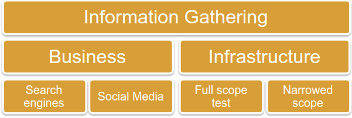
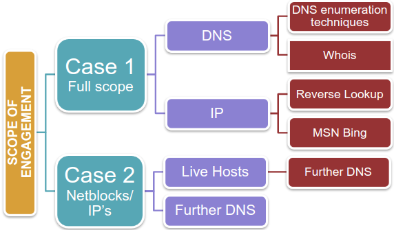

# Information gathering

Mapping tools: [XMind](https://www.xmind.net/), [FreeMind](http://freemind.sourceforge.net/wiki/index.php/Main_Page)

Reporting tools: [Dradis](https://dradisframework.com/ce/), [Faraday](https://github.com/infobyte/faraday), [MagicTree](https://www.gremwell.com/what_is_magictree)

* * *
***

#### Search Engine

Check list: 

1. **Web Presence**

First search for the company get as much details we can get.
- `cache:www.target.com`
- `link:www.target.com`
- `site:www.target.com`
- `elearnsecurity filetype:www.target.com`

[Google search help](https://support.google.com/websearch/answer/2466433?hl=en&ref_topic=3081620&visit_id=637414807948638515-1456163180&rd=1), [Google Guide](http://www.googleguide.com/advanced_operators_reference.html), [Google Hackers Guide](http://pdf.textfiles.com/security/googlehackers.pdf), [Google hacking database](https://www.exploit-db.com/google-hacking-database).

We should other search engines too.

Searching linkedin also can give lot of details. 

The company that are operating globally have desire to sell to US government. to get DUNS and CAGE code we can get codes from [Follow website](https://www.sam.gov/SAM/).

Publically listed companies in US can be get from [EDGAR](https://www.sec.gov/edgar.shtml).

2. **Partner and Third Party**
3. **Job Posting**
4. **Financial Information**

[Crunchbase](https://www.crunchbase.com/), [inc](https://www.inc.com/), EDGAR, Google Finace and Yahoo Finance

5. **Harvesting**

`site:target.com and filetype:[filetype]`
[FOCA](https://www.elevenpaths.com/labstools/foca/index.html) can also be used to harvest metadata.

Autmatic tools can be used like the Harvester `theharvester -d elearnsecurity.com -l 100 -b google`

`theharvester -d elearnsecurity.com -l 100 -b linkedin` will result in other details.

6. **Cached or Archived site**
[archive.org](https://archive.org/index.php)
`cache:URL`

* * *
***

- `nmap -n -sn -PS22,135,443,445 10.50.96.0/23`
 - DNS Discovery: `nmap -sS -sU -p53 -n 10.50.96.0/23`
- Do the following:
>>`nslookup`
>>`server 10.50.96.5`
>>`set q=NS`
>>`foocampus.com`
>>`ns.foocampus.com`
>>`ns1.foocampus.com`
>>`set q=MX`
>>`foocampus.com`
- `dig @10.50.96.5 foocampus.com -t AXFR +nocookie`
`host -t axfr foocampus.com 10.50.96.5`

From the above data try drawing Diagram.
***
***

#### Social Media
You can use linkedin or `site:linkedin` for searching for information.
to get information on people: [people search](https://pipl.com/), [spokeo](https://www.spokeo.com/), [peoplefinder](https://www.peoplefinders.com/), [crunchbase](https://www.crunchbase.com/), usenet is also very useful.
***
***

#### Infrastructures

**whois**
`whois target.com`
[more about whois](https://tools.ietf.org/html/rfc3912)

Regional Internet registry:
- AFRINIC
- ARIN
- APNIC
- LACNIC
- RIPE NCC

[https://who.is/](https://who.is/)
[https://whois.domaintools.com/](https://whois.domaintools.com/)
[https://bgp.he.net/](https://bgp.he.net/)
[https://networking.ringofsaturn.com/Tools/whois.php](https://networking.ringofsaturn.com/Tools/whois.php)
[https://www.networksolutions.com/whois](https://www.networksolutions.com/whois)
[http://www.betterwhois.com/](http://www.betterwhois.com/)

**DNS lookup**
`nslookup targetorganisation.com`
`nslookup -query=PTR IPaddress`
or we can use online tools such as [http://network-tools.com/nslook/](http://network-tools.com/nslook/).
`nslookup -query=MX domain`
or we can use [http://www.dnsqueries.com/en/](http://www.dnsqueries.com/en/) and [https://mxtoolbox.com/](https://mxtoolbox.com/).
`nslookup -query=NS domain.com`

To see zone transfer:
>>`nslookup`
>>`server  [NAMESERVER for domain.com]`
>>`ls -d mydomain.com`

**dig**
`dig target.com +short`
`dig target.com PTR`
`dig target.com MX`
`dig target.com	NS`
`dig axfr @target.com target.com`
`dig +nocmd target.com MX +noall +answer`
`dig +nocmd target.com NS +noall + answer`
`dig +nocmd target.com A +noall +answer @target.com`

To check reverse lookup in bing: `ip:<ipaddress>`
[domaintools](https://reverseip.domaintools.com/), [DNSlytics](https://dnslytics.com/reverse-ip), [reverse ip checker](https://networkappers.com/tools/reverse-ip-checker), [robtex](https://www.robtex.com/).

Automatic tools: [meltego](https://www.maltego.com/?utm_source=paterva.com&utm_medium=referral&utm_campaign=301), Hostmap, Foca, Fierce, Dmitry.

To see live host: fping, nmap, hping
`fping -a -g 192.168.1.0/24`
`nmap -sn 10.0.0.0/24`  (`--disable-arp-ping` or `--send-ip` for to avoid nmap run as ARP scan).

`fierce -dns target.com`
`fierce -dns target.com -dnsserver ns1.target.com`
`dnsenum target.com`
`dnsenum target.com --dnsserver ns1.target.com`
`dnsenum target.com -f /host.txt` for brute forcing
`dnsmap target.com`
`dnsrecon -d target.com`
***
***

#### Tools

- DNSdumpster - [https://dnsdumpster.com/](https://dnsdumpster.com/).
- DNSEnum - [https://github.com/fwaeytens/dnsenum](https://github.com/fwaeytens/dnsenum)
`dnsenum.pl [options] <domain>`
Options:
	- `--private` Show and save private IPs at the end of the file domain_ips.txt.
	- `--subfile <file>` Write all valid subdomains to this file.
	- `--threads <value>` the number of threads that will perform different queries.
	- `-p`, `--pages <values>` The number of Google pages to process when scrapping names, the default is 20 pages, the -s switch must be specified.
	- `-s`,`--scrap <value>` The maximum number of subdomains that will be scrapped from Google.
	- '-f', `--file <file>` read subdomains from the file and bruteforce.
- Fierce- `fierce -dns target.com`, `fierce -dns target.com -dnsserver ns1.target.com`
- Dnsmap - `dnsmap target.com`
	- `dnsmap targetdomain -w wordlist.txt`
	- `dnsmap targetdomain -r /tmp/` save result to /tmp/
	- `dnsmap-bulk.sh  domains.txt/ /tmp/results`
- Metagoofil
- Foca - windows tool
- Shodan - [https://www.shodan.io/](https://www.shodan.io/)
- Maltego
- Dmitry
- Recon-ng

