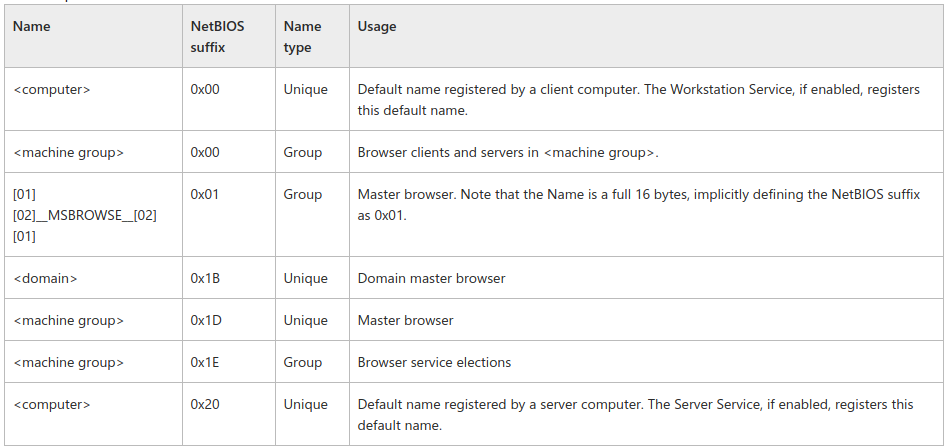

# Enumeration
## NetBIOS
NetBIOS suffix bytes for computer and NetBIOS name of the domains are listed in the following table. Only the names related to the browser protocol are listed.

[what is WINS?](https://docs.microsoft.com/en-us/previous-versions/windows/it-pro/windows-server-2003/cc784180(v=ws.10)?redirectedfrom=MSDN)

**Windows**
- `nbtstat -n`
[nbtstat study guide](https://docs.microsoft.com/en-us/previous-versions/windows/it-pro/windows-2000-server/cc940106(v=technet.10)?redirectedfrom=MSDN)

- `nbtstat -A [target_ip]`
- `nbtstat -V [target_ip]`
- `net view [target_ip]`
- `net use K: \\[target_ip]\c`
- For null session `net use \\[target_ip]\IPC$ "" /u:""`
- Winfigerprint is GUIa tool for finding null session.
- `winfo [target_ip] -n` is also another enumeration tool.
- DumpSec is another GUI tool.
- nab10bin
- sid2user

**Linux**
- `nmblookup -A 10.130.40.70` to view name table.
- `smbclient -L [target_ip]` to see shares.
`smbclient \\\\[target_ip]\\Worksharing`
Use `get` command to download file.
- Alternative to "net use" is `sudo mount.cifs //[target_ip]/c /media//K_share/ user=,pass=`
- `enum4linux [target_ip]` - This is a wrapper around rpcclient, net, nmblookup and smbclient.
Dependency tools for enum4linux to work:
	- polenum. and copy to /usr/bin/
	- ldapscripts and can be installed by apt.
- `rpcclient -N -U "" [target_ip]`
`-N` will instruct not to use password.
`-U` to set username.
`enumdomusers`command can be used to retrieve available machines.
Some useful commands for rpcclient are `enumalsgroups`, `srvinfo`, `lookupnames`, `queryuser`, `enumprivs`.
- `auxiliary/scanner/smb/smb_login` for smb brute forcing.
- `nmap --script=smb-enum-users -p 445 10.130.40.70 --script-args smbuser=administrator,smbpass=password` to enumerate host information. we can use rpcclient and enumdomusers.
- `exploit/windows/smb/psexec` use this to exploit if password is known.
`use incognito`
`list_tokens -u`
`impersonate_token eLS-Win7\\Administrator`
`auxiliary/scanner/smb/smb_enumshares`
***
***

## SNMP
[snmpwalk](http://www.net-snmp.org/docs/man/snmpwalk.html)
- `snmpwalk -v 2c [target_ip] -c public`
`-v`option specifies SNMP version  to use(`2c`), while `-c` sets community string to use (`public`).
- `snmpwalk -c public -v1 [target_ip] hrSWInstalledName` for listing only softwares installed.

[snmpset](http://www.net-snmp.org/docs/man/snmpset.html)
- `snmpset -v 2c -c public [target_ip] system.sysContact.0 s new@els.com`
`s` tells to use STRING type.
- `sudo nmap -sU -p 161 --script=snmp-win32-services.nse [target_ip]` to enumerate services available in target machine.
- `sudo nmap -sU -p 161 --script=snmp-win32-services.nse [target_ip]` to see available users.
- `sudo nmap -sU -p 161 [target_ip] --script=snmp-brute.nse` this uses default wordlist used by nmap `/usr/share/nmap/nselib/data/snmpcommunities.lst`
- `sudo nmap -sU -p 161 [target_ip] --script snmb-brute --script-args snmp-brute.communitiesdb=/usr/share/seclists/Misc/wordlists-common-snmp-community-strings.txt`
- To find community name 
	- `onesixtyone -c /usr/share/doc/onesixtyone/dict.txt 10.10.10.5`
	- `nmap -vv -sV -sU -Pn -p 161,162 --script=snmp-netstat,snmp-processes 10.10.10.5`
	- `snmpwalk -v 1 -c public 10.10.10.20`
- To gather information do any one: 
	- `perl snmpenum.pl 10.10.10.5 public windows.txt` if files are not compatible use command `dos2unix *.txt` where snmpenum.pl exist.
	- `nmap -sU -p 161 --script snmp-win32-users 10.10.10.5`
	- `nmap -sU -p 161 --script snmp-* 10.10.10.5 -oG snmp.txt`
***
***