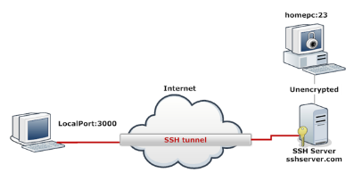
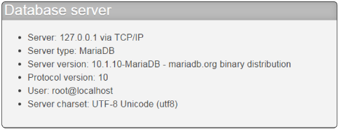

# Anonymity

## Browsing Anonymously

[https://www.whatsmyip.org/](https://www.whatsmyip.org/)
[http://www.checkip.org/](http://www.checkip.org/)
[https://whatismyipaddress.com/](https://whatismyipaddress.com/)

Using proxy server:

[https://hide.me/en/proxy](https://hide.me/en/proxy)
[https://hidemy.name/en/proxy-list/](https://hidemy.name/en/proxy-list/)

Always use owned proxy server.
There are 3 subtypes of proxies:
1. High anonymous (elite proxies)
2. Anonymous proxies
3. Transparent Proxies

Anonymity testing:

[http://www.all-nettools.com/](http://www.all-nettools.com/)
[https://centralops.net/co/](https://centralops.net/co/)
[https://pentest-tools.com/home](https://pentest-tools.com/home)
[do-know.com](https://do-know.com/privacy-proxy-test.html?HgpLoTnR+Qjx0cGJJzJkNOcJZk151qo2bHXr3J6pYvnZEFABE1/mS/l7+f61xm+ttkiBrAgQej6KXUpeh4xnK28yO+tP8stgJp1AAElf2Pred+E)
[http://www.all-nettools.com/](http://www.all-nettools.com/)

HTTP via / HTTP x should not show to we are using proxy or our real ip so always use high anonymous proxies.

#### Tor Browser

[https://2019.www.torproject.org/about/overview.html.en](https://2019.www.torproject.org/about/overview.html.en)

***
***

## Tunneling for Anonymity

[https://help.ubuntu.com/community/SSH/OpenSSH/PortForwarding](https://help.ubuntu.com/community/SSH/OpenSSH/PortForwarding)
**Secure Shell (SSH Tunneling)**
It encrypts all information between client and server.

syntax: `ssh -L [Local_port_to_listen_on]:[Remote_Machine]:[Remote_port] [USERNAME]@[SSHSERVER]`

For example:

`ssh -L 3000:homepc:23 root@mybox`
`telnet 127.0.0.1:3000`

Another example,

Our Machine IP: 192.168.231.134
SSH server IP: 192.168.231.135

`SSH -L 3000:Localhost:3306 els@192.168.231.135`
`mysql -h 127.0.0.1 -P 3000 -u root`
***
***