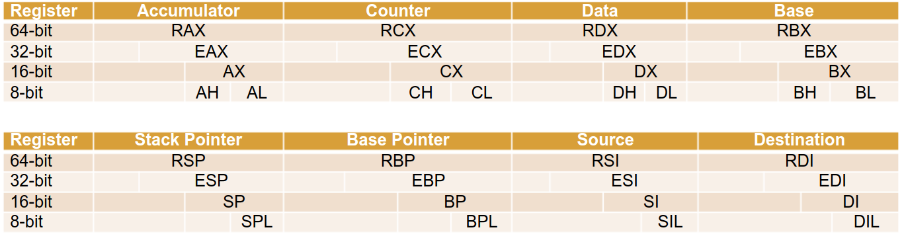
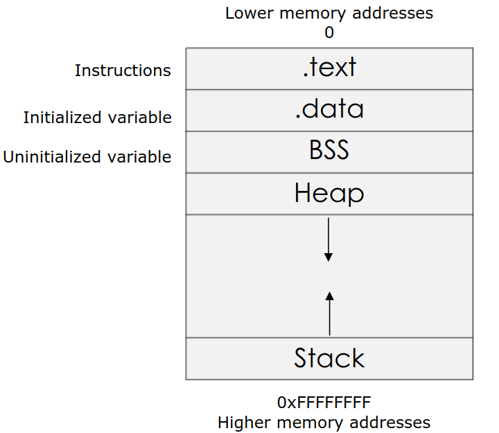

## Registers

X86 Naming connvention

|     |     |     |
| --- | --- | --- |
| **X86 Naming Convention** | **Name** | **Purpose** |
| EAX | Accumulator | Used in arithmetic operation |
| ECX | Counter | Used in shift/rotate instruction and loops |
| EDX | Data | Used in arithmetic operation and I/O |
| EBX | Base | Used as a pointer to data |
| ESP | Stack Pointer | Pointer to the top of the stack |
| EBP | Base Pointer | Pointer to the base of the stack (aka Stack Base Pointer, or Frame pointer) |
| ESI | Source Index | Used as a pointer to a source in stream operation |
| EDI | Destination | Used as a pointer to a destination in stream operation |

The following tables summarize the naming conventions. Although we will mainly use 32-bit name convention, it is useful to understand the 64-bit name convention as well.

Other than the above 8 general purpose registers, there is another register that will be important for our purposes **EIP (Instruction Pointer)**. EIP controls the program execution by storing a pointer to the address of the next instruction that will be executed.

## Process Memory

When a process runs, it is typically organized in memory as shown below:

- Text region is read only as it should not change during program execution.
`PUSH E` and `POP E`

## Reference
[brk](http://man7.org/linux/man-pages/man2/brk.2.html)
[free](http://man7.org/linux/man-pages/man1/free.1.html)
[MASM](https://www.microsoft.com/en-us/download/details.aspx?id=12654)
[malloc](http://man7.org/linux/man-pages/man3/malloc.3.html)
[NASM](http://www.nasm.us)
[realloc](http://man7.org/linux/man-pages/man3/realloc.3p.html)
[sbrk](http://man7.org/linux/man-pages/man2/brk.2.html)